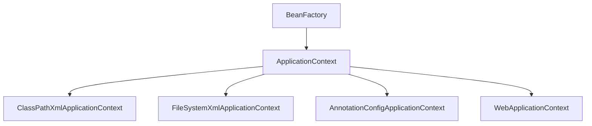

[Spring官网](https://spring.io/ “spring”)


# SpringFramework

主要功能模块

| 功能模块       | 功能介绍                              |
| -------------- | ------------------------------------- |
| Core Container | 环境下使用任何功能都必须基于 IOC 容器 |
| AOP&Aspects    | 面向切面编程                          |
| TX             | 声明式事务管理                        |
| Spring MVC     | 提供了面向Web应用程序的集成功能       |


# SpringIoC

**SpringIoC(Inversion of Control)控制反转**

Spring IoC 容器，负责实例化、配置和组装 bean（组件）。容器通过读取配置元数据来获取有关要实例化、配置和组装组件的指令。配置元数据以 XML、Java 注解或 Java 代码形式表现。它允许表达组成应用程序的组件以及这些组件之间丰富的相互依赖关系


## SpringIoC容器和容器实现类

**SpringIoc容器接口**：

`BeanFactory` 接口提供了一种高级配置机制，能够管理任何类型的对象，它是SpringIoC容器标准化超接口！

`ApplicationContext` 是 `BeanFactory` 的子接口。它**扩展**了以下功能：

| 类型名                                 | 简介                                                         |
| -------------------------------------- | ------------------------------------------------------------ |
| ClassPathXmlApplicationContext         | 通过读取类路径下的 XML 格式的**配置文件**创建 IOC 容器对象   |
| FileSystemXmlApplicationContext        | 通过文件系统路径读取 XML 格式的**配置文件**创建 IOC 容器对象 |
| **AnnotationConfigApplicationContext** | 通过读取**Java配置类**创建 IOC 容器对象                      |
| **WebApplicationContext**              | 专门为 Web 应用准备，基于 Web 环境创建 **IOC 容器对象**，并将对象引入存入 ServletContext 域中 |




### Spring IoC 容器管理配置方式

Spring框架提供了多种配置方式：XML配置方式、**注解方式**和**Java配置类**方式

1. XML配置方式：是Spring框架最早的配置方式之一，通过在XML文件中定义Bean及其依赖关系、Bean的作用域等信息，让Spring IoC容器来管理Bean之间的依赖关系。该方式从Spring框架的第一版开始提供支持
2. 注解方式：从Spring 2.5版本开始提供支持，可以通过在Bean类上使用注解来代替XML配置文件中的配置信息。通过在Bean类上加上相应的注解（如@Component, @Service, @Autowired等），将Bean注册到Spring IoC容器中，这样Spring IoC容器就可以管理这些Bean之间的依赖关系
3. **Java配置类**方式：从Spring 3.0版本开始提供支持，通过Java类来定义Bean、Bean之间的依赖关系和配置信息，从而代替XML配置文件的方式。Java配置类是一种使用Java编写配置信息的方式，通过@Configuration、@Bean等注解来实现Bean和依赖关系的配置


# 事务管理器

```java
/**
 * @Transactional
 *  isolation: 事务的隔离级别
 *  propagation: REQUIRED | REQUIRES_NEW 设置事务的传播行为
 *      REQUIRED: 默认值 利用 参照调用方法的事务
 *      REQUIRES_NEW: 以自身方法为一个事务
 */
@Override
@Transactional(
        readOnly = false,
        timeout = 3,
        isolation = Isolation.DEFAULT,
        propagation = Propagation.REQUIRES_NEW
)
```


# AOP

AOP (Aspect Oriented Programming) 是一种设计思想，是软件设计领域中的面向切面编程，它是面向对象编程的一种补充和完善，它以通过预编译方式和运行期动态代理方式实现在不修改源代码的情况下给程序动态统一添加额外功能的一种技术。

- 抽取一些非核心功能的公共代码（例如日志）放到一个类里面。这个类就是切面

@Aspect // 将当前组件标识为切面

@Order(1) // 切面优先级，值越小，优先级越高

- 切面：封装横切关注点的类
