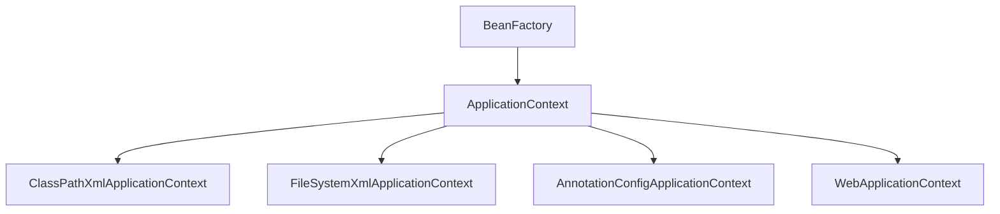

# SpringIoC

**SpringIoC(Inversion of Control)控制反转**

Spring IoC 容器，负责实例化、配置和组装 bean（组件）。容器通过读取配置元数据来获取有关要实例化、配置和组装组件的指令。配置元数据以 XML、Java 注解或 Java 代码形式表现。它允许表达组成应用程序的组件以及这些组件之间丰富的相互依赖关系


## SpringIoC容器和容器实现类

**SpringIoc容器接口**：

`BeanFactory` 接口提供了一种高级配置机制，能够管理任何类型的对象，它是SpringIoC容器标准化超接口！

`ApplicationContext` 是 `BeanFactory` 的子接口。它**扩展**了以下功能：

| 类型名                                 | 简介                                                         |
| -------------------------------------- | ------------------------------------------------------------ |
| ClassPathXmlApplicationContext         | 通过读取类路径下的 XML 格式的**配置文件**创建 IOC 容器对象   |
| FileSystemXmlApplicationContext        | 通过文件系统路径读取 XML 格式的**配置文件**创建 IOC 容器对象 |
| **AnnotationConfigApplicationContext** | 通过读取**Java配置类**创建 IOC 容器对象                      |
| **WebApplicationContext**              | 专门为 Web 应用准备，基于 Web 环境创建 **IOC 容器对象**，并将对象引入存入 ServletContext 域中 |




### Spring IoC 容器管理配置方式

Spring框架提供了多种配置方式：XML配置方式、**注解方式**和**Java配置类**方式

1. XML配置方式：是Spring框架最早的配置方式之一，通过在XML文件中定义Bean及其依赖关系、Bean的作用域等信息，让Spring IoC容器来管理Bean之间的依赖关系。该方式从Spring框架的第一版开始提供支持
2. 注解方式：从Spring 2.5版本开始提供支持，可以通过在Bean类上使用注解来代替XML配置文件中的配置信息。通过在Bean类上加上相应的注解（如@Component, @Service, @Autowired等），将Bean注册到Spring IoC容器中，这样Spring IoC容器就可以管理这些Bean之间的依赖关系
3. **Java配置类**方式：从Spring 3.0版本开始提供支持，通过Java类来定义Bean、Bean之间的依赖关系和配置信息，从而代替XML配置文件的方式。Java配置类是一种使用Java编写配置信息的方式，通过@Configuration、@Bean等注解来实现Bean和依赖关系的配置


## Spring IoC / DI 实践步骤

1. **配置元数据（配置）**

   ```xml
   // springioc.xml / ***.xml
   <bean id="helloBean" class="com.springioc.bean.HelloBean"></bean>
   ```

2. **实例化 IoC 容器**

   ```java
   // 获取 IOC 容器
   ApplicationContext ioc = new ClassPathXmlApplicationContext("springioc.xml");
   ```

3. **获取Bean（组件）**

   ```java
   // 获取 IOC 容器
   ApplicationContext ioc = new ClassPathXmlApplicationContext("springioc.xml");
   // 获取 IOC 容器中的 bean
   HelloBean helloBean = (HelloBean) ioc.getBean("helloBean");
   helloBean.sayHello();
   ```


### 组件(Bean)声明配置

```xml
// ***.xml
<!--
    方式1: 无参构造函数实例化组件
 -->
<!--
    id: 唯一标识，方便以后获取 Bean
    class: 类, bean 对象对应的类型
 -->
<bean id="helloBean" class="com.springioc.bean.HelloBean"></bean>

<!--
    方式2: 静态工厂方法实例化
 -->
<bean id="helloBean2" class="com.springioc.bean.HelloBean" factory-method="createInstance"></bean>

```

```java
public class HelloBean {

    private static HelloBean helloBean = new HelloBean();

    public void sayHello() {
        System.out.println("hello bean");
    }

    public static HelloBean createInstance() {
        return helloBean;
    }
}
```


### 依赖注入

```java
// 准备类
public class UserDao {
}
```

```java
public class UserService {
    
    private UserDao userDao;

    private String name;

    public UserService() {
    }

    public UserService(UserDao userDao, String name) {
        this.userDao = userDao;
        this.name = name;
    }

    public UserDao getUserDao() {
        return userDao;
    }

    public void setUserDao(UserDao userDao) {
        this.userDao = userDao;
    }

    public void setName(String name) {
        this.name = name;
    }

    public String getName() {
        return name;
    }
}
```

```xml
<bean id="userDao" class="com.springioc.dao.UserDao"></bean>

<!--
    1. 可以通过 <constructor-arg></constructor-arg> 构造函数注入
    2. 更建议通过 <property></property> 基于Setter方法依赖注入，此时，类里一定要声明对应的 setter 方法
 -->
<bean id="userService" class="com.springioc.service.UserService">
    <!--
        name = 属性名
        ref = 引用bean的id值
        value= 基本类型值
     -->
    <property name="userDao" ref="userDao"></property>
    <property name="name" value="bin"></property>
</bean>
```


### IoC容器的创建和使用

1. 获取 IOC 容器实例化对象

   ```java
   // 方式1
   // 获取 IOC 容器
   ApplicationContext applicationContext = new ClassPathXmlApplicationContext("springioc.xml");
   
   // 方式2
   // 获取 IOC 容器
   ClassPathXmlApplicationContext applicationContext = new ClassPathXmlApplicationContext();
   applicationContext.setConfigLocations("springioc.xml");
   applicationContext.refresh();
   ```

2. 获取 IOC 容器中的 bean `applicationContext.getBean()`

   1. **通过 id 获取**，这种方式**需要强转类型**，一般不推荐使用

      ```java
      // 获取 IOC 容器
      ApplicationContext applicationContext = new ClassPathXmlApplicationContext("springioc.xml");
      
      // 获取 IOC 容器中的 bean
      UserService userService = (UserService) applicationContext.getBean("userService");
      System.out.println(userService.getName());
      ```

   2. **根据类型获取**，使用这种方式，同一个类在IoC中只能有一个Bean，即只能同一个类在xml中只能配置一个id

      ```java
      // 获取 IOC 容器中的 bean
      UserService userService = applicationContext.getBean(UserService.class);
      System.out.println(userService.getName());
      ```

      这里的`UserService.class`可以是根据接口类型获取

   3. **根据id和类型获取**

      ```java
      // 获取 IOC 容器中的 bean
      UserService userService = applicationContext.getBean("userService", UserService.class);
      System.out.println(userService.getName());
      ```

      

### 组件(Bean)作用域和周期方法配置

#### 生命周期方法

我们可以在组件类中定义方法，然后当**IoC容器实例化**和**销毁组件对象**的时候进行调用！这两个方法我们成为**生命周期方法**！

类似于Servlet的init/destroy方法,我们可以在周期方法完成初始化和释放资源等工作。

```java
public class HelloBean {

    //周期方法要求： 方法命名随意，但是要求方法必须是 public void 无形参列表
    public void init() {
        System.out.println("JavaBean init");
    }

    public void destory() {
        System.out.println("JavaBean destory");
    }
}
```

在 xml 文件中声明 init-method 和 destroy-method

```xml
<bean id="helloBean" class="com.springioc.bean.HelloBean" init-method="init" destroy-method="destory"></bean>
```

```java
@Test
public void testLifeCycle() {
    // 获取 IOC 容器
    ClassPathXmlApplicationContext applicationContext = new ClassPathXmlApplicationContext("springioc.xml");
    // 销毁
    applicationContext.close();
}
```


#### 作用域 Scope

`<bean` 标签声明Bean，只是将Bean的信息配置给SpringIoC容器！

在IoC容器中，这些`<bean`标签对应的信息转成Spring内部 `BeanDefinition` 对象，`BeanDefinition` 对象内，包含定义的信息（id,class,属性等等）！

这意味着，`BeanDefinition`与`类`概念一样，SpringIoC容器可以可以根据`BeanDefinition`对象反射创建多个Bean对象实例。

具体创建多少个Bean的实例对象，由Bean的作用域Scope属性指定！

```xml
<!--
    scope: singleton | prototype
        singleton: 单例模式 （默认）
        prototype: 多例模式
-->
<bean id="helloBean" class="com.springioc.bean.HelloBean" scope="prototype"></bean>
```

```java
@Test
public void testScope() {
    // 获取 IOC 容器
    ApplicationContext applicationContext = new ClassPathXmlApplicationContext("springioc.xml");
    // 获取 IOC 容器中的 bean
    HelloBean helloBean = (HelloBean) applicationContext.getBean(HelloBean.class);
    HelloBean helloBean2 = (HelloBean) applicationContext.getBean(HelloBean.class);
    System.out.println(helloBean == helloBean2);
}
```

