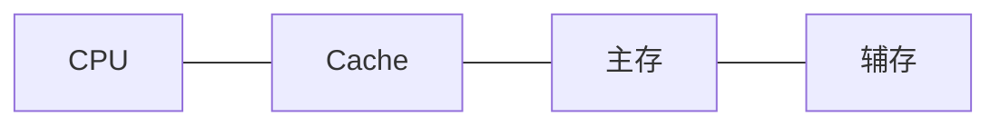

# 计算机组成

## CPU组成

**运算器**

1. 算术逻辑单元ALU：数据的算术运算和逻辑运算
2. 累加寄存器AC：**通用寄存器**，为ALU提供一个工作区，用在暂存数据数据
3. 缓冲寄存器DR：写内存时，暂存指令或数据
4. 状态条件寄存器PSW：存状态标志与控制标志

**控制器**

1. 程序计数器PC：存储下一条要执行**指令的地址**
2. 指令寄存器IR：存储即将执行的指令
3. 指令译码器ID：对指令中的操作码字段进行分析解释
4. 时序部件:：供时序控制信号


## 计算机组成结构

**冯·诺依曼结构**

冯·诺依曼结构也称普林斯顿结构，是一种将**程序指令存储器和数据存储器合并在一起的**存储器结构。

1. 一般用于PC处理器，如I3，15，17处理器


**哈佛结构**

哈佛结构是一种将程序指令存储和数据存储分开的存储器结构。哈佛结构是一种并行体系结构，它的主要特点是将程序和数据存储在不同的存储空间中，即**程序存储器和数据存储器是两个独立**的存储器，每个存储器独立编址、独立访问。

1. 一般用于嵌入式系统处理器(DSP)数字信号处理


## 存储系统

### 层次化存储结构

1. CPU寄存器

   速度最快，但容量小，成本高

2. Cache

   按内容存取

3. 内存（主存）

   随机存储器DRAM，只读存储器ROM

4. 外存（辅存）

   硬盘、光盘等




局部性原理是层次化存储结构的支撑

时间局部性：刚被访问的内容，立即又被访问

空间局部性：刚被访问的内容，临近的空间很快被访问


### 存储分类

1. 按存储位置

   分内存和外存

2. 存取方式

   1. 按内容存取

      相联存储器（Cache）

   2. 按地址存取

      随机存取存储器（如内存）

      顺序存取存储器（磁带）

      直接存取存储器（磁盘）

3. 工作方式

   随机存取存储器RAM（如DRAM）

   只读存储器ROM（如BIOS）


### Cache

可用于**指令存储**

- 时间局部性：指**程序中的某条指令一旦执行，不久以后该指令可能再次执行**，典型原因是由于程序中存在着大量的循环操作。
- 空间局部性：指一旦程序访问了某个存储单元，不久以后，其附近的存储单元也将被访问，即程序在一段时间内所访问的地址可能集中在一定的范围内，其典型情况是程序顺序执行。
- 工作集理论：工作集是进程运行时被频繁访问的页面集合。

`s+=;`存在重复执行情况

```c
int i,j,s=0, n=10000;
for(i=1; i<=n; i++)
	for(j=1; j<=n; j++)
		s+=j;
printf("结果为:%d", s);
```

> 例：如果以h代表对Cache的访问命中率，$t_{1}$表示Cache的周期时间，$t_{2}$表示主存储器周期时间，以读操作为例，使用“Cache+主存储器”的系统的平均周期为$t_{3}$，则:

$$
t_{3} = h * t_{1} + (1-h) * t_{2}
$$

其中，（1-h）又称为失效率（未命中率）

---

<p>
    题：以下关于Cache的叙述中，正确的是（B）。<br />
    A、在容量确定的情况下，替换算法的时间复杂度是影响Cache命中率的关键因素<br />
    B、Cache的设计思想是在合理的成本下提高命中率<br />
    C、Cache的设计目标是容量尽可能与主存容量相等<br />
    D、CPU中的Cache容量应大于CPU之外的Cache容量
</p>


---


#### Cache概念

**主存**与**Cache**之间的**地址映射**由硬件直接完成

- **直接相联映像**：**硬件电路**较简单，但**冲突率很高**
- **全相联映像**：**电路**难于设计和实现，只适用于小容量的cache，**冲突率较低**
- **组相联映像**：直接相联与全相联的折中


### 主存编址

编址内容：

- 按**字**编址：存储体的存储单元是字(4bit)存储单元，即最小寻址单位是一个字
- 按**字节**编址：存储体的存储单元是字节(8bit)存储单元，即最小寻址单位是个字节

总容量 = 存储单元个数 \* 编址内容

---

<p>
    内存按字节编址，利用8K×4bit的存储器芯片构成84000H到8FFFFH的内存，共需（C）片。<br />
    A、6 <br />
    B、8<br />
    C、12<br />
    D、24
</p>


按**字节**编址，**F - 4 + 1** = 12，一个存储单元有8bit：$\frac{12*16*16*16*8}{8*1024*4}=12$

---


## 输入输出技术

### 数据传输控制方式

CPU数据传输控制（CPU Data Transfer Control）指的是在计算机内部，CPU与其他硬件组件（如内存、输入/输出设备、外部总线等）之间进行数据交换时，所采用的一系列控制机制和技术。它负责协调和管理CPU与外部设备之间的数据传输，确保数据能够在不同部件之间有效、可靠地传输

程序控制(查询)方式最慢，I/O处理机最快

1. **程序控制(查询)方式**：分为无条件传送和程序查询方式两种。方法简单，硬件开销小，但I/0能力不高，**严重影响CPU的利用率**

2. **程序中断方式**：与程序控制方式相比，中断方式因为CPU无需等待而提高了传输请求的响应速度。CPU与数据传输并行

3. **DMA（直接内存访问）方式**：DMA方式是为了在**主存与外设**之间实现高速、批量数据交换而设置的。DMA方式比程序控制方式与中断方式都高效

   DMAC向总线裁决逻辑提出总线请求；CPU执行完当前**总线周期**即可释放总线控制权。此时DMA响应，通过DMAC通知I/O接口开始DMA传输。

4. 通道方式

5. I/O处理机


中断处理过程：

1. CPU无需等待也不必查询I/0状态
2. 当I/0系统准备好以后，发出**中断请求信号**通知CPU
3. CPU接到中断请求后，保存正在执行程序的现场(**保存现场**)到栈中，打断的程序当前位置即为**断点**
4. (通过**中断向量表**)转入I/0中的服务程序的执行，完成I/0系统的数据交换
5. 返回被打断的程序继续执行（恢复现场）

---

<p>
    1-12、嵌入式系统中采用中断方式实现输入输出的主要原因是（）。在中断时,CPU断点信息一般保存到（）中。<br />
	A、速度最快<br />
    B、CPU不参与操作<br />
    C、实现起来比较容易<br />
    D、能对突发事件做出快速响应<br /><br />
    A、通用寄存器<br />
    B、堆<br />
    C、栈<br />
    D、I/O接口
</p>
---


## 总线

总线是一组能为多个部件分时共享的公共信息传送线路

- 共享
- 分时双工：是指**同一时刻仅允许一个部件向总线发送信息**，但**允许多个部件同时从总线上接收相同的信息**

**串行总线**适合长距离传输、**并行总线**适合近距离连接，不宜过长，成本高

单工、半双工与全双工

总线宽度与总线带宽

**总线分类**：

- 数据总线

  在CPU与RAM之间来回传送需要处理或是需要储存的数据

- 地址总线

  用来指定在RAM(RandomAccessMemory)之中储存的数据的地址

- 控制总线

  将微处理器控制单元(ControlUnit)的信号，传送到周边设备

---

<p>
    1-13、挂接在总线上的多个部件,（）。<br />
    A、只能分时向总线发送数据，并只能分时从总线接收数据<br />
    B、只能分时向总线发送数据，但可同时从总线接收数据<br />
    C、可同时向总线发送数据，并同时从总线接收数据<br />
    D、可同时向总线发送数据，但只能分时从总线接收数据
</p>


---

<p>
    1-14、下列说法中正确的是（）。<br />
    A、半双工总线只在一个方向上传输信息，全双工总线可在两个方向上轮流传输信息<br />
    B、半双工总线只在一个方向上传输信息，全双工总线可在两个方向上同时传输信息<br />
    C、半双工总线可在两个方向上轮流传输信息，全双工总线可在两个方向上同时传输信息<br />
    D、半双工总线可在两个方向上同时传输信息，全双工总线可在两个方向上轮流传输信息<br />
</p>


---

<p>
    1-15、以下关于串行总线的说法中，正确的是（）。<br />
    A、串行总线一般都是全双工总线，适宜于长距离传输数据<br />
    B、串行总线传输的波特率是总线初始化时预先定义好的，使用中不可改变<br />
    C、串行总线是按位(bit)传输数据的，其数据的正确性依赖于校验码纠正<br />
    D、串行总线的数据发送和接收是以软件查询方式工作
</p>

---


# 指令系统


## CISC、RISC

CISC：复杂指令集

RISC：精简指令集

| 指令系统类型 | 指令                                                         | 寻址方式   | 实现方式                                          | 其他                       |
| ------------ | ------------------------------------------------------------ | ---------- | ------------------------------------------------- | -------------------------- |
| CISC（复杂） | 数量多，使用频率差别大;可变长格式                            | 支持多种   | 微程序控制技术(微码)                              | 研制周期长                 |
| RISC（精简） | 数量少，使用频率接近，定长格式，大部分为单周期指令，操作寄存器，只有Load/Store操作内存 | 支持方式少 | 增加了通用寄存器;硬布线逻辑控制为主适合采用流水线 | 优化编译，有效支持高级语言 |


## 指令执行流水线

使用原因：不同的部件可以**并行**跑程序

- **流水线周期**：流水线执行时间最长的一段，即 $t_{最大}$

- 流水线**时间**计算公式

  **理论公式**： $(t_1 + t_2 + ... + t_k) + (n-1)t_{最大}$ ；**默认**使用理论公式，当理论公式没有答案再使用实践公式

  实践公式：$k×t_{最大}+(n-1)t_{最大}$；即每个过程的执行时间都是 $t_{最大}$

  n 表示 n 条指令，k 表示一条指令执行过程数。如一条指令包含取址、分析、执行，则 k = 3

- 吞吐量：$\frac{1}{t_总}$

- **吞吐率**：$TP = \frac{指令执行条数}{流水线执行总时间}$

  10条指令执行总时间是45，吞吐率是$\frac{10}{45}$

- **最大**吞吐率：$TP_{max} = \frac{1}{t_{最大}}$，当指令条数是无限大的时候，最大吞吐率是**流水线执行时间最长的一段**的倒数

- 加速比：$\frac{不使用流水线执行时间}{使用流水线执行时间}$，基本大于1


校验方式：

- 奇偶校验，可以检查1位错误，不可纠错。

- **循环冗余校验CRC**：与生成多项式异或后拼接在尾部，不可纠错
  
  - **冗余位数**为生成多项式的最高次幂
  
  
  
- 海明校验：可检错，可纠错  $2^r >= m+r+1$


# 参考答案：

- 存储系统

  1-12：D、C

  1-13：B

  1-14：C

  1-15：C

- 指令执行流水线

  1-4：90、4、45

  1-6：B、C

  1-7：101111100


存储系统
