# 计算机组成

## CPU组成

**运算器**

1. 算术逻辑单元ALU：数据的算术运算和逻辑运算
2. 累加寄存器AC：**通用寄存器**，为ALU提供一个工作区，用在暂存数据数据
3. 缓冲寄存器DR：写内存时，暂存指令或数据
4. 状态条件寄存器PSW：存状态标志与控制标志

**控制器**

1. 程序计数器PC：存储下一条要执行**指令的地址**
2. 指令寄存器IR：存储即将执行的指令
3. 指令译码器ID：对指令中的操作码字段进行分析解释
4. 时序部件:：供时序控制信号

## 计算机组成结构

**冯·诺依曼结构**

冯·诺依曼结构也称普林斯顿结构，是一种将**程序指令存储器和数据存储器合并在一起的**存储器结构。

1. 一般用于PC处理器，如I3，15，17处理器

**哈佛结构**

哈佛结构是一种将程序指令存储和数据存储分开的存储器结构。哈佛结构是一种并行体系结构，它的主要特点是将程序和数据存储在不同的存储空间中，即**程序存储器和数据存储器是两个独立**的存储器，每个存储器独立编址、独立访问。

1. 一般用于嵌入式系统处理器(DSP)数字信号处理

## 层次化存储结构

1. CPU寄存器
2. Cache
3. DRAM，ROM（内存）
4. 硬盘、光盘等（外存）

## Cache

可用于**指令存储**

- 时间局部性：指**程序中的某条指令一旦执行，不久以后该指令可能再次执行**，典型原因是由于程序中存在着大量的循环操作。
- 空间局部性：指一旦程序访问了某个存储单元，不久以后，其附近的存储单元也将被访问，即程序在一段时间内所访问的地址可能集中在一定的范围内，其典型情况是程序顺序执行。
- 工作集理论：工作集是进程运行时被频繁访问的页面集合。

`s+=;`存在重复执行情况

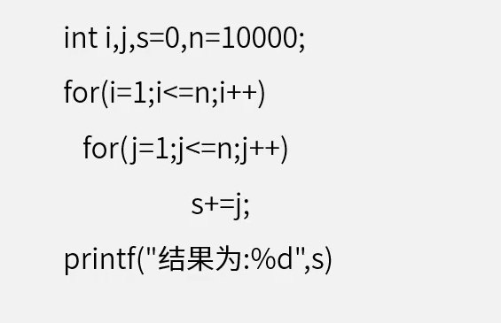

如果以h代表对Cache的访问命中率，$t_{1}$表示Cache的周期时间，$t_{2}$表示主存储器周期时间，以读操作为例，使用“Cache+主存储器”的系统的平均周期为$t_{3}$，则:
$$
t_{3} = h * t_{1} + (1-h) * t_{2}
$$

其中，（1-h）又称为失效率（未命中率）

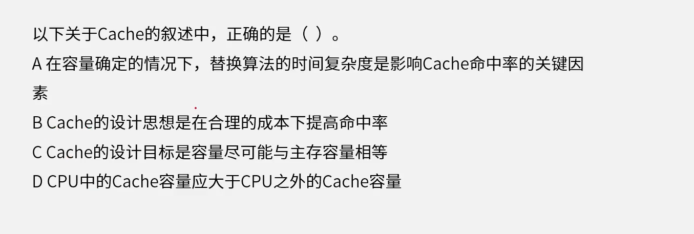

## 主存编址

编址内容：

- 按**字**编址：存储体的存储单元是字存储单元，即最小寻址单位是一个字
- 按**字节**编址：存储体的存储单元是字节存储单元，即最小寻址单位是个字节

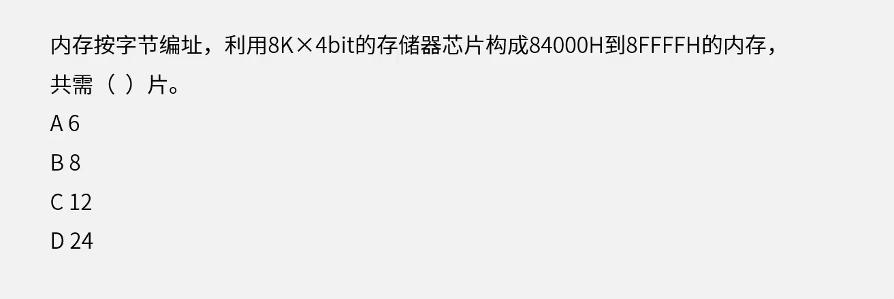

# 磁盘管理

单缓冲区：

- **磁盘读取**与磁盘**送至用户区**域是**串行**的
- **磁盘读取**与**用户区处理**工作是**并行**的

双缓冲区：

- 磁盘读取与磁盘送至用户区域是并行的
- 磁盘读取与用户区处理工作是并行的

**存取时间=寻道时间+等待时间**，寻道时间是指磁头移动到磁道所需的时间，等待时间为等待读写的扇区转到磁头下方所用的时间

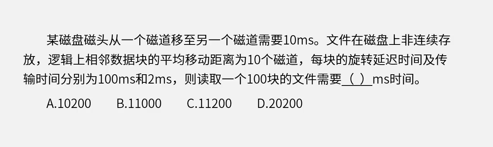

- 单缓冲区

- 双缓冲区

  能将更多的资源放入缓冲区，等在被执行。（在缓冲区1的资源被执行的时候，缓冲区2可以读取资源，即缓冲区双线程）
  
  
  
  

## 磁盘移臂调度算法

- 先来先服务

- 最短寻道优先

- 扫描算法

- 循环扫描

  

## 数据传输控制方式

程序控制(查询)方式最慢，I/O处理机最快

1. 程序控制(查询)方式：分为无条件传送和程序查询方式两种。方法简单，硬件开销小，但I/0能力不高，严重影响CPU的利用率

2. 程序中断方式：与程序控制方式相比，中断方式因为CPU无需等待而提高了传输请求的响应速度

3. DMA方式：QMA方式是为了在主存与外设之间实现高速、批量数据交换而设置的。DMA方式比程序控制方式与中断方式都高效

   (DMAC向总线裁决逻辑提出总线请求;CPU执行完当前总线周期即可释放总线控制权。此时DMA响应，通过DMAC通知I/O接口开始DMA传输。

4. 通道方式

5. I/O处理机

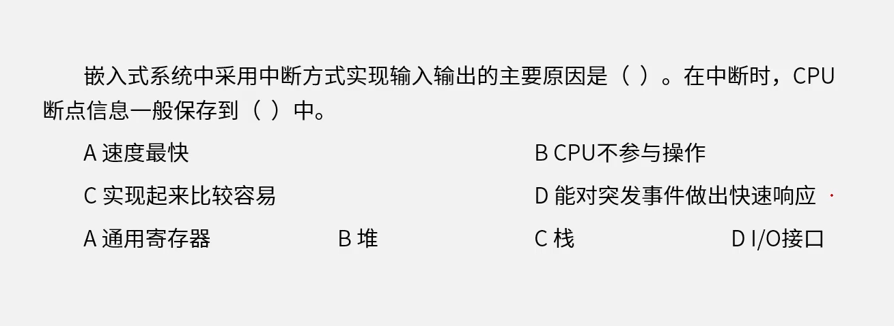

## 总线

总线是一组能为多个部件分时共享的公共信息传送线路

- 共享
- 分时：是指**同一时刻仅允许一个部件向总线发送信息**，但**允许多个部件同时从总线上接收相同的信息**

串行总线(适合长距离传输)与并行总线(适合近距离连接，不宜过长)

单工、半双工与全双工

总线宽度与总线带宽

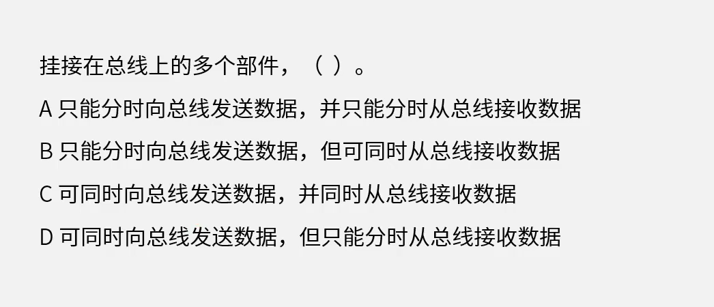

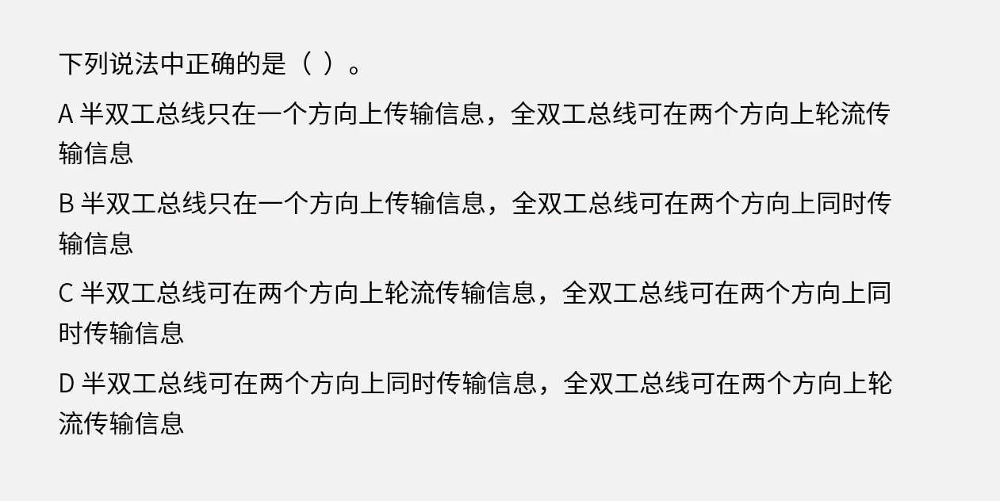

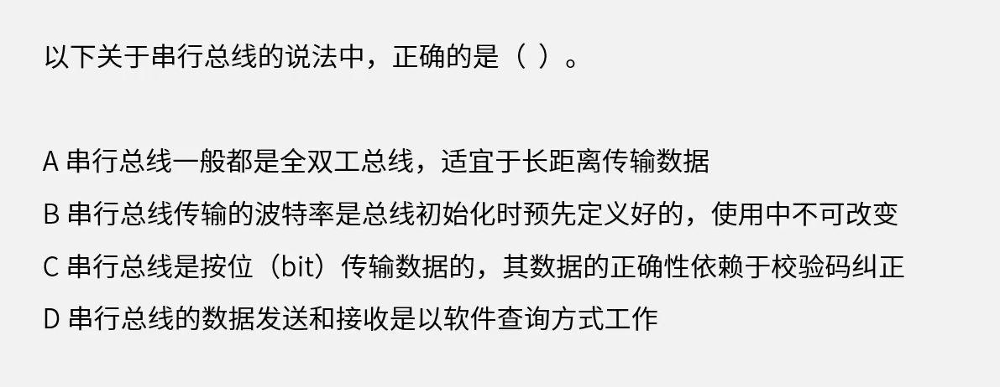

**总线分类**：

- 数据总线

  在CPU与RAM之间来回传送需要处理或是需要储存的数据

- 地址总线

  用来指定在RAM(RandomAccessMemory)之中储存的数据的地址

- 控制总线

  将微处理器控制单元(ControlUnit)的信号，传送到周边设备

## CISC、RISC

CISC：复杂指令集

RISC：精简指令集

| 指令系统类型 | 指令                                                         | 寻址方式   | 实现方式                                          | 其他                       |
| ------------ | ------------------------------------------------------------ | ---------- | ------------------------------------------------- | -------------------------- |
| CISC（复杂） | 数量多，使用频率差别大;可变长格式                            | 支持多种   | 微程序控制技术(微码)                              | 研制周期长                 |
| RISC（精简） | 数量少，使用频率接近，定长格式，大部分为单周期指令，操作寄存器，只有Load/Store操作内存 | 支持方式少 | 增加了通用寄存器;硬布线逻辑控制为主适合采用流水线 | 优化编译，有效支持高级语言 |

# 指令执行流水线

- **流水线周期**：理论公式 $(t_1 + t_2 + ... + t_k) + (n-1)t_{最大}$ 

  n表示n条指令，k表示一条指令包含k个指令，如$(t_1 + t_2 + t_3) + (3-1)t_{最大}$

- 吞吐量：$\frac{1}{t_总}$

- **吞吐率**：$TP = \frac{指令执行条数}{流水线执行总时间}$

  10条指令执行总时间是45，吞吐率是$\frac{10}{45}$

- **最大吞吐率**：$TP_{max} = \frac{1}{t_{最大}}$，当指令条数是无限大的时候，最大吞吐率是流水线周期的倒数

- 加速比：$\frac{不使用流水线执行时间}{使用流水线执行时间}$，基本大于1

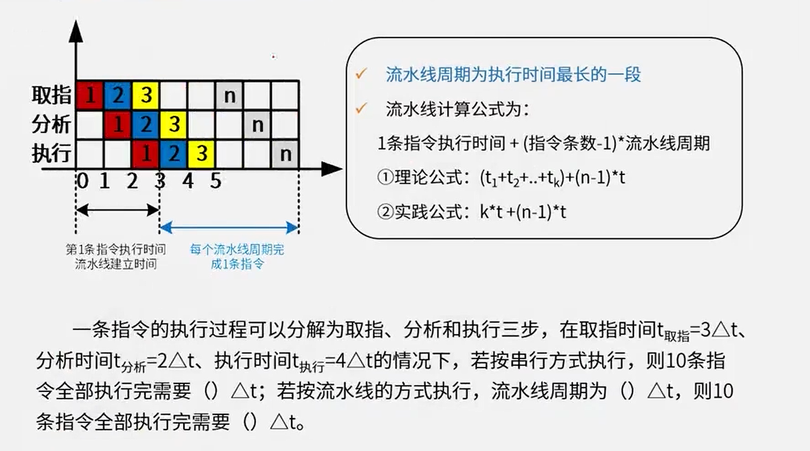

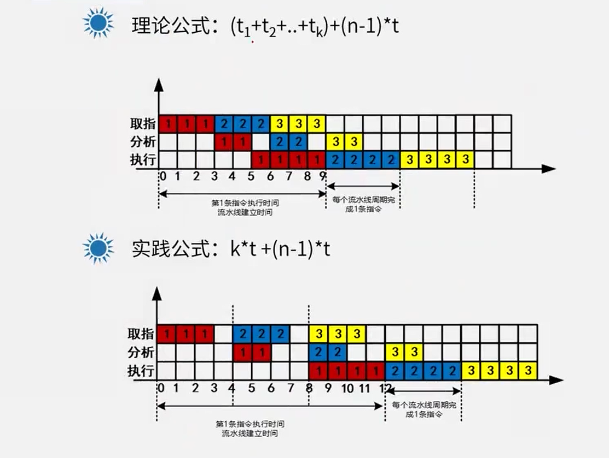

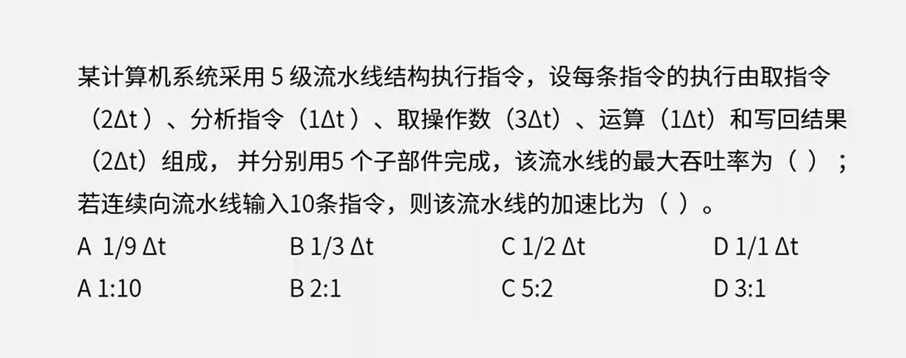

校验方式：

- 奇偶校验，可以检查1位错误，不可纠错。

- **循环冗余校验CRC**：与生成多项式异或后拼接在尾部，不可纠错
  
  - **冗余位数**为生成多项式的最高次幂
  
  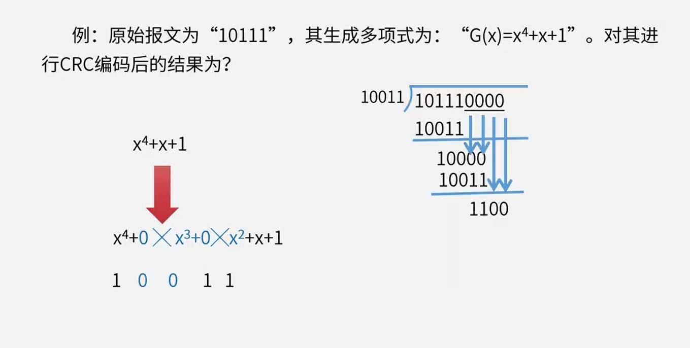
  
- 海明校验：可检错，可纠错  $2^r >= m+r+1$

参考答案：

- 计算机组成

  1-9：B

  1-10：C 、按字节编址，一个存储单元有8bit：$\frac{12*16*16*16*8}{8*1024*4}=12$

- 磁盘管理

  1-11：D：$（10*10+100+2）*100$

  1-1： C 、B 

  ​	$3+3+(3*10+3+3)*10=366$ 3+3是第一个记录的处理时间，3*10寻址时间，3读取时间，3处理时间。

  1-2： D 、C

  1-3： B

  1-12：D、C

  1-13：B

  1-14：C

  1-15：C

- 指令执行流水线

  1-4：90、4、45

  1-6：B、C

  1-7：101111100

