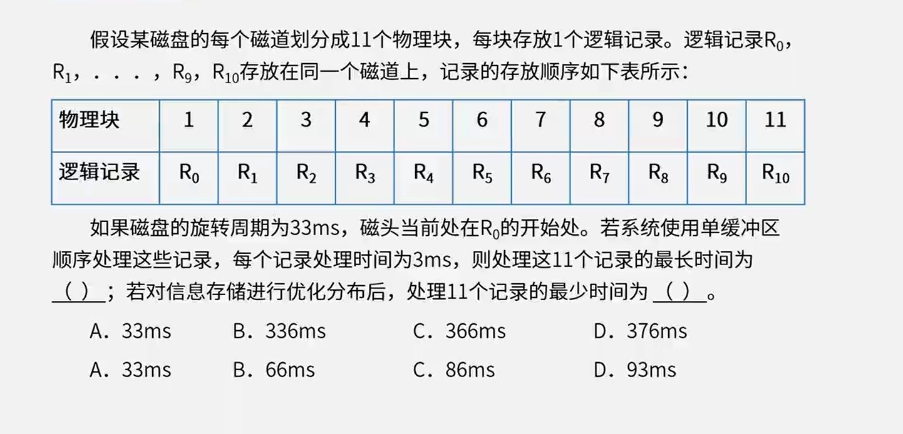
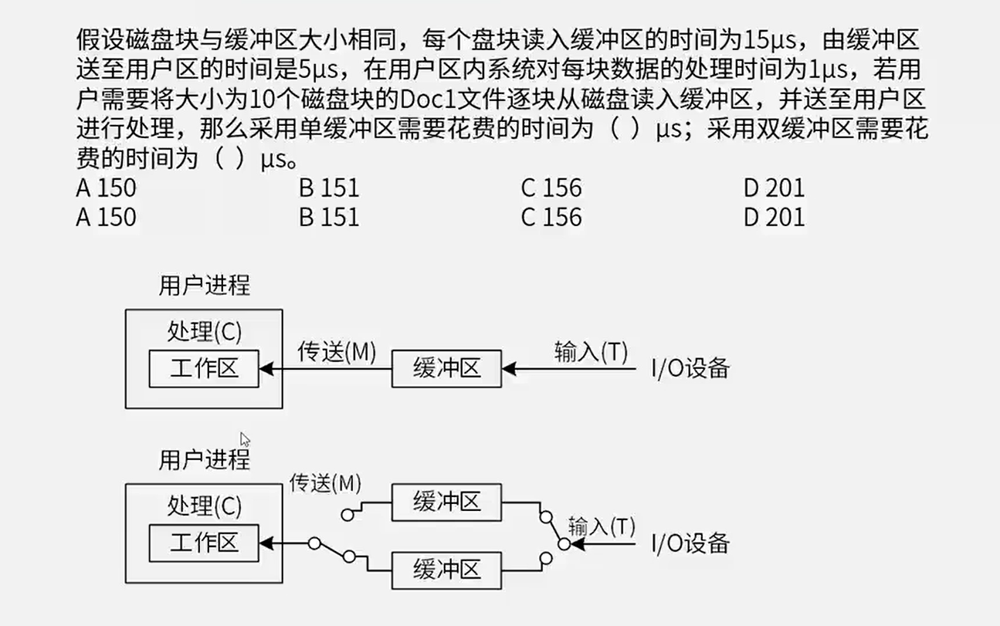
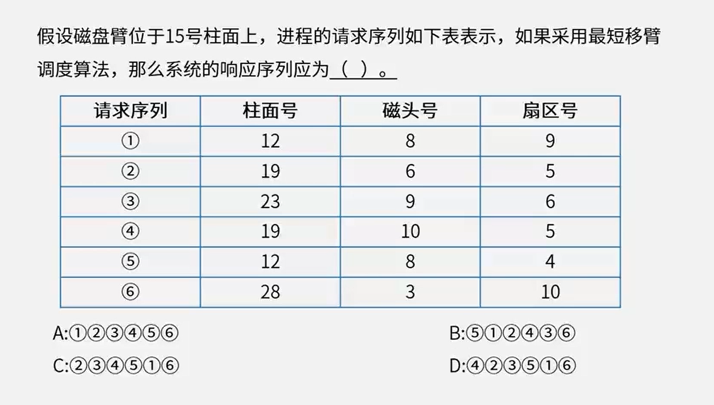

# 1.计算机组成

# 磁盘管理

单缓冲区：

- **磁盘读取**与磁盘**送至用户区**域是**串行**的
- **磁盘读取**与**用户区处理**工作是**并行**的

双缓冲区：

- 磁盘读取与磁盘送至用户区域是并行的
- 磁盘读取与用户区处理工作是并行的

**存取时间=寻道时间+等待时间**，寻道时间是指磁头移动到磁道所需的时间；

等待时间为等待读写的扇区转到磁头下方所用的时间。

- 单缓冲区

- 双缓冲区

  能将更多的资源放入缓冲区，等在被执行。（在缓冲区1的资源被执行的时候，缓冲区2可以读取资源，即缓冲区双线程）
  
  
  
  

**磁盘移臂调度算法**：

- 先来先服务

- 最短寻道优先

- 扫描算法

- 循环扫描

  

# 指令执行流水线

流水线周期：理论公式 $(t_1 + t_2 + ... + t_k) + (n-1)t_{最大}$

吞吐量：$\frac{1}{t_总}$

校验方式：

- 奇偶校验，可以检查1位错误，不可纠错。
- 循环冗余校验CRC：与生成多项式异或后拼接在尾部，不可纠错
  - 冗余位数为生成多项式的最高次幂
- 海明校验：可检错，可纠错  $2^r >= m+r+1$

参考答案：

1-1： C 、B

1-2： D 、C

1-3： B

