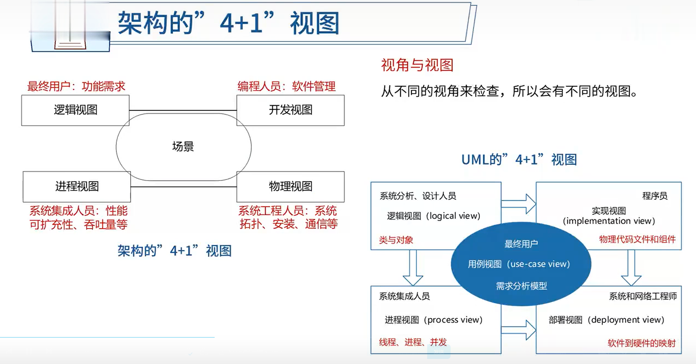

20多分

# 软件架构的概念

1. 软件架构为软件系统提供了一个结构、行为和属性的高级抽象。
2. 软件架构风格是特定应用领域的惯用模式，架构定义一个词汇表和一组约束。

---

架构设计就是需求分配，即将满足需求的职责分配到组件上

# 软件架构风格（√）

架构风格反映了领域中众多系统所共有的结构和语义特性，并指导如何将各个构件有效地组织成一个完整的系统

**五大架构风格**

## 数据流风格

子风格：批处理、**管道-过滤器**

优点：

1. 松合[高内聚-低合]
2. 良好的重用性/可维护性;
3. 可扩展性(标准接口适配]
4. 良好的隐蔽性;
5. **支持并行。**

缺点：

1. **交互性较差;**
2. 复杂性较高;
3. 性能较差(每个过滤器都需要解析与合成数据)

## 调用/返回风格

子风格：**主程序/子程序**、面向对象、层次结构

优点：

1. 良好的重用性，只要接口不变可用在其它处;
2. 可维护性好;
3. 可扩展性好，支持递增设计

缺点：

1. 并不是每个系统都方便分层;1.
2. 很难找到一个合适的、正确的层次抽象方法;
3. 不同层次之间耦合度高的系统很难实现

## 独立构件风格

子风格：进程通信、事件驱动系统(**隐式调用**)

优点：

1. 松耦合。
2. 良好的重用性/可修改性/可扩展性

缺点：

1. 构件放弃了对系统计算的控制。一个构件触发一个事件时，不能确定其他构件是否会响应它。而且即使它知道事件注册了哪些构件的过程，它也不能保证这些过程被调用的顺序。
2. 数据交换的问题。
3. 既然过程的语义必须依赖于被触发事件的上下文约束，关于正确性的推理就存在问题。

## 虚拟机风格

子风格：**解释器**、规则系统

优点：

可以灵活应对自定义场景

缺点：

复杂度较高

## 仓库风格

子风格：数据库系统、**黑板系统**、超文本系统

**以数据为中心**

优点：

可更改性和可维护性;可重用的知识源;容错性和健壮性

缺点：

测试困难;不能保证有好的解决方案;难以建立好的控制策略;低效;开发困难;缺少并行机制

**闭环控制结构**

适合于嵌入式系统，用于解决简单闭环控制问题

经典应用：空调温控，定速巡航。

**C2架构风格**

- **构件和连接件都有一个顶部和一个底部。**
- 构件的顶部要连接到连接件的底部，构件的底部要连接到连接件的顶部，构件之间不允许直连。
- 一个连接件可以和任意数目的其他构件和连接件连接。
- 当两个连接件进行直接连接时，必须由其中一个的底部到另一个的顶部。

## 层次架构风格 C/S B/S

**两层C/S -> 三层C/S -> 三层B/S -> 混合架构风格**

三层B/S：

- 表现层

  MVC -> MVP -> MVVM

- 中间层

- 数据访问层

- 数据架构层

## RIA架构风格

## 基于服务的架构（SOA）

服务构件粗粒度，传统构件细粒度居多

服务构件的接口是标准的，主要是WSDL接口，传统构件常以具体API形式出现

服务构件的实现与语言无关，传统构件绑定某种特定语言

服务构件可以通过构件容器提供QoS的服务，传统构件完全由程序代码直接控制

## 微服务

​	微服务架构是一种架构模式，它提倡将单一应用程序划分成一组小的服务，服务之间互相协调、互相配合，为用户提供最终价值。每个服务运行在其独立的进程中，服务与服务间采用轻量级的通信机制互相沟通(通常是基于HTTP协议的RESTful API)。每个服务都围绕着具体业务进行构建，并且能够被独立的部署到生产环境、类生产环境等。另外，应当尽量避免统一的、集中式的服务管理机制，对具体的一个服务而言，应根据业务上下文，选择合适的语言、工具对其进行构建。

# 架构描述语言ADL

ADL是这样一种形式化语言，它在底层语义模型的支持下，为软件系统的概念体系结构建模提供了具体语法和概念框架。

**ADL的三个基本元素**

- **构件**：计算或数据存储单元。
- **连接件**：用于构件之间交互建模的体系结构构造块及其支配这些交互的规则。
- **架构配置**：描述体系结构的构件与连接件的连接图。

# 特定领域软件架构

基本活动：

- 领域分析

- 领域设计

- 领域实现

领域分析机制：

- 领域专家
- 领域分析人员
- 领域设计人员
- 领域实现人员

# 基于架构的软件开发

基于架构的软件开发（ABSD）方法是架构驱动，即强调由**业务、质量和功能需求**的组合驱动架构设计。

ABSD方法有三个基础。第一个基础是**功能的分解**。在功能分解中，ABSD方法使用已有的基于模块的内聚和耦合技术，第二个基础是**通过选择架构风格来实现质量和业务需求**，第三个基础是**软件模板的使用**

视角与视图：从**不同的视角来检查**，所以会有**不同的视图**

用例用来**捕获功能需求**、特定场景用来**捕获质量需求**

## 开发方法

1. 架构需求
2. 架构设计
3. 架构文档化
4. 架构复审
5. 架构实现
6. 架构演化

# 软件质量属性（√）

## 性能

​	性能 (performance) 是指**系统的响应能力**，即要经过多长时间才能对某个事件做出响应，或者在某段时间内系统所能处理的事件的个数

- 资源需求
  - 提高计算效率
  - 减少计算开销
  - 管理事件率
  - 控制采样频率
- 资源管理
  - 引入并发
  - 维持多个副本
  - 增加可用资源
- **资源仲裁**
  - **资源调度策略:**
    - 先进/先出
    - 固定优先级
    - 动态优先级
    - 静态调试

## 可靠性

## 可用性

​	可用性 (availability)是系统能够正常运行的**时间比例**。经常用两次故障之间的时间长度或在出现故障时系统能够恢复正常的速度来表示

- 错误检测
  - 命令/响应[Ping /Echo]
  - 心跳
  - 异常
- 错误恢复
  - 表决
    冗余[主动/被动]
    备件
- 错误预防
  - 进程监视器
  - 事务
  - 从服务器删除

## 安全性

​	安全性(security)是指系统在向合法用户提供服务的同时能够阻止非授权用户使用的企图或拒绝服务的能力。安全性又可划分为机密性、完整性、不可否认性及可控性等特性

- 抵抗攻击
  - 身份验证
  - 用户授权
  - 数据加密
  - 数据完整性
  - 限制暴露
  - 限制访问
- 检测攻击
  - 入侵检测
- 从攻击中恢复
  - 识别：**审计追踪**
  - 恢复：冗余[与可用性重叠]

## 可修改性

​	可修改性 (modifiability)是指能够快速地以较高的性能价格比对系统进行变更的能力。通常以某些具体的变更为基准，通过考察这些变更的代价衡量可修改性

- 局部化修改
  - 维持语义一致性
  - 预期期望的变更
  - 泛化模块
  - 限制可能的选择
  - 抽象通用服务
- 防止连锁反应
  - **隐藏信息**
  - 维持现有的接口
  - 限制通信路径
  - 使用仲裁者
- 推迟绑定时间
  - 运行时注册
  - 配置文件
  - 多态
  - 组件更换
  - 遵守已定义的协议

## 易用性
易用性关注的是对用户来说完成某个期望任务的容易程度和系统所提供的用户支持的种类

例如:

1. 界面友好
2. 新用户学习使用系统时间不超过2小时。

## 可测试性
软件可测试性是指通过测试揭示软件缺陷的容易程度

例如:

1. 提供远程调试接口,支持远程调试

## 功能性

## 可变性

## 互操作性

# 软件架构评估（√）

- **敏感点**是一个或多个构件 (和/或构件之间的关系) 的特性

- **权衡点**是影响多个质量属性的特性，是多个质量属性的敏感点。

- **风险点**是指架构设计中潜在的、存在问题的架构决策所带来的隐患

- **非风险点**是指不会带来隐患，一般以“XXX要求是可以实现(或接受)的”方式表达

例如:

(1)对交易请求处理时间的要求将影响系统的数据传输协议和处理过程的设计;（敏感点）

(2)假设每秒中用户交易请求的数量是10个，处理请求的时间为30毫秒，则“在1秒内完成用户的交易请求”这一要求是可以实现的;（非风险点）

(3)目前对系统信用卡支付业务逻辑的描述尚未达成共识，这可能导致部分业务功能模块的重复影响系统的可修改性;（风险点）

(4)更改加密的级别将对安全性和性能产生影响。（权衡点）

## 软件架构评估方法

- 问卷调查
- **场景**
  - **软件架构分析法(SAAM)**
    - 问题描述
    - 需求说明
    - 架构描述
  - **架构权衡分析法(ATAM)**
    - 场景和需求收集
    - 架构师图和场景实现
    - 属性模型构造和分析
    - 折中
  - 成本效益分析法
- 度量

# 软件产品线

# 构件与中间件技术（√）

定义：软件构件是一种组装单元，它具有规范的接口规约和显式的语境依赖。软件构件可以被独立地部署并由第三方任意地组装

构件复用：

复用的**维度**

- **水平复用**：不分行业领域，通用
- **垂直复用**：分行业领域，专用

复用的**流程**

- 检索与提取构件
- 理解与评价构件
- 修改构件
- 组装构件

## 中间件

中间件是一类系统软件，**简化结构、屏蔽差异、利于复用**

采取中间件的优点：

- **面向需求**。即设计师集中精力于业务逻辑本身。
- **业务的分隔和包容性**。应用开发人员可以按照不同的业务进行功能的划分，体现为不同的接口或交互模式。
- **设计与实现隔离**。构件对外发生作用或构件间的交互，都是通过接口进行的，构件使用者只需要知道构件的接口，而不必关心其内部实现，这是设计与实现分离的关键。
- **隔离复杂的系统资源**。架构很重要的一个功能就是将系统资源与应用构件隔离，这是保证构件可复用甚至“即插即用”的基础，与中间件的意图也是一致的。
- **符合标准的交互模型**。中间件则实现了架构的模型，实现了标准的协议。
- **软件复用**。中间件提供了构件封装、交互规则、与环境的隔离等机制，这些都为软件复用提供了方便的解决方案。
- **提供对应用构件的管理**。基于中间件的软件可以方便地进行管理，因为构件总可以通过标识机制进行划分。

## 构件标准

- COBRA
  - 伺服对象(Servant)：CORBA对象的真正实现，负责完成**客户端请求**。
  - 对象适配器(ObiectAdapter)：用于屏蔽ORB内核的实现细节，为服务器对象的实现者提供抽象接口，以便他们使用ORB内部的某些功能。
  - 对象请求代理 (Obiect Request Broker)：解释调用并负责查找实现该请求的对象，将参数传给找到的对象，并调用方法返回结果。客户方不需要了解服务对象的位置、通信方式、实现、激活或存储机制。
- COM
- EJB
  - **会话Bean**：实现业务逻辑，负责完成服务端与客户端的交互
  - **实体Bean**：实现O/R映射，简化数据库开发工作
  - **消息驱动Bean**：处理并发与异常访问

CORBA体系的主要内容包括以下几部分:

1. 对象请求代理 (Object Request Broker，ORB)。负责对象在分布环境中透明地收发请求和响应，它是构建分布对象应用、在异构或同构环境下实现应用间互操作的基础。

2. 对象服务(Obiect Services)。为使用和实现对象而提供的基本对象集合，这些服务应独立于应用领域。

3. 公共设施(Common Facilitites)。向终端用户提供一组共享服务接口，例如系统管理、组合文档和电子邮件等

4. 应用接口(ApplicationInterfaces)。由销售商提供的可控制其接口的产品相应于传统的应用层表示，处于参考模型的最高层。

5. 领域接口(Domainlnterfaces)。为应用领域服务而提供的接口，如OMG组织为PDM系统制定的规范

# Web架构设计（√）

