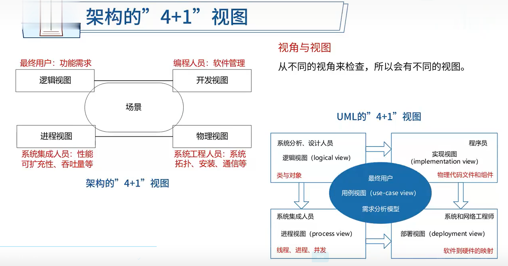
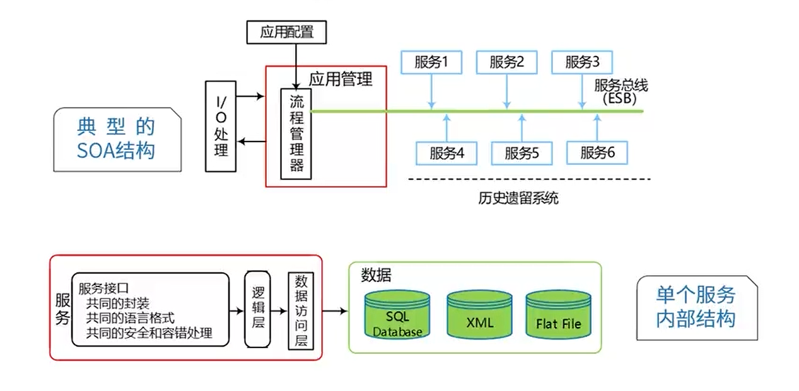
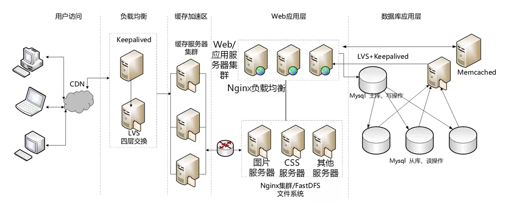

# 10.软件架构设计（20多分）

# 软件架构的概念

1. 软件架构为软件系统提供了一个**结构**、**行为**和**属性**的高级抽象。
2. 软件架构风格是特定应用领域的惯用模式，架构定义一个词汇表和一组约束。

---

架构设计就是**需求分配**，即将**满足需求的职责分配到组件上**

## 架构的4+1视图

# 软件架构风格（√）

软件架构风格是指描述特定软件系统组织方式的惯用模式。组织方式描述了系统的组成构件和这些构件的组织方式，惯用模式则反映众多系统共有的结构和语义。

架构风格反映了领域中众多系统所共有的结构和语义特性，并指导如何将各个构件有效地组织成一个完整的系统

**五大架构风格**

## 1. 数据流风格

子风格：批处理、**管道-过滤器**

优点：

1. 松耦合[高内聚-低耦合]
2. 良好的重用性/可维护性;
3. 可扩展性(标准接口适配]
4. 良好的隐蔽性;
5. **支持并行。**

缺点：

1. **交互性较差;**
2. 复杂性较高;
3. 性能较差(每个过滤器都需要解析与合成数据)

## 2. 调用/返回风格

子风格：**主程序/子程序**、面向对象、层次结构

优点：

1. 良好的重用性，只要接口不变可用在其它处;
2. 可维护性好;
3. 可扩展性好，支持递增设计

缺点：

1. 并不是每个系统都方便分层;
2. 很难找到一个合适的、正确的层次抽象方法;
3. 不同层次之间耦合度高的系统很难实现

## 3. 独立构件风格

子风格：进程通信、事件驱动系统(**隐式调用**)

优点：

1. 松耦合。
2. 良好的重用性/可修改性/可扩展性

缺点：

1. 构件放弃了对系统计算的控制。一个构件触发一个事件时，不能确定其他构件是否会响应它。而且即使它知道事件注册了哪些构件的过程，它也不能保证这些过程被调用的顺序。
2. 数据交换的问题。
3. 既然过程的语义必须依赖于被触发事件的上下文约束，关于正确性的推理就存在问题。

## 4. 虚拟机风格

子风格：**解释器**、规则系统

优点：

可以灵活应对自定义场景

缺点：

复杂度较高

## 5. 仓库风格

子风格：数据库系统、**黑板系统**、超文本系统

**以数据为中心**

优点：

可更改性和可维护性；可重用的知识源；容错性和健壮性

缺点：

测试困难；不能保证有好的解决方案；难以建立好的控制策略；低效;开发困难；**缺少并行机制**

## 闭环控制结构（过程控制）

适合于嵌入式系统，用于解决简单闭环控制问题

经典应用：空调温控，定速巡航。

**C2架构风格**

- **构件和连接件都有一个顶部和一个底部。**
- 构件的顶部要连接到连接件的底部，构件的底部要连接到连接件的顶部，构件之间不允许直连。
- 一个连接件可以和任意数目的其他构件和连接件连接。
- 当两个连接件进行直接连接时，必须由其中一个的底部到另一个的顶部。

## 层次架构风格 C/S B/S

- 两层C/S：客户端、服务器

  优点：客户应用和服务器构件分别运行在不同的计算机上

  缺点：

  - 开发成本较高
  - **客户端程序设计复杂**
  - 信息内容和形式单一
  - 用户界面风格不一
  - **软件移植困难**
  - **软件维护和升级困难**
  - 新技术不能轻易应用

-  三层C/S：客户端、应用服务器、数据库服务器

- B/S：浏览器、服务器

  - 缺乏动态页面支持能力
  - 系统拓展能力差
  - **安全性难以控制**
  - 响应速度不足
  - 数据交互性不强

- 混合架构风格

  企业内用C/S，企业外用B/S，安全

  

**两层C/S -> 三层C/S -> B/S -> 混合架构风格**

**三层B/S：**表示层、功能层、数据层

- 表现层

  MVC -> MVP -> MVVM

- 中间层

- 数据访问层

- 数据架构层

**RIA架构风格**

## 基于服务的架构（SOA）

1. 服务提供者
2. 服务请求者

服务是一种为了满足某项业务需求的操作、规则等的逻辑组合，它包含一系列有序活动的交互，为实现用户目标提供支持。

- 松散耦合
- 粗粒度
- 标准化接口

**基于服务的构件与传统构件的区别有四点：**

1. 服务构件**粗粒度**，传统构件细粒度居多
2. 服务构件的**接口是标准**的，主要是WSDL接口，传统构件常以具体API形式出现
3. 服务构件的实现与语言无关，传统构件绑定某种特定语言
4. 服务构件可以通过构件容器提供QoS的服务，传统构件完全由程序代码直接控制

## 微服务

​	**微服务架构是一种架构模式**，它提倡将单一应用程序划分成**一组小的服务**，服务之间互相协调、互相配合，为用户提供最终价值。每个服务运行在其独立的进程中，服务与服务间采用轻量级的通信机制互相沟通(通常是基于HTTP协议的RESTful API)。每个服务都围绕着具体业务进行构建，并且能够被独立的部署到生产环境、类生产环境等。另外，应当尽量避免统一的、集中式的服务管理机制，对具体的一个服务而言，应根据业务上下文，选择合适的语言、工具对其进行构建。

**微服务与 SOA**：

| 微服务                       | SOA                                         |
| ---------------------------- | ------------------------------------------- |
| 能拆分的就拆分               | 是整体的，服务能放一起的都放一起            |
| 纵向业务划分                 | 是水平分多层                                |
| 由单一组织负责               | 按层级划分不同部门的组织负责                |
| 细粒度                       | 粗粒度                                      |
| 两句话可以解释明白           | 几百字只相当于SOA的目录                     |
| 独立的子公司                 | 类似大公司里面划分了一些业务单元 (BU)       |
| 组件小                       | 存在较复杂的组件                            |
| 业务逻辑存在于每一个服务中   | 业务逻辑横跨多个业务领域                    |
| 使用轻量级的通信方式，如HTTP | 企业服务产总线(ESB)充当了服务之间通信的角色 |

# 架构描述语言ADL

ADL是这样一种形式化语言，它在底层语义模型的支持下，为软件系统的概念体系结构建模提供了具体语法和概念框架。

**ADL的三个基本元素**

- **构件**：计算或数据存储单元。
- **连接件**：用于构件之间交互建模的体系结构构造块及其支配这些交互的规则。
- **架构配置**：描述体系结构的构件与连接件的连接图。

# 特定领域软件架构（DSSA）

基本活动：

- 领域分析

- 领域设计

- 领域实现

领域分析机制：

- 领域专家：有经验的用户、从事该领域中系统的需求分析、设计、实现以及项目管理的有经验的软件工程师等。
- 领域分析人员：领域分析人员应由具有知识工程背景的有经验的系统分析员来担任。
- 领域设计人员：领域设计人员应由有经验的软件设计人员来担任
- 领域实现人员：领域实现人员应由有经验的程序设计人员来担任。

# 基于架构的软件开发方法

基于架构的软件开发（ABSD）方法是架构驱动，即强调由**业务、质量和功能需求**的组合驱动架构设计。

ABSD方法有三个基础。第一个基础是**功能的分解**。在功能分解中，ABSD方法使用已有的基于模块的内聚和耦合技术，第二个基础是**通过选择架构风格来实现质量和业务需求**，第三个基础是**软件模板的使用**

视角与视图：从**不同的视角来检查**，所以会有**不同的视图**

用例用来**捕获功能需求**、特定场景用来**捕获质量需求**

## 开发过程

1. 架构需求
2. 架构设计
3. 架构文档化
4. 架构复审
5. 架构实现
6. 架构演化

# 软件质量属性（√）

## 1. 性能

​	性能 (performance) 是指**系统的响应能力**，即要经过多长时间才能对某个事件做出响应，或者在某段时间内系统所能处理的事件的个数

例如：

1. 同时支持1000并发
2. 响应时间小于1s
3. 显示分辨率达到4K

**性能战术：**

- 资源需求
  - 提高计算效率
  - 减少计算开销
  - 管理事件率
  - 控制采样频率
- 资源管理
  - 引入并发
  - 维持多个副本
  - 增加可用资源
- **资源仲裁**
  - **资源调度策略:**
    - 先进/先出
    - 固定优先级
    - 动态优先级
    - 静态调试

## 2. 可用性/可靠性

​	可用性 (availability)是系统能够正常运行的**时间比例**。经常用两次故障之间的时间长度或在出现故障时系统能够恢复正常的速度来表示

例如:

1. 主服务器故障，1分钟内切换至备用服务器
2. 系统故障，1小时内修复;
3. 系统支持7×24小时工作。

 **可用性战术：**

- 错误检测
  - 命令/响应[Ping /Echo]
  - 心跳
  - 异常
- 错误恢复
  - 表决
    冗余[主动/被动]
    备件
- 错误预防
  - 进程监视器
  - 事务
  - 从服务器删除

## 3. 安全性

​	安全性(security)是指系统在向合法用户提供服务的同时能够阻止非授权用户使用的企图或拒绝服务的能力。安全性又可划分为机密性、完整性、不可否认性及可控性等特性

例如:

1. 可抵御SQL注入攻击;
2. 对计算机的操作都有完整记录;
3. 用户信息数据库授权必须保证99.9%可用

**安全性战术：**

- 抵抗攻击
  - 身份验证
  - 用户授权
  - 数据加密
  - 数据完整性
  - 限制暴露
  - 限制访问
- 检测攻击
  - 入侵检测
- 从攻击中恢复
  - 识别：**审计追踪**
  - 恢复：冗余[与可用性重叠]

## 4. 可修改性

​	可修改性 (modifiability)是指能够快速地以较高的性能价格比**对系统进行变更的能力**。通常以某些具体的变更为基准，通过考察这些变更的代价衡量可修改性

例如：

1. 更改系统报表模块，必须在2人周内完成;
2. 对Web界面风格进行修改，修改必须在4人月内完成;

**可修改性战术：**

- 局部化修改
  - 维持语义一致性
  - 预期期望的变更
  - 泛化模块
  - 限制可能的选择
  - 抽象通用服务
- 防止连锁反应
  - **隐藏信息**
  - 维持现有的接口
  - 限制通信路径
  - 使用仲裁者
- 推迟绑定时间
  - 运行时注册
  - 配置文件
  - 多态
  - 组件更换
  - 遵守已定义的协议

## 5. 易用性
易用性关注的是对用户来说完成某个期望任务的**容易程度**和系统所提供的用户支持的种类

例如:

1. 界面友好
2. 新用户学习使用系统时间不超过2小时。

## 6. 可测试性
软件可测试性是指通过测试揭示软件缺陷的容易程度

例如:

1. 提供远程调试接口，支持远程调试

# 软件架构评估（√）

- **敏感点**是一个或多个**构件** (和/或构件之间的关系) 的特性

- **权衡点**是影响**多个**质量属性的特性，是**多个质量属性**的敏感点。

- **风险点**是指架构设计中潜在的、存在问题的架构决策所带来的隐患

- **非风险点**是指不会带来隐患，一般以“XXX要求是可以实现(或接受)的”方式表达

例如:

(1)对交易请求处理时间的要求将影响系统的数据传输协议和处理过程的设计;（敏感点）

(2)假设每秒中用户交易请求的数量是10个，处理请求的时间为30毫秒，则“在1秒内完成用户的交易请求”这一要求是可以实现的;（非风险点）

(3)目前对系统信用卡支付业务逻辑的描述尚未达成共识，这可能导致部分业务功能模块的重复影响系统的可修改性;（风险点）

(4)更改加密的级别将对安全性和性能产生影响。（权衡点）

## 软件架构评估方法

1. 基于问卷调查的方式
2. 基于场景的方式
3. 基于度量的方式

**软件架构分析法(SAAM)**：最初用于分析架构可修改性，后扩展到其他质量属性

- 问题描述
- 需求说明
- 架构描述

**架构权衡分析法(ATAM)**：在SAAM的基础上发展起来的，主要针对性能、实用性、安全性和可修改性，在系统开发之前，对这些质量属性进行评价和折中。

- 场景和需求收集
- 架构师图和场景实现
- 属性模型构造和分析
- 折中

**成本效益分析法**

# 软件产品线

组成：

- 核心资源
- 产品集合

是否适合采用产品线开发方法关键在于企业是否**存在拥有共性领域模型**的产品集合。

建立方式：

|              |                           演化方式                           |                           革命方式                           |
| :----------: | :----------------------------------------------------------: | :----------------------------------------------------------: |
| 基于现有产品 | 基于现有产品架构设计产品线的架构，经演化现有构件，开发产品线构件 | 核心资源的开发基于现有产品集的需求和可预测的、将来需求的超集 |
|  全新产品线  |            产品线核心资源随产品新成员的需求而演化            |        开发满足**所有预期产品线成员**的需求的核心资源        |

- 将现有产品演化为产品线
- 用软件产品线替代现有产品集
- 全新软件产品线的演化
- 全新软件产品线的开发

**组织结构类型**

- 设立独立的核心资源小组

- 不设立独立的核心资源小组

- 动态的组织结构

要**成功实施产品线**，主要取决于以下因素

- **对该领域具备长期和深厚的经验**

- 一个用于构建产品的好的核心资源库

- 好的产品线架构

- 好的管理(软件资源、人员组织、过程) 支持

# 构件与中间件技术（√）

构件是一组通常需同时部署的原子构件

定义：软件构件是一种组装单元，它具有规范的接口规约和显式的语境依赖。软件构件可以**被独立地部署**并**由第三方任意地组装**

**构件复用：**

复用的**维度**：

- **水平复用**：不分行业领域，通用
- **垂直复用**：分行业领域，专用

复用的**流程**：

1. 检索与提取构件
2. 理解与评价构件
3. 修改构件
4. 组装构件
   - 功能
   - 数据
   - 面向对象

## 中间件

中间件是一类**构件**

中间件是一类系统软件，**简化结构、屏蔽差异、利于复用**

采取中间件的优点：

- **面向需求**。即设计师集中精力于业务逻辑本身。
- **业务的分隔和包容性**。应用开发人员可以按照不同的业务进行功能的划分，体现为不同的接口或交互模式。
- **设计与实现隔离**。构件对外发生作用或构件间的交互，都是通过接口进行的，构件使用者只需要知道构件的接口，而不必关心其内部实现，这是设计与实现分离的关键。
- **隔离复杂的系统资源**。架构很重要的一个功能就是将系统资源与应用构件隔离，这是保证构件可复用甚至“即插即用”的基础，与中间件的意图也是一致的。
- **符合标准的交互模型**。中间件则实现了架构的模型，实现了标准的协议。
- **软件复用**。中间件提供了构件封装、交互规则、与环境的隔离等机制，这些都为软件复用提供了方便的解决方案。
- **提供对应用构件的管理**。基于中间件的软件可以方便地进行管理，因为构件总可以通过标识机制进行划分。

## 构件标准

- COBRA
  - 伺服对象(Servant)：CORBA对象的真正实现，负责完成**客户端请求**。
  - 对象适配器(ObiectAdapter)：用于屏蔽ORB内核的实现细节，为服务器对象的实现者提供抽象接口，以便他们使用ORB内部的某些功能。
  - 对象请求代理 (Obiect Request Broker)：解释调用并负责查找实现该请求的对象，将参数传给找到的对象，并调用方法返回结果。客户方不需要了解服务对象的位置、通信方式、实现、激活或存储机制。
- COM
- EJB
  - **会话Bean**：**实现业务逻辑**，负责完成服务端与客户端的交互
  - **实体Bean**：**实现O/R映射**，简化数据库开发工作
  - **消息驱动Bean**：**处理并发与异常访问**

CORBA体系的主要内容包括以下几部分:

1. 对象请求代理 (Object Request Broker，ORB)。负责对象在分布环境中透明地收发请求和响应，它是构建分布对象应用、在异构或同构环境下实现应用间互操作的基础。

2. 对象服务(Obiect Services)。为使用和实现对象而提供的基本对象集合，这些服务应独立于应用领域。

3. 公共设施(Common Facilitites)。向终端用户提供一组共享服务接口，例如系统管理、组合文档和电子邮件等

4. 应用接口(ApplicationInterfaces)。由销售商提供的可控制其接口的产品相应于传统的应用层表示，处于参考模型的最高层。

5. 领域接口(Domainlnterfaces)。为应用领域服务而提供的接口，如OMG组织为PDM系统制定的规范

# Web架构设计（√）

- **高性能**
- 高可用
- 可维护
- 应变
- 安全

## 应用服务集群

### 负载均衡技术

#### 应用层的负载均衡

1. **http重定向**。HTTP重定向就是应用层的请求转发。用户的请求其实已经到了HTTP重定向负载均衡服务器，服务器根据算法要求用户重定向，用户收到重定向请求后，再次请求真正的集群。

   特点：实现简单，但性能较差。

2. **反向代理服务器**。在用户的请求到达反向代理服务器时 (已经到达网站机房)，由反向代理服务器根据算法转发到具体的服务器。常用的apache、nginx都可以充当反向代理服务器。

   特点：部署简单，但代理服务器可能成为性能的瓶颈。

#### 传输层的负载均衡

1. **DNS域名解析负载均衡**。DNS域名解析负载均衡就是在用户请求DNS服务器，获取域名对应的IP地址时，DNS服务器直接给出负载均衡后的服务器IP。

   特点：效率比HTTP重定向高，减少维护负载均衡服务器成本。但一个应用服务器故障，不能及时通知DNS，而且DNS负载均衡的控制权在域名服务商那里，网站无法做更多的改善和更强大的管理。

2. **基于NAT的负载均衡**。基于NAT的负载均衡将一个外部IP地址映射为多个IP地址，对每次连接请求动态地转换为一个内部节点的地址。

   特点：技术较为成熟，一般在网关位置，可以通过硬件实现。像四层交换机一般就采用了这种技术。

#### 负载均衡算法

1. **静态算法** (不考虑动态负载)
   1. **轮转**算法：轮流将服务请求(任务) 调度给不同的节点(即:服务器)
   2. **加权轮转**算法：考虑不同节点处理能力的差异。
   3. **源地址哈希**散列算法：根据请求的源IP地址，作为散列键从静态分配的散列表找出对应的节点。
   4. 目标地址哈希散列算法：根据请求目标IP做散列找出对应节点。
   5. **随机**算法：随机分配，简单，但不可控。

2. 动态算法(考虑动态负载)
   1. **最小连接数算法**：新请求分配给当前活动请求数量最少的节点，每个节点处理能力相同的情况下。
   2. 加权最小连接数算法：考虑节点处理能力不同，按最小连接数分配
   3. 加权百分比算法：考虑了节点的利用率、硬盘速率、进程个数等，使用利用率来表现剩余处理能力。

负载均衡实现：

1. 硬件负载均衡：F5
2. 软件负载均衡：**LVS、Nginx**、HAproxy

### 有状态与无状态

- **无状态服务**(stateless service) 对单次请求的处理，不依赖其他请求，也就是说，处理一次请求所需的全部信息，要么都包含在这个请求里，要么可以从外部获取到(比如说数据库)，服务器本身不存储任何信息。

- **有状态服务** (statefulservice) 则相反，它会在自身保存一些数据，先后的请求是有关联的。

## CDN

CDN的全称是Content Delivery Network，即内容分发网络。其基本思路是尽可能避开互联网上有可能影响**数据传输速度**和**稳定性的瓶颈**和环节，使**内容传输得更快、更稳定**。

XML与JSON

## XML

扩展标记语言(Extensible Markup Language,XML)，用于标记电子文件使其具有结构性的标记语言，可以用来标记数据、定义数据类型，是一种允许用户对自己的标记语言进行定义的源语言。

**XML的优点**

1. 格式统一，符合标准;
2. 容易与其他系统进行远程交互，数据共享比较方便

**XML的缺点**

1. XML文件庞大，文件格式复杂，传输占带宽
2. 服务器端和客户端都需要花费大量代码来解析XML，导致服务器端和客户端代码变得异常复杂且不易维护
3. 客户端不同浏览器之间解析XML的方式不一致，需要重复编写很多代码
4. 服务器端和客户端解析XML花费较多的资源和时间

## JSON

JSON (JavaScript object Notation)一种**轻量级的数据交换格式**，具有良好的可读和便于快速编写的特性。可在不同平台之间进行数据交换。

**JSON的优点**

1. 数据格式比较简单，易于读写，格式都是压缩的，占用带宽小
2. 易于解析，客户端JavaScript可以简单的通过eval()进行JSON数据的读取
3. 支持多种语言，包括ActionScript，C，C#，ColdFusion，Java，JavaScript,Perl，PHP，Python，Ruby等服务器端语言，便于服务器端的解析
4. 因为JSON格式能直接为服务器端代码使用，大大简化了服务器端和客户端的代码开发量，且完成任务不变，易于维护

**JSON的缺点**
没有XML格式这么推广得深入人心和使用广泛，没有XML那么通用。

## WEB应用服务器

**WEB服务器**：其职能较为单一，就是把浏览器发过来的Request请求，返回Html页面。
**应用服务器**：进行业务逻辑的处理。

- Apache:：Web服务器，市场占有率60%左右。它可以运行在几乎所有的Unix、Windows、Linux系统平台上。
- IIS：早期Web服务器，目前小规模站点仍有应用。
- Tomcat：开源、运行servlet和JSP Web应用软件的基于Java的Web应用软件容器。
- JBOSS：JBOSS是基于J2EE的开放源代码的应用服务器。一般与Tomcat或Jetty绑定使用。
- WebSphere：一种功能完善、开放的Web应用程序服务器，它是基于Java的应用环境，用于建立部署和管理Internet和Intranet Web应用程序。
- WebLogic：BEA WebLogic Server是一种多功能、基于标准的web应用服务器，为企业构建自己的应用提供了坚实的基础。
- Jetty：Jetty 是一个开源的servlet容器，它为基于Java的web容器。

## REST（表述性状态转移）

REST（Representational State Transfer，表述性状态转移）是一种只使用HTTP和XML进行基于Web通信的技术，可以降低开发的复杂性，提高系统的可伸缩性。

如:

http://www.educity.cn/orders/29127123134

**REST的5个原则**

1. 网络上的所有事物都被抽象为资源
2. 每个资源对应一个唯一的资源标识。
3. 通过通用的连接件接口对资源进行操作。
4. 对资源的各种操作不会改变资源标识。
5. 所有的操作都是无状态的。

## 响应式Web设计

响应式WEB设计是一种网络页面设计布局，其理念是：集中创建页面的图片排版大小，可以智能地根据用户行为以及使用的设备环境进行相对应的布局。

方法与策略

1. 采用流式布局和弹性化设计：使用相对单位设定百分比而非具体值的方式设置页面元素的大小。
2. 响应式图片：不仅要同比的缩放图片，还要在小设备上降低图片自身的分辨率。

## 关于中台

中台是一套结合互联网技术和行业特性，将企业核心能力以共享服务形式沉淀，形成“大中台、小前台”的组织和业务机制，供企业快速低成本的进行业务创新的企业架构。中台又可以进一步细分，比如业务中台，数据中台，XX中台。本质上，都是对企业通用能力在不同层面的沉淀，并对外能力开放

中台的践行者：
Supercell：芬兰移动游戏巨头，2015年世界游戏前10占5席，员工仅200多人，因使用中台具有小团队快速开发能力，后被腾讯86亿美金收购。
阿里：2015年参观Supercell，而后推行中台。

**中台：把传统的构件服务化、云化，利于业务扩展、演进**

区分业务中台和数据中台

**业务中台 VS 数据中台**

多个电商渠道使用一个下单服务，一个订单接口同时为多个前台系统提供服务。 -> 业务中台

多个前台系统，根据一个用户的手机号，获取对应的画像、用户的标签。 -> 数据中台

将多个支付通道，抽象建立成一个支付API，暴露给前台业务系统。 -> 业务中台

通过一个订单编号，来获取可能的商品推荐清单，从而做到交叉销售。 -> 数据中台

## Web系统分层

- 用户访问
- 负载均衡
- 缓存加速区
- Web应用层
- 数据库应用层

