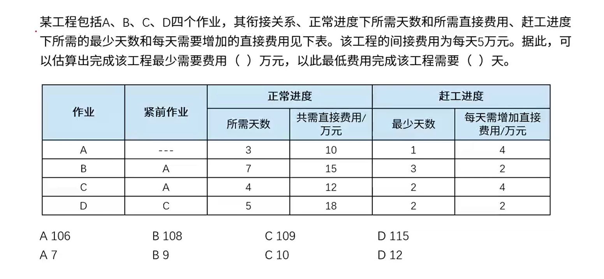

# 13.项目管理

# 项目管理基础

1. 项目是为提供一项独特产品、服务或成果所做的临时性努力
2. 项目的具体特点：临时性（一次性）；独特的产品、服务和成果；逐步完善；资源约束；目的性
3. 项目工作的三个主要目标（三约束）：**时间**、**成本**和**质量**
4. 项目经理的责任就是在时间、成本、质量和项目范围之间进行权衡以保证项目的成功

# 立项管理

**盈亏平衡分析：**

销售额 = 固定成本 + 可变成本 + 税费 + 利润[正常情况下]

销售额 = 定成本 + 可变成本 + 税费[**盈亏平衡时**]

可变成本：会跟着销售额发生变化（产品成本费，没卖出去就不算花掉）

# 范围管理

范围管理：确定项目的边界，即哪些工作是项目应该做的，哪些工作不应该包括在项目中。

- 范围计划编制
- 范围定义
  - **项目章程**
  - **项目范围管理计划**
  - **批准的变更申请**
  - 组织过程资产
- 创建WBS
  - WBS：便于估算，**明确范围**，防止需求蔓延。**最底层是工作包**
  - WBS字典
- 范围确认
- 范围控制

# 时间管理（√）

时间管理：也叫进度管理，就是采用科学的方法，确定进度目标，编制进度计划和资源供应计划，进行进度控制，在与质量、成本目标协调的基础上，实现工期目标

- 活动定义
- 活动排序
- 活动资源估算
- 活动历时估算
  - 专家判断法
  - **三点估算法**
    - $\frac{乐观时间 + 4*最可能时间 + 悲观时间}{6}$
  - 功能点估算法
  - 自上而下的估算
  - 自下而上的估算
- 制定进度计划
- 进度控制
  - 是否为关键活动
  - 偏差是否大于总时差
  - 偏差是否大于自由时差
    赶工：增加资源
  - 快速跟进：活动并行执行

## 前导图法(PERT)

**单代号网络图，PDM**

|  ES  | 持续时间 |  EF  |
| :--: | :------: | :--: |
|      | 活动编号 |      |
|  LS  |  总时差  |  LF  |

- ES：最早开始时间                      EF：最早完成时间
- LS：最迟开始时间                      LF：最迟完成时间

**双代号网络图，ADM**

## 关键路径法

关键路径法是在制定进度计划时使用的一种进度网络分析技术。关键路径法沿着项目进度网络路线进行正向与反向分析，从而计算出所有计划活动理论上的最早开始与完成日期、最迟开始与完成日期，不考虑任何资源限制

总时差(松弛时间：在不延误总工期的前提下，该活动的机动时间。活动的总时差等于该活动最迟完成时间与最早完成时间之差，或该活动最迟开始时间与最早开始时间之差

自由时差：在不影响紧后活动的最早开始时间前提下，该活动的机动时间

## 甘特图(Gantt)

- **优点**：甘特图直观、简单、容易制作，便于理解，能很清晰地标识出直到每一项任务的起始与结束时间，一般适用比较简单的小型项目，可用于WBS的任何层次、进度控制、资源优化、编制资源和费用计划。
- **缺点**：不能系统地表达一个项目所包含的各项工作之间的 复杂关系，难以进行定量的计算和分析，以及计划的优化等。

赶工进度：每减少一天需要增加的费用。如A减少1天需要4w，最多能减少2天，就是要10+8=18w

**PERT图与Gantt图对比：**

**PERT(项目评估与评审技术)图**是一种图形化的网络模型，描述一个项目中任务和任务之间的关系每个节点表示一个任务，通常包括任务编号、名称、开始和结束时间、持续时间和松弛时间。

**Gantt图**是一种简单的水平条形图，它以一个日历为基准描述项目任务，横坐标表示时间，纵坐标表示任务，图中的水平线段表示对一个任务的进度安排，线段的起点和终点对应在横坐标上的时间分别表示该任务的开始时间和结束时间，线段的长度表示完成该任务所需的时间。

PERT图主要描述不同任务之间的**依赖关系**；Gantt图主要描述不同任务之间的**重叠关系**

# 成本管理

成本管理：在整个项目的实施过程中，为确保项目在批准的预算条件下尽可能保质按期完成而对所需的各个过程进行管理与控制

- 成本估算
  - 自顶向下的估算
  - 自底向上的估算
  - 差别估算法
- 成本预算
  - 直接成本与间接成本
  - 管理储备
  - 零基准预算
- 成本控制
  - 挣值分析

## 挣值管理

- 计划工作量的预算成本(PV)

  PV=计划工作量X预算定额

- 已完成工作量的实际成本(AC)

- 已完成工作量的预算成本(EV)

  EV=已完成工作量X预算定额

- 完工预算(BAC)

  BAC = 完工时的 PV总和

- 进度偏差: SV =  EV - PV

- 成本偏差: CV = EV - AC

- 进度绩效指数:SPI = EV / PV

- 成本绩效指数:CPI = EV / AC

- 剩余工作的成本(ETC)

  非典型偏差：ETC = BAC - EV

  典型偏差：ETC = (BAC - EV) / CPI

- 完工估算(EAC)

  EAC=AC +ETC

# 软件质量管理

**质量保证**（QA）一般是每隔一定时间 (例如，每个阶段末) 进行的，主要通过系统的质量审计和过程分析来保证项目的质量。独特工具包括：**质量审计和过程分析**

**质量控制**（QC）是实时监控项目的具体结果，以判断它们是否符合相关质量标准，制定有效方案以消除产生质量问题的原因。

# 软件配置管理

配置管理是通过**技术和行政**手段对产品及其**开发过程**和**生命周期**进行控制、规范的一系列措施和过程。

1. 属于产品组成部分的工作成果，如需求文档、设计文档、源代码、测试用例等。
2. 属于项目管理和机构支撑过程域产生的文档，如工作计划、项目质量报告、项目跟踪报告等。这些文档虽然不是产品的组成部分，但是值得保存。

软件系统的文档可以分为用户文档和系统文档两类

- 用户文档

  - 功能描述
  - 安装文档
  - 使用手册
  - 参考手册
  - 操作员指南

- 系统文档

  系统文档是指从问题定义、需求说明到验收测试计划这样一系列和系统实现有关的文档。描述系统设计、实现和测试的文档对于**理解程序和维护程序**来说是非常重要的

## 配置项与配置库

关于配置项：

**基线配置项**（**可交付成果**）：需求文档、设计文档、源代码、可执行代码测试用例、运行软件所需数据等

**非基线配置项**：**各类计划** (如项目管理计划，进度管理计划) 、各类报告

关于配置库：

开发库(动态库、程序员库、工作库)：保存**正在开发**的配置实体。

受控库(主库)：**管理基线**。

产品库(静态库、产品库、软件仓库)：**最终产品**

## 软件工具

按软件过程活动将软件工具分为:

- **软件开发工具**：需求分析工具、设计工具、编码与排错工具。
- **软件维护工具**：版本控制工具 (VSS、CVS、SCCS、SVN)、文档分析工具、开发信息库工具、逆向工程工具、再工程工具。
- **软件管理和软件支持工具**：项目管理工具、配置管理工具、软件评价工具、软件开发工具的评价和选择。

# 项目管理计划

**项目管理计划**应该包含：

1. 项目背景
2. 项目经理、项目经理的主管领导、客户方联系人、客户方的主管领导，项目领导小组(项目管理团队)和项目实施小组人员
3. 项目的总体技术解决方案
4. 所选择的项目管理过程及执行水平
5. 对这些过程的工具、技术和输入输出的描述
6. 选择的项目的生命周期和相关的项目阶段
7. 项目最终目标和阶段性目标
8. 进度计划
9. 项目预算
10. 变更流程和变更控制委员会
11. 对于内容、范围和时间的关键管理评审，以便于确定悬留问题和未决决策

答案：

- 13-2：106 / 7

- 13-3：C   
