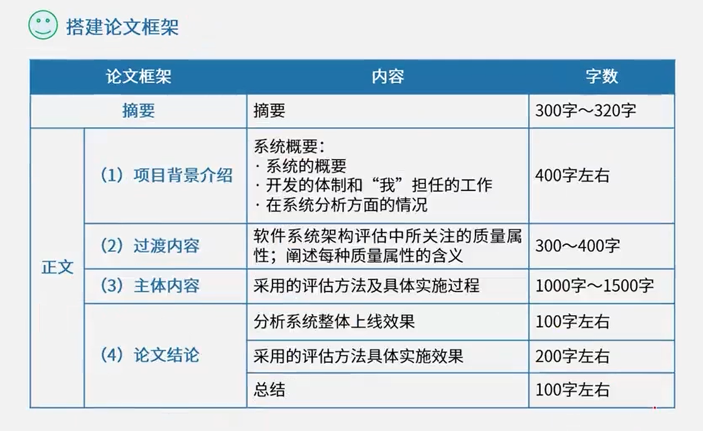

1. 找准核心论点(5分钟)
2. 搭建论文框架(10分钟)
3. 撰写摘要(15分钟)
4. 正文写作(90分钟)

1. 摘要

   

2. 项目背景介绍

3. 过渡内容

4. 主体内容

5. 论文结论

# 1. 论==软件系统建模方法==及其应用

1. 结构化建模

   结构化建模方法是以过程为中心的技术，可用于分析一个现有的系统以及定义新系统的业务需求。结构化建模方法所绘制的模型称为数据流图(DFD)。对于流程较为稳定的系统可考虑结构化建模方法。

2. 信息工程建模

   信息工程建模方法是一种以数据为中心，但过程敏感的技术，它强调在分析和研究过程需求之前，首先研究和分析数据需求。信息工程建模方法所创建的模型被称为实体联系图(ERD)。主要用于数据建模。

3. 面向对象建模

   面向对象建模方法将“数据”和“过程”集成到被称为“对象”的结构中，消除了数据和过程的人为分离现象。面向对象建模方法所创建的模型被称为对象模型。随着面向对象技术的不断发展和应用，形成了面向对象的建模标准，即UML(统一建模语言》。UML定义了几种不同类型的模型图，这些模型图以对象的形式共建一个信息系统或应用系统，是目前比较常用的建模方法。

4. 功能分解法

5. 基于构件的开发方法

# 2. 论==软件设计方法==及其应用

1. 结构化设计
2. 信息工程
3. 面向对象设计
4. 原型设计
5. 基于构件的开发方法

# 3. 论==软件设计模式==及其应用

1. 创建型

   工厂模式、抽象工厂模式、原型模式、单例模式、构件器模式

2. 结构型

   适配器模式、桥接模式、组合模式、装饰模式、外观模式、享元模式、代理模式

3. 行为型

   策略模式、责任链模式、命令模式、状态模式、模板方法模式、备忘录模式、迭代器模式、解释器模式、观察者模式、中介者模式、访问者模式

# 4. 论微服务架构及其应用

微服务架构**优点**：

1. 成本低
2. 可独立部署和升级
3. 可独立管理
4. 单一职责原则
5. 更容易分工
6. 支持负载均衡
7. 离散化数据管理
8. 具有更快的发布周期

# 5. 论==软件的可靠性==设计

可靠性包含：

- 成熟性
- 容错性
- 易恢复性

提高软件可靠性方法：

1. 避错设计

2. 检错设计

3. 容错设计

   N版本程序设计、恢复块设计、冗余设计等

# 6. 论软件质量保证及其应用

# 7. 论企业集成架构设计及其应用

企业集成架构属于企业集成平台技术的一种，用于解决企业内部信息孤岛的问题

可以分为

- 数据集成
- 应用集成
- 企业集成

# 8. 论==基于架构的软件设计方法(ABSD)==及应用

1. 架构需求阶段
2. 架构设计阶段
3. 架构文档化阶段
4. 架构复审阶段
5. 架构实现阶段
6. 架构演化阶段

# 9. 论==软件架构风格==

主流体系架构风格：

1. 数据流风格

   批处理、管道-过滤器

2. 调用/返回风格

   主程序/子程序、面向对象、层次架构风格

3. 独立构件风格

   进程通信、事件驱动

4. 虚拟机风格

   解释器、规则系统

5. 仓库风格

   数据库系统、黑板系统、超文本系统

6. 闭环控制风格

   二层C/S风格、三层C/S风格、B/S风格

# 10. 论==软件系统架构评估==及其应用

1. 调查问卷或检查法

2. 度量法

3. 场景评估法

   基于场景的件架构分析法(SAAM)、架构权衡分析法(ATAM)

# 11. 论数据湖技术及其应用

定义：

数据湖：数据湖是一个以**原始格式存储数据**的平台，不需要定义数据按原样存储数据，而无须事先对数据进行结构化处理或者定义数据模式

数据仓库：数据仓库是从各种外部数据源、各种内部应用程序中定期提取数据的大型存储库

# 12. 论湖仓一体架构及其应用

湖仓一体结合了数据湖和数据仓库的优势，它构建在数据湖低成本的数据存储架构之上，又继承了数据仓库的数据处理和管理功能

湖仓一体特征：

1. 事务支持
2. 数据的模型化和数据治理
3. 报表以及分析应用的支持
4. 数据类型扩展
5. 存储与计算分离，降低存储成本
6. 开放性
7. 减少数据冗余
8. 避免数据沼泽

# 13. 论软件维护方法及其应用

影响软件维护工作的因素有：可理解性、可测试性、可修改性、可靠性、可移植性、可使用性、效率等

1. 更正性维护
2. 适应性维护
3. 预防性维护
4. 完善性维护

# 系统建模

# 软件架构设计

# 系统设计

# 分布式系统设计

# 系统可靠性分析与设计

# 系统安全性和保密性设计