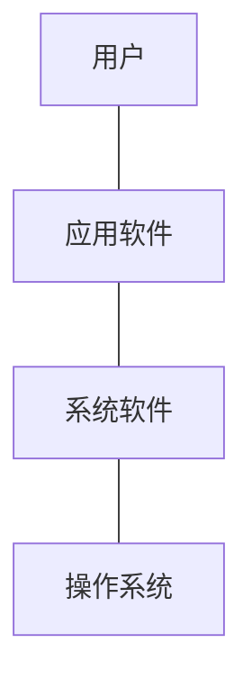
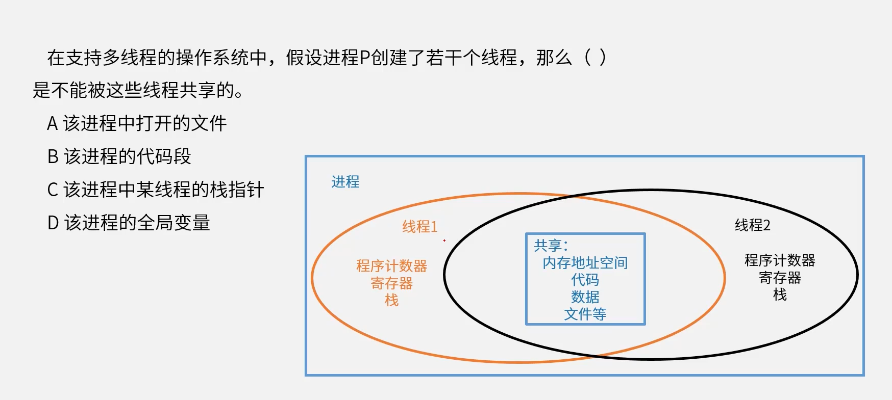
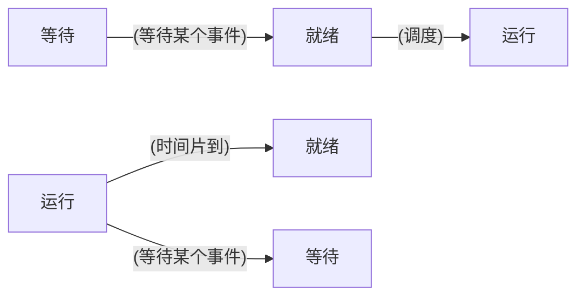
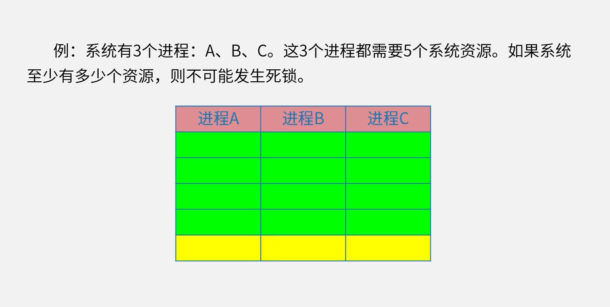
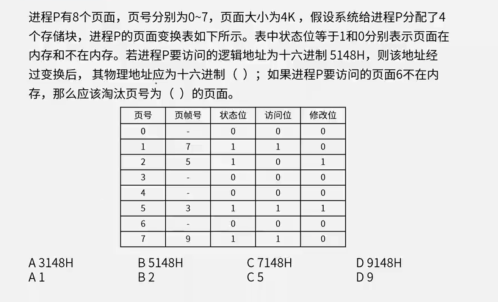
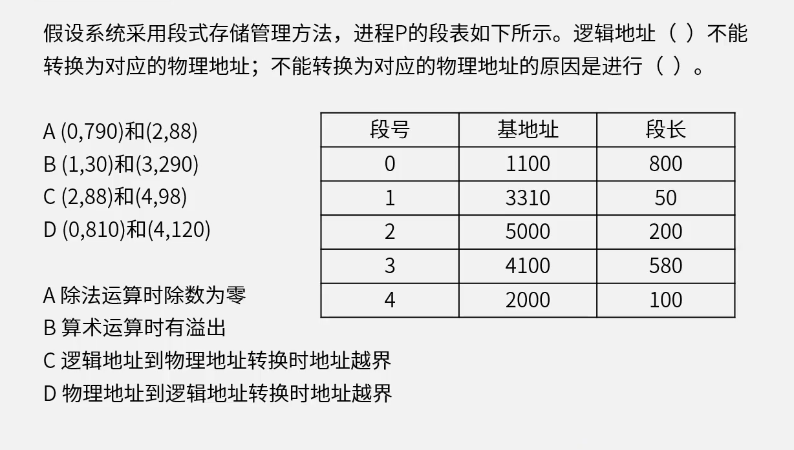
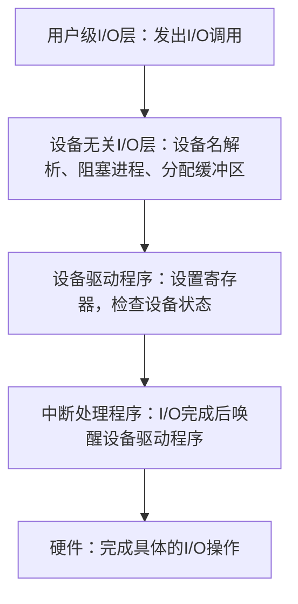
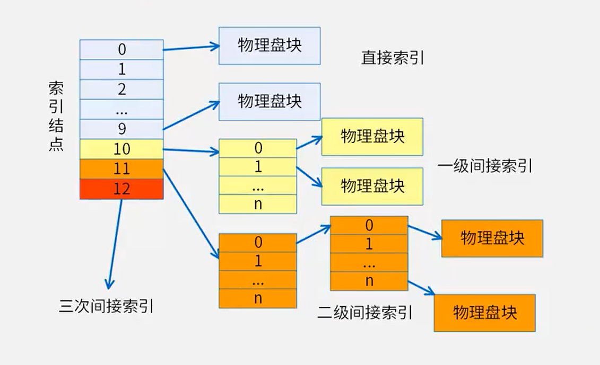
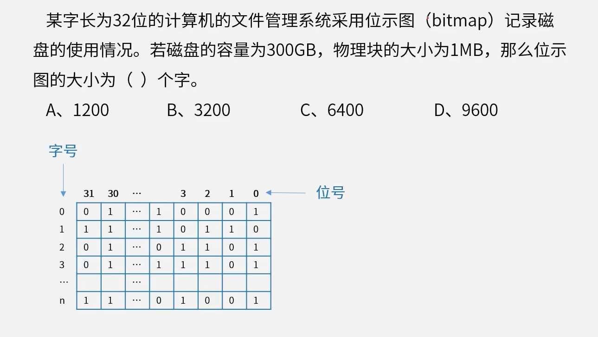

# 操作系统(2-6分)

没有操作系统，用户需要直接操作硬件

**操作系统**是计算机系统中的核心系统软件，负责管理和控制计算机系统中硬件和软件资源，合理地组织计算机工作流程和有效利用资源，在计算机与用户之间起接口的作用

## 操作系统层次结构

操作系统的作用：

1. 管理系统的硬件、软件、数据资源
2. 控制程序运行
3. 人机之间的接口
4. 应用软件与硬件之间的接口
   
1. 进程管理
2. 存储管理
3. 文件管理
4. 作业管理
5. 设备管理

操作系统**分类**：

1. 批处理操作系统

   单道批、多道批

2. 分时操作系统

   采用**时间片轮转**的方式为多个用户提供服务

3. **实时操作系统**

   实时控制系统和实时信息系统，交互能力要求不高，可靠性要求高

4. 网络操作系统

   方便有效共享网络资源，提供服务软件和有关协议的集合，Linux、Windows Server

5. 分布式操作系统

   任意两台计算机可以通过通信交换信息

6. 微型计算机操作系统

   Windows、Linux

7. **嵌入式操作系统**

   运行在智能芯片环境中

# 进程管理

进程是程序在一个数据集合上运行的过程，它是**系统进行资源分配和调度**的一个独立单位。它由程序块、进程控制块(PCB)和数据块三部分组成

## 进程状态

1. 运行状态
2. 就绪状态
3. 等待状态

等待状态不能直接切换到运行

## 进程调度（重要）

- 信号量S
- P操作  S = S - 1，**加锁**。若S < 0，表示当前没有资源分配给该进程，进程暂停执行，进入等待序列
- V操作  S = S + 1，**解锁释放资源**。若S <= 0，表示阻塞队列中有等待该资源的进程，唤醒等待队列中的第一个进程

初始S一般为1，这时候需要执行P操作让S=0，加锁；资源用完后执行V操作让S=1，解锁释放资源

当初始S为0时，这时候需要执行V操作让S=1，解锁释放资源；再给之后的资源执行P操作让S=0，加锁；

### 前趋图

**箭头流入方向是P操作**，**流出是V操作**（两个流出就是两个V操作）

### 死锁资源计算

13

解释：

最低执行资源：如果有5个资源，A利用5个资源执行完进程A，B再利用这5个资源继续执行
如果有12个资源，ABC各自占有4个资源，谁都不能执行完成，造成死锁
如果有13个资源，必定有一个占有5个资源，如果A占有5个资源，A执行完了，5个资源全部释放，BC也能顺利执行完毕而不会造成死锁

# 存储管理

## 页式存储

**页号，页帧号，状态位，访问位**

将程序与内存均划分为同样大小的块，以页为单位将程序调入内存

优点：利用率高，碎片小，分配及管理简单

缺点：增加了系统开销，可能产生抖动现象

- 逻辑地址和物理地址

  高级程序语言使用逻辑地址、运行状态使用物理地址

  逻辑地址转化成物理地址，页内地址不变

- **逻辑地址 = 页号 + 页内地址**（5148H：5H是页号，148H是页内地址）

- 物理地址 = 页帧号 + 页内地址（3148H：3H是页帧号，148H是页内地址）
-  状态位：1在内存中，0不在内存中

淘汰原则：

1. 访问位为0
2. 修改位为0

## 段式存储

**段号，基地址，段长**

按用户作业中的自然段来划分逻辑空间，然后调入内存，段的长度可以不一样

优点：多道程序共享内存，各段程序修改互不影响

缺点：内存利用率低，内存碎片浪费大

- 逻辑地址： （段号，段内偏移量）

- 物理地址 = （基址，段内偏移量）

- 段内偏移量不能超过段长，不然地址非法。

- **段页式存储**（段号+页号+页内地址）

  段页式存储：段式与页式的综合体。先分段，再分页。1个程序有若干个段，每个段中可以有若干页，每个页的大小相同，但每个段的大小不同。

## 磁盘管理

单缓冲区：

- **磁盘读取**与磁盘**送至用户区**域是**串行**的
- **磁盘读取**与**用户区处理**工作是**并行**的

双缓冲区：

- 磁盘读取与磁盘送至用户区域是并行的
- 磁盘读取与用户区处理工作是并行的

**存取时间 = 寻道时间 + 等待时间**，寻道时间是指磁头移动到磁道所需的时间，等待时间为等待读写的扇区转到磁头下方所用的时间

**读取磁盘数据**包括以下三个部分：

1. 找磁道时间
2. 旋转延迟时间
3. 传输时间

---

    某磁盘磁头从一个磁道移至另一个磁道需要10ms。文件在磁盘上非连续存放，逻辑上相邻数据块的平均移动距离为10个磁道，每块的旋转延迟时间及传输时间分别为100ms和2ms，则读取一个100块的文件需要（D）ms时间。  
    A.10200 
    B.11000 
    C.11200 
    D.20200

(10\*10+100+2)\*100

---

- 单缓冲区

- 双缓冲区

  能将更多的资源放入缓冲区，等在被执行。（在缓冲区1的资源被执行的时候，缓冲区2可以读取资源，即缓冲区双线程）

  

  

### 磁盘移臂调度算法

- 先来先服务

- 最短寻道优先

- 扫描算法

- 循环扫描

  

# 设备管理

## I/O管理软件

分层：分五层，为了屏蔽硬件，方便用户使用

- 硬件
- 中断处理程序
- 设备驱动程序
- 设备无关程序
- 用户进程

# 文件管理

## 文件目录结构

- 相对路径：不包含文件名
- 绝对路径：不包含文件名
- 全文件名：绝对路径 + 文件名

## 索引文件

- 索引文件结构

  索引结点 -> 物理块 -> 逻辑块

  - 直接地址索引
  - 一级地址索引
  - 二级地址索引

  索引节点是连续的，物理块不一定连续，逻辑块也是连续的（逻辑块号从0开始）

  

  

## 位视图

- 位视图

  一位对应一个物理块。0表示空闲，1表示占用

若无特殊说明，字号从1开始

# 嵌入式操作系统

嵌入式系统主要由嵌入式硬件平台、相关支撑硬件、嵌入式操作系统、支撑软件和应用软件组成。其中，嵌入性、专用性和计算机系统是嵌入式系统的三个核心要素

典型的嵌入式系统具有以下特点：

1. 系统专用性强
2. 系统实时性强
3. 软硬件依赖性强
4. 处理器专用
5. 多种技术紧密结合
6. 系统透明性
7. 系统资源受限

嵌入式操作系统特点：

1. 微型化
2. 代码质量高
3. 专业化
4. 实时性强
5. 可裁减、可配置

针对不同的硬件平台，操作系统通常建立在一个**硬件抽象层**(HAL)上，该层位于底层硬件和内核之间，为内核提供各种方便移植的宏定义接口，在不同的平台间移植时，只需要修改宏定义即可

# 实时操作系统（Real-Time OperatingSystem）

实时系统存在多种调度算法：

1. 优先级调度算法（非抢占式）
2. 抢占式优先级调度算法
3. 时间轮转调度算法
4. 最晚截止期调度算法
5. 最早截止期调度算法

在RTOS中，大多数的RTOS调度算法都是**抢占式**的

# 微内核操作系统

|          | 实质                                                         | 优点                                                         | 缺点                                                         |
| -------- | ------------------------------------------------------------ | ------------------------------------------------------------ | ------------------------------------------------------------ |
| 单体内核 | 将图形、设备驱动及文件系统等功能全部在内核中实现，运行在内核状态和同一地址空间。 | 减少进程间通信和状态切换的系统开销，获得**较高的运行效率**。 | **内核庞大**，占用资源较多且不易剪裁。 **系统的稳定性和安全性不好**。 |
| 微内核   | 只实现基本功能，将图形系统、文件系统、设备驱动及通信功能放在内核之 外。 | 内核精练，便于剪裁和移植。系统服务程序运行在用户地址空间，系统的**可靠性、稳定性和安全性较高**。 **可用于分布式系统** | 用户状态和内核状态需要频繁切换，从而导致**系统效率**不如单体内核。 |

# 参考答案：

- 进程管理

  2-7：C

  2-1：B、A

  2-2：A、C、B

  2-3：C、A

- 存储管理

  2-4：A、B     有8个页，首位逻辑号16进制，可以接受16个页面。故而逻辑号占比1位

  2-9：D、C
  
  2-6：i-addr[0]的 50 是物理块，指向的是逻辑块 0；1kb 除 4字节=256，故而选C、D
  
  2-10：字长32，选D
  
- 磁盘管理

  1-1： C 、B 

  ​	$3+3+(3*10+3+3)*10=366$ 3+3是第一个记录的处理时间，3*10寻址时间，3读取时间，3处理时间。
  
  1-2： D 、C
  
  1-3： B

