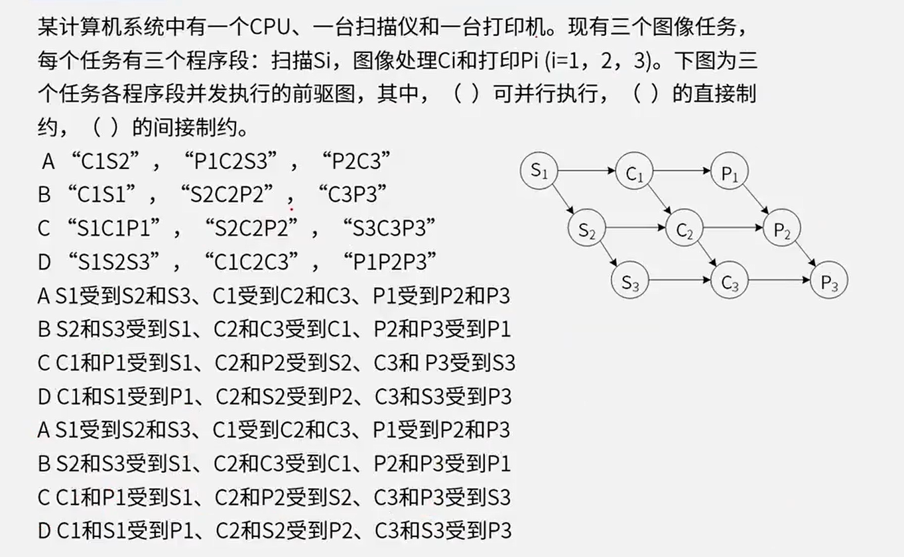
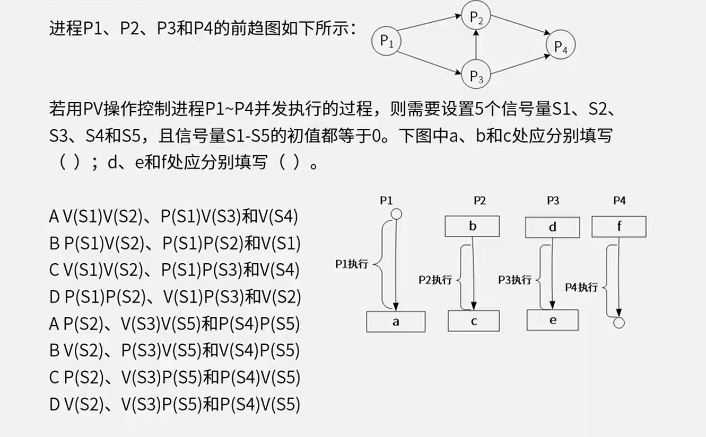

# 2.操作系统

**操作系统**是计算机系统中的核心系统软件，负责管理和控制计算机系统中硬件和软件资源，合理地组织计算机工作流程和有效利用资源，在计算机与用户之间起接口的作用。

操作系统**分类**：

1. 批处理操作系统
2. 分时操作系统
3. 实时操作系统
4. 网络操作系统
5. 分布式操作系统
6. 微型计算机操作系统
7. 嵌入式操作系统

# 进程

- 信号量S
- P操作  S = S - 1，若S < 0，表示当前没有资源分配给该进程，进程暂停执行，进入等待序列
- V操作  S = S + 1，若S<=0，表示阻塞队列中有等待该资源的进程，唤醒等待队列中的第一个进程

初始S一般为1，这时候需要执行P操作让S=0，加锁；资源用完后执行V操作让S=1，解锁释放资源

当初始S为0时，这时候需要执行V操作让S=1，解锁释放资源；再给之后的资源执行P操作让S=0，加锁；

# 存储管理

- **页式存储**（页号，页帧号，状态位，访问位）

  **逻辑地址 = 页号 + 页内地址**（5148H：5H是页号，148H是页内地址）

  物理地址 = 页帧号 + 页内地址（3148H：3H是页帧号，148H是页内地址）

  

- **段式存储**（段号，基地址，段长）

  逻辑地址： （段号，段内偏移量）

  物理地址 = （基址，段内偏移量）

  段内偏移量不能超过段长，不然地址非法。

- **段页式存储**（段号+页号+页内地址）

  段页式存储：段式与页式的综合体。先分段，再分页。1个程序有若干个段，每个段中可以有若干页，每个页的大小相同，但每个段的大小不同。

# 文件管理

- 索引文件结构

  索引结点 -> 物理块 -> 逻辑块

  - 直接地址索引
  - 一级地址索引
  - 二级地址索引

  索引节点是连续的，物理块不一定连续，逻辑块也是连续的

  

  

- 位视图

  一位对应一个物理块。0表示空闲，1表示占用

答案：

2-1：A、B

2-3：i-addr[0]的 50 是物理块，指向的是逻辑块 0，故而选C、D

