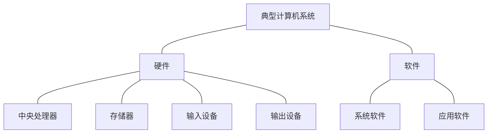

# 2. 计算机系统

- 硬件子系统
- 软件子系统

计算机网络：连接多个计算机，实现计算机间数据交换能力的网络设备，简称**网络**

## 2.2 计算机硬件

冯 · 诺依曼 计算机硬件

- **处理器**
  - CISC
  - RISC
- **存储器**
  - 片上缓存
  - 片外缓存
  - 主存
  - 外存
- **总线**
  - 内总线
  - 系统总线
  - 外部总线
- **接口**
- **外部设备**

## 2.3 计算机软件

计算机软件是指计算机系统中的程序及其文档，是计算任务的处理对象和处理规则的描述。

- 计算机软件通常分为两大类

  1. **系统软件**

     系统软件是为整个计算机系统配置的不依赖特定应用领域的通用软件。

  2. **应用软件**

     应用软件是指为某类应用需要或解决某个特定问题而设计的软件。

     应用软件还可以细分为以下两类：

     - 专用的应用软件
     - 通用的应用软件

### 操作系统

操作系统是计算机系统的资源管理者者，它包含对系统软、硬件资源实施管理的一组程序。

- 操作系统通常由**操作系统内核**(Kernel) 和其他许多**附加的配套软件**所**组成**

操作系统的**作用**：

1. 管理计算机中运行的程序和分配各种软硬件资源。
2. 为用户提供友善的人机界面。
3. 为应用程序的开发和运行提供一个高效率的平台。

操作系统的**特点**：

1. 并发性
2. 共享性
3. 虚拟性
4. 不确定性

操作系统**分类**：

1. 批处理操作系统
2. 分时操作系统
3. 实时操作系统
4. 网络操作系统
5. 分布式操作系统
6. 微型计算机操作系统
7. 嵌入式操作系统

### 数据库

数据库（DataBase）是指长期存储在计算机内、有组织的、统一管理的相关数据的**集合**。

数据库类型：

1. 关系型数据库
2. 键值数据库
3. 列存储数据库
4. 文档数据库
5. 搜索引擎数据库

---

- **关系型数据库系统**的设计

- **分布式数据库系统**

  分布式数据库系统是指地理上分散，而管理上又需要不同程度集中管理的需求而提出的一种数据管理信息系统。

  特性：

  - 集中控制性
  - 数据独立性
  - 数据冗余可控性
  - 场地自治性
  - 存取有效性

- 常用的数据库管理系统：

  - Oracle

  - MySql

### 文件系统

文件系统是操作系统中实现文件统一管理的一组软件和相关数据的集合，是专门负责管理和存取文件信息的软件机构。

**文件的结构：**

1. 从用户的角度看成为**文件的逻辑结构**：
   - 有结构的记录式文件
   - 无结构的流式文件
2. 从实现的角度看成为**文件的物理结构**：
   - 连续结构
   - 链接结构
   - 索引结构
   - 多个物理块的索引表

**文件的存取方法：**

- 顺序存取
- 随机存取

**文件存储空间的管理：**

- 空闲区表
- 位示图
- 空闲块链

### 网络协议

- 局域网协议（LAN）
- 广域网协议（WAN）
- 无线网协议
- 移动网协议

### 中间件

中间件：使应用软件的开发相对独立与计算机硬件和操作系统，并能在不同的系统上运行，实现相同的应用功能。

中间件分类：

1. 通信处理（消息）中间件
2. 事务处理（交易）中间件
3. 数据库存取管理中间件
4. Web服务器中间件
5. 安全中间件
6. 跨平台和架构的中间件
7. 专用平台中间件
8. 网络中间件

### 软件构件

构件又称为组件，是一个自包容、可复用的程序集。

构建组装模型的开发过程

### 应用软件

- 通用的应用软件
- 专用的应用软件

