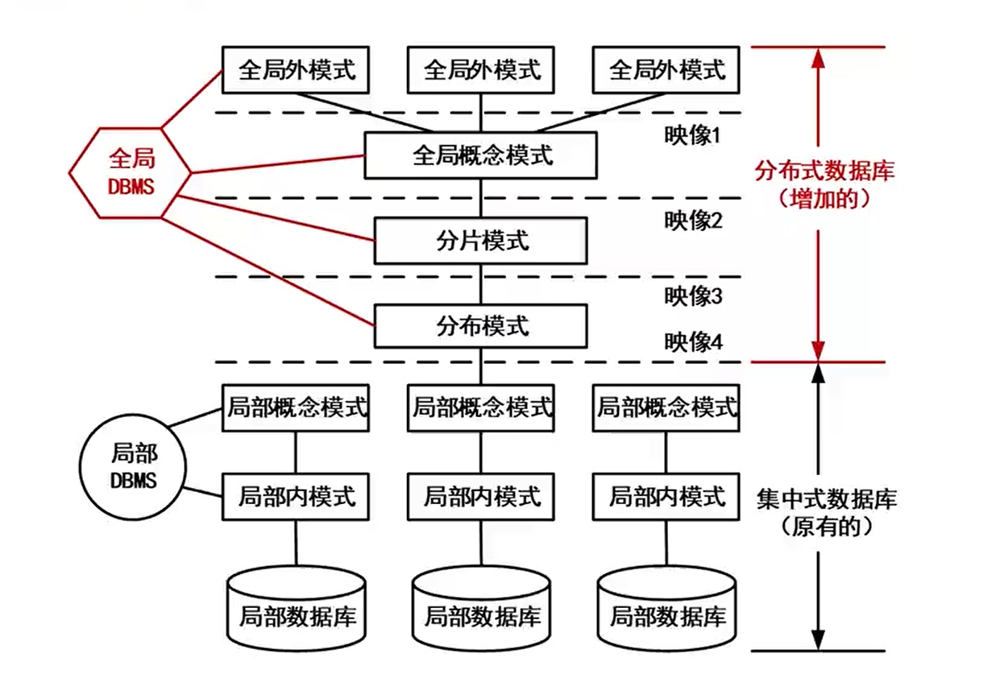
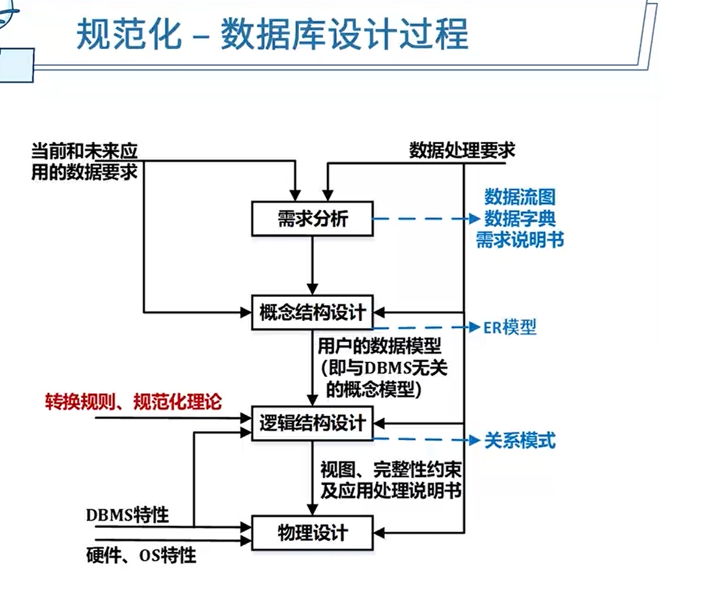
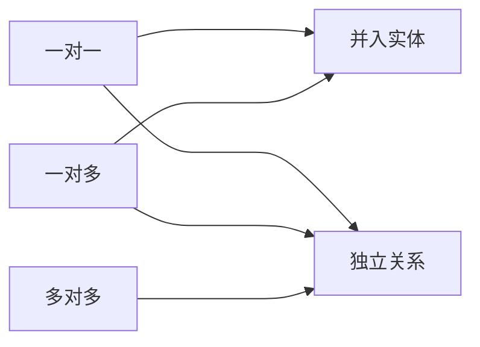

5分

# 数据库模式

- 外模式
- 概念模式
- 内模式

关系表类型

- 基本关系
- 查询表
- 视图表

# 分布式数据库

全局：

- 全局外模式

  最终被用户看到的

- 全局概念模式

  数据的整体逻辑结构

- 分片模式

  数据如何切割

- 分布模式

  数据如何放置

局部：

- 局部概念模式

  局部数据库的库表

- 局部内模式

  存放在哪里

- 局部数据库

## 数据分片

透明性

- 分片透明性

  - 水平分片：按**记录**分
  - 垂直分片：按**字段**分
  - 混合分片

- 复制透明性

  用户不用关心数据库在网络中各个节点的复制情况

- 位置透明性

  数据放在哪里，用户不用管

- 局部映像模型透明性（逻辑透明）

  提供数据到局部数据库的映像

**2PC 事务提交的两个阶段**

**表决阶段**，目标是形成一个共同的决定

**执行阶段**，目标是实现这个协调者的决定

**两条全局提交规则**

只要有一个参与者撤销事务，协调者就必须做出全局撤销决定

只有所有参与者都同意提交事务，协调者才能做出全局提交决定

# 数据库设计过程

1. 需求分析

   数据流图、数据字典、需求说明书

2. 概念结构设计

   ER模型

3. 逻辑结构设计

   转换规则、规范化理论

4. 物理设计

   硬件、OS特性

## 数据模型

数据模型三要素

数据结构、数据操作、数据的约束条件

- 层次模型
- 网状模型
- 面向对象模型
- 关系模型

## 完整性约束

**实体完整性**：规定基本关系的主属性不能取空值**主键**

**参照完整性**：关系与关系间的引用，**外键**

**用户自定义完整性约束**：应用环境决定

## 逻辑结构设计

一个实体型必须转换为一个关系模式

- 一对一

  可以并入任意一端

- 一对多

  并入多端

- 多对多

  不能做归并

# 关系代数

并(∪)、交(∩)、差(-)、笛卡尔积(×)、投影(π)、选择(σ)、连接(⋈)

# 规范化理论

## 候选键

将关系模式的函数依赖关系用“有向图”的方式表示

- 找入度为0的属性，并以该属性集合为起点，尝试遍历有向图，若能正常遍历图中所有结点，则该属性集即为关系模式的候选键
- 若入度为0的属性集不能遍历图中所有结点，则需要尝试性的将一些中间结点(既有入度，也有出度的结点)并入入度为0的属性集中，直至该集合能遍历所有结点，集合为候选键

**Armstrong公理**

- 自反律(Reflexivity) : 若Y∈X∈U，则X->Y成立。
- 增广律(Augmentation):若Z∈U且X->Y，则XZ->YZ成立
- 传递律(Transitivity):若X->Y且Y->Z，则X->Z成立。

根据A1，A2，A3这三条推理规则可以得到下面三条推理规则：

- 合并规则:由X->Y，X->Z，有X->YZ。 (A2，A3)
- 伪传递规则:由X->Y，WY->Z，有XW->Z。 (A2，A3)
- 分解规则:由X->Y及Z∈Y，有X->Z。 (A1，A3)

## 范式

部分依赖：A->C，AB->D，候选键是AB，A->C属于部份依赖。

- 第一范式 (1NF)

  在关系模式R中，当且仅当所有域只包含原子值，即每个属性都是**不可再分的数据项**，则称关系模式R是第一范式。

- 第二范式 (2NF)

    当且仅当实体E是第一范式 (1NF) ，且每一个非主属性完全依赖主键 (**不存在部分依赖**) 时，则称实体E是第二范式。

- 第三范式 (3NF)

    当且仅当实体E是第二范式 (2NF) ，且E中**没有非主属性传递依赖于码**时，则称实体E是第三范式。

- BC范式 (BCNF)

    设R是一个关系模式，F是它的依赖集，R属于BCNF当且仅当其F中每个依赖的决定因素**必定包含R的某个候选码**。

## 模式分解

- **保持函数依赖分解**

  设数据库模式ρ={R1，R2，··，Rk}是关系模式R的一个分解，F是R上的函数依赖集，ρ中每个模式Ri上的FD集是Fi。如果{F1, F2, ···, FK}与F是等价的 (即相互逻辑蕴涵)，那么称分解ρ保持FD。

  例：有关系模式R(A，B，C)，F= {A->B，B->C，A->C}，将其拆分为:R1 (A，B)，R2 (B，C) ，则保持函数依赖。

  

- **无损联接分解**：指将一个关系模式分解成若干个关系模式后，通过自然联接和投影等运算仍能还原到原来的关系模式

  **表格法**：出现同名属性列的才可以当主键，如R(A，B，C)，F= {A->B，A->C}，将其拆分为:R1 (A，B)，R2 (B，C) ，同名属性列是B，故而只能推导出B->A，B->C，此间关系不在{A->B，A->C}中，所以这样分解是有损联接分解。

  例：设R=ABC，F={A->B}，则分解ρ1={R1(AB)，R2(AC)}与分解ρ2{R1(AB)，R3(BC)是否都为无损分解?

  - ρ1同名列为A，R1(AB)满足A->B将B提上AC行得出ABC，故而ρ1是保持了函数依赖，并且是无损联接分解

  - ρ2同名列为B，B->A，B->C都不满足A->B，无法满足一行同时拥有ABC，ρ2是保持了函数依赖，可有损联接分解

# 反规范化

优点：

​	连接操作少、检索快、**统计快**，需要查的表减少，检索容易

缺点：

- 数据冗余，**需要更大存储空间**
- 插入、更新、删除操作开销更大、**数据不一致**
- 可能产生添加、修改、删除**异常**、更新和插入代码更难写

# 数据库分区、分表、分库

分区：存储分区

分表：如国内、国外分表

分库：不同数据库

|      |                             分区                             |                             分表                             |
| :--: | :----------------------------------------------------------: | :----------------------------------------------------------: |
| 共性 | 都针对数据表、都使用了分布式存储、都提升了查询效率、都低数据库的频繁I/O压力值 | 都针对数据表、都使用了分布式存储、都提升了查询效率、都低数据库的频繁I/O压力值 |
| 差异 |                       逻辑上还是一张表                       |                       逻辑上已是多张表                       |

分区：

- 范围分区

- 哈希分区
- 列表分区

分区的优点

1. 相对于单个文件系统或是硬盘，分区可以**存储更多的数据**
2. 数据管理比较方便，比如要清理或废弃某年的数据，就可以直接删除该日期的**分区数据即可**。
3. 精准定位分区查询数据，**不需要全表扫描查询**，大大提高数据检索效率。
4. 可跨多个分区**磁盘查询**，来提高查询的吞吐量。
5. 在涉及聚合函数查询时，可以很容易进行**数据的合并**。

# 数据库性能优化

性能、数据一致性、安全

## 集中式数据库优化

- **硬件系统**

  CPU，内存，I/0(硬盘，阵列) ，网络

- **系统软件**

  参数，如进程优先级，CPU使用权，内存使用

- **数据库设计**

  - 表与视图
  - 索引
  - SQL优化

- 应用软件

  数据库连接池

## 分布式数据库优化

- 通信代价
  - 全局查询树的变换
  - 多副本策略
  - 查询树的分解
  - 半连接与直接连接

## 数据库读写分离化

**主从数据库结构特点:**

1. 一般:一主多从，也可以多主多从。
2. 主库做写操作，从库做读操作。

**主从复制步骤:**

1. 主库(Master)更新数据完成前，将操作写binlog日志文件。
2. 从库(Salve) 打开I/0线程与主库连接，做binlog dump
   process，并将事件写入中继日志。
3. 从库执行中继日志事件，保持与主库一致。

## 用缓存缓解读库的压力

缓存与数据库的协作

数据读取

1. 根据key从缓存读取
2. 若缓存中没有，则根据key在数据库中查找
3. 读取到“值”之后，更新缓存

数据写入

1. 根据key值写数据库
2. 根据key更新缓存

## Redis

**Redis数据分片方案**

- 范围分片：按数据范围值来做分片
- 哈希分片：通过对key进行hash运算分片
- 一致性哈希分片：哈希分片的改进

**分布式存储方案**

- 主从(Master/Slave)模式：一主多从，故障时手动切换
- 哨兵(Sentinel) 模式：有哨兵的一主多从，主节点故障自动选择新的主节点
- 集群(Cluster)模式：分节点对等集群，分slots，不同slots的信息存储到不同节点。

**数据类型**

| 类型               |                             特点                             |                       示例                        |
| ------------------ | :----------------------------------------------------------: | :-----------------------------------------------: |
| String(字符)       |             存储二进制，任何类型数据，最大512MB              |              缓存，计数，共享Session              |
| Hash (字典)        | 无序字典，数组+链表，适合存对象Key对应一个**HashMap**。**针对一组数据** |             存储、读取、修改用户属性              |
| List (列表)        |              双向链表，有序，增删快，**查询慢**              | 消息队列，文章列表，记录前N个最新登录的用户ID列表 |
| Set (集合)         | 键值对**无序，唯一**增删查复杂度均为0(1)，支持交/并/差集操作 |              独立IP，共同好爱，标签               |
| Sorted Set(有集合) |           键值对**有序，唯一**，自带按权重排序效果           |                      排行榜                       |

**缓存淘汰策略**

<table style="text-align: center;">
    <tr>
        <td>淘汰作用范围</td>
        <td>机制名</td>
        <td>策略</td>
    </tr>
    <tr>
        <td>不淘汰</td>
        <td>noeviction</td>
        <td>禁止驱逐数据，内存不足以容纳新入数据时， 新写入操作就会报错。系统默认的一种淘汰策略。</td>
    </tr>
    <tr>
        <td rowspan="3">设置了过期时间的键空间</td>
        <td>volatile-random</td>
        <td>随机移除某个key</td>
    </tr>
    <tr>
        <td>volatile-lru</td>
         <td>优先移除最近未使用的key</td>
    </tr>
    <tr>
        <td>volatile-ttl</td>
         <td>ttl值小的key优先移除</td>
    </tr>
    <tr>
        <td rowspan="2">全键空间</td>
         <td>allkeys-random</td>
         <td>随机移除某个key</td>
    </tr>
    <tr>
        <td>allkeys-random</td>
         <td>优先移除最近未使用的key</td>
    </tr>
</table>

**Redis持久化**

Redis的持久化主要有两种方式：RDB和AOF。

**RDB**：传统数据库中快照的思想。指定时间间隔将数据进行快照存储。

**AOF**：传统数据库中日志的思想，把每条改变数据集的命令追加到AOF文件末尾，这样出问题了,可以重新执行AOF文件中的命令来重建数据集。

|   对比维度   |              RDB持久化               |                 AOF持久化                  |
| :----------: | :----------------------------------: | :----------------------------------------: |
|    备份量    | 重量级的**全量备份**，保存整个数据库 | 轻量级**增量备份**，一次只保存一个修改命令 |
| 保存间隔时间 |          保存**间隔时间长**          |          保存间隔时间短，默认1秒           |
|   还原速度   |            数据还原速度快            |               数据还原速度慢               |
|   阻塞情况   | save会阻塞，但bgsave或者自动不会阻塞 |     无论是平时还是AOF重写，都不会阻塞      |
|   数据体积   |           同等数据体积：小           |              同等数据体积：大              |
|    安全性    |    数据安全性：**低**，容易丢数据    |      数据安全性：**高**，根据策略决定      |

**Redis常见问题**

1. 缓存雪崩

   大部分缓存失效 -> 数据库崩溃

   当缓存里有大量的数据，并且大量数据同时失效，导致大量的请求直接到数据库导致的数据库崩溃。

   解决方案：

   1. 使用锁或队列：**保证不会有大量的线程对数据库一次性进行读写**，从而避免失效时大量的并发请求落到底层存储系统上
   2. 为key设置不同的缓存失效时间：在固定的一个缓存时间的基础上+随机一个时间作为缓存失效时间。
   3. 二级缓存：设置一个有时间限制的缓存+一个无时间限制的缓存。**避免大规模访问数据库**。

2. 缓存穿透

   查询无数据返回 -> 直接查数据库

   解决方案

   1. 如果查询结果为空，直接设置一个默认值存放到缓存，这样第二次到缓冲中获取就有值了。设置一个不超过5分钟的过期时间，以便能正常更新缓存。
   2. 设置布隆过滤器，将所有可能存在的数据哈希到一个足够大的bitmap中，一个定不存在的数据会被这个bitmap拦截掉，从而避免了对底层存储系统的查询压力。

3. 缓存预热

   系统上线后，将相关需要缓存数据直接加到缓存系统中。

   解决方案：

   1. 直接写个缓存刷新页面，上线时手工操作。
   2. 数据量不大时，可以在项目启动的时候自动进行加载
   3. 定时刷新缓存。

4. 缓存更新

   除Redis系统自带的缓存失效策略，常见采用以下两种:

   1. **定时清理过期的缓存**
   2. 当有用户请求过来时，再判断这个请求所用到的缓存是否过期，过期的话就去底层系统得到新数据并更新缓存。

5. 缓存降级

   降级的目的是**保证核心服务可用**，即使是有损的，而且有些服务是无法降级的(如电商的购物流程等)；在进行降级之前要对系统进行梳理，从而梳理出哪些必须保护，哪些可降级。

