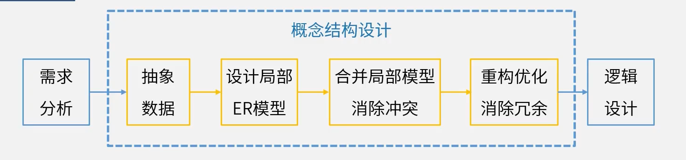
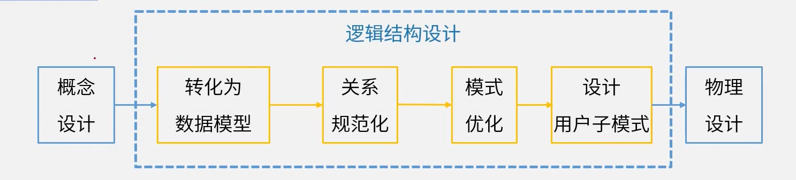
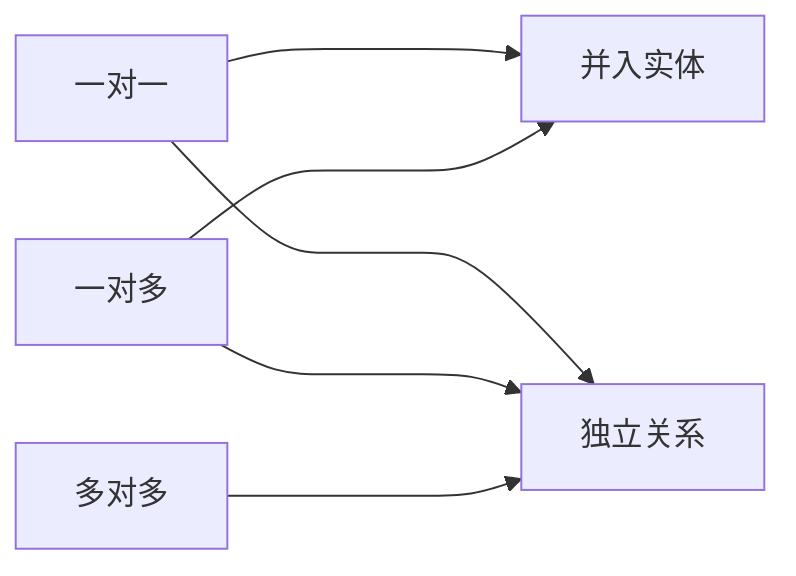
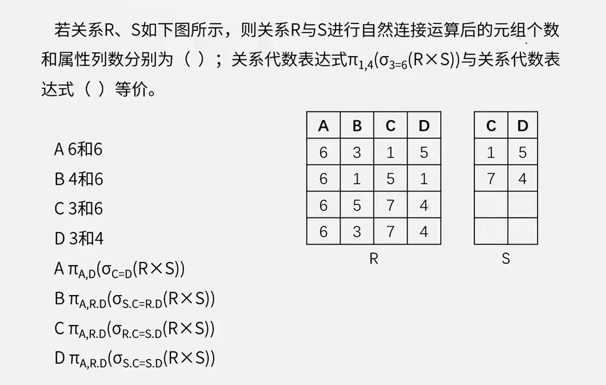
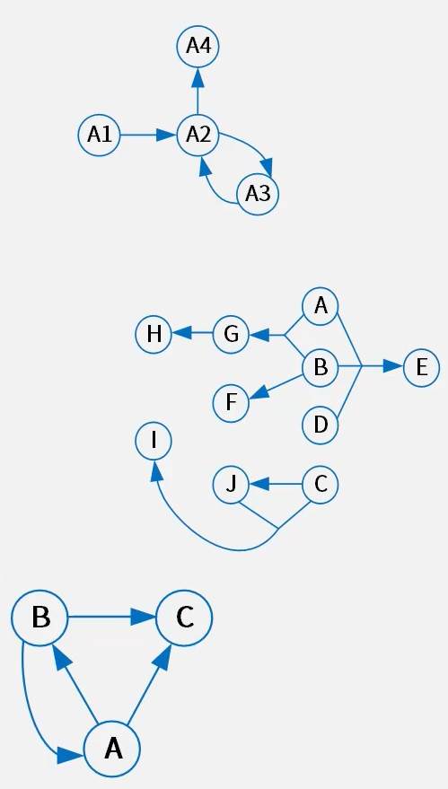

# 3.数据库设计基础知识（5分）

1. 集中式数据库系统
2. C/S、B/S结构
3. 分布式数据库
4. 并行数据库


# 分布式数据库

数据的集中控制性、数据独立性、数据冗余可控性、场地自治性、存取有效性

- 数据的集中控制性：局部独立地管理局部数据库

- 数据冗余可控性：在不同场地存储同一数据副本

  可以提高系统的**可靠性和可用性**


## 分布式数据库透明性

- **分片透明性**

  用户不必关心数据是如何分片的，他们对**数据的操作**在全局关系上进行

  - 水平分片：按**记录**分
  - 垂直分片：按**字段**分
  - 混合分片

- **复制透明性**

  用户不用关心数据库在网络中各个节点的复制情况，被复制的数据和更新都由系统自动完成

- **位置透明性**

  数据放在哪里，用户不用管，即数据分配到哪个站点存储对用户是透明的

- **局部映像模型透明性（逻辑透明）**

  提供数据到局部数据库的映像，用户不必关心局部DBMS支持哪种**数据模型**，使用哪种**数据操纵语言**，数据模型和操纵语言由系统自动完成


## 数据库三级模式结构

- 外模式（用户模式）

  **视图级**

  **逻辑独立性**：数据的逻辑结构发生变化后，需要修改外模式和概念模式之间的映像

- 概念模式（模式）

  **表级**、基本表

  **物理独立性**：数据的逻辑结构发生变化后，需要修改概念模式和内模式之间的映像

- 内模式

  **文件级**、物理文件


全局：

- 全局外模式

  最终被用户看到的

- 全局概念模式

  数据的整体逻辑结构

- 分片模式

  数据如何切割

- 分布模式

  数据如何放置

局部：

- 局部概念模式

  局部数据库的库表

- 局部内模式

  存放在哪里

- 局部数据库


**2PC 事务提交的两个阶段**

**表决阶段**，目标是形成一个共同的决定

**执行阶段**，目标是实现这个协调者的决定


**两条全局提交规则**

只要有一个参与者撤销事务，协调者就必须做出全局撤销决定

只有所有参与者都同意提交事务，协调者才能做出全局提交决定


关系表类型

- 基本关系
- 查询表
- 视图表


# 数据库设计过程

1. 需求分析

   **数据流图、数据字典、需求说明书**

2. 概念结构设计

   **ER模型**

3. 逻辑结构设计

   **转换规则、规范化理论**

4. 物理设计

   **硬件、OS特性、聚簇索引**


## 1.需求分析阶段

## 2.概念设计阶段

### 概念设计过程



1. 抽象数据

2. 设计局部ER模型

3. 合并局部模型消除冲突

   集成方法：

   - 多个局部E-R图一次集成
   - 逐步集成，用累加的方式一次集成两个局部E-R

   集成产生的冲突及解决办法:(针对同一对象)

   - 属性冲突：包括属性域冲突和属性取值冲突
   - 命名冲突：包括同名异义和异名同义
   - 结构冲突：包括同一对象在不同应用中具有不同的抽象，以及同一实体在不同局部E-R图中所包含的属性个数和属性排列次序不完全相同

4. 重构优化消除冗余

### E-R图（实体联系图）

E：实体

R：联系


#### 联系类型判断

两个不同实体集之间联系

- 一对一

- 一对多

- 多对多


## 3.逻辑结构设计



### 关系模式相关概念

#### 数据模型

数据模型三要素：数据结构、数据操作、数据的约束条件

- 层次模型
- 网状模型
- 面向对象模型
- **关系模型**

##### 关系模型

- 目或度：关系模式中**属性的个数**
- 候选码（[候选键](#候选键)）：唯一标识元组，且无冗余
- 主码（主键）：候选键的其中一个
- [主属性与非主属性](#主属性与非主属性)：组成候选码的属性就是主属性，其它的就是非主属性
- 外码（外键）
- 全码（ALL-Key）：关系模式的所有**属性组**是这个关系的候选码

##### 完整性约束

**实体完整性**：规定基本关系的主属性不能取空值**主键**

**参照完整性**：关系与关系间的引用，**外键**

**用户自定义完整性约束**：应用环境决定


### E-R图转关系模式

一个**实体**型必须转换为一个**关系模式**
联系转关系模式

- 一对一：

  **独立的关系模式**：并入两端主键及联系自身属性。（主键：任一端主键）

  **归并(任意一端)**：并入另一端主键及联系自身属性。（主键：保持不变）

- 一对多：

  **独立的关系模式**：并入两端主键及联系自身属性。（主键：多端主键）

  **归并(多端)**：并入另一端主键及联系自身属性。(主键：保持不变）

- 多对多：

  **独立的关系模式**：并入两端主键及联系自身属性。（主键:两端主键的组合键）

  不能做归并




### 关系代数

并(∪)、交(∩)、差(-)、笛卡尔积(×)、投影(π)、选择(σ)、连接(⋈)

- 笛卡尔积(×)

  - 列：二者之和
  - 行：二者乘积

- 投影(π)

  无条件选择

  ```sql
  select * from table where 1=1
  ```

- 选择(σ)

  有条件选择

  ```sql
  select * from table where columnName > 1
  ```

- 连接(⋈)

  条件相等的两个表
  
  ```sql
  select * from table1, table2
  where table1.a = table2.b
  ```
  
  - 列：二者之和 减 重复列数
  - 行：条件相等的行数




### 规范化理论

**Armstrong公理**

- 自反律(Reflexivity) : 若Y∈X∈U，则X->Y成立。
- 增广律(Augmentation):若Z∈U且X->Y，则XZ->YZ成立
- 传递律(Transitivity):若X->Y且Y->Z，则X->Z成立。

根据A1，A2，A3这三条推理规则可以得到下面三条推理规则：

- 合并规则:由X->Y，X->Z，有X->YZ。 (A2，A3)
- 伪传递规则:由X->Y，WY->Z，有XW->Z。 (A2，A3)
- 分解规则:由X->Y及Z∈Y，有X->Z。 (A1，A3)


冗余依赖：A->B、B->C、A->C，则A->C是冗余的。即传递函数依赖


#### 候选键

将关系模式的函数依赖关系用“有向图”的方式表示

- 找**入度为0**的属性，并以该属性集合为起点，尝试遍历有向图，若能正常遍历图中所有结点，则该属性集即为关系模式的候选键
- 若入度为0的属性集不能遍历图中所有结点，则需要尝试性的将一些**中间结点**(既有入度，也有出度的结点)并入入度为0的属性集中，直至该集合能遍历所有结点，集合为候选键



图1：此处A1的入度位0（0个箭头流向它），并且能推出所有节点，所以A1为候选键

图2：候选键为ABCD

图3：A能推出所有节点，B也能推出所有节点，所以A、B为均是候选键


#### 主属性与非主属性

组成候选码的属性就是主属性，其他的就是非主属性

图1的主属性为A1，图2的主属性为A、B、C、D


#### 范式

**部分依赖**：A->C，AB->D，候选键是AB，A->C属于部份依赖。

- 第一范式 (1NF)

  在关系模式R中，当且仅当所有域只包含原子值，即每个属性都是**不可再分的数据项**，则称关系模式R是第一范式。

  如，课程老师可以分为语文老师、数学老师，则属于可再分

- 第二范式 (2NF)

    当且仅当实体E是第一范式 (1NF) ，且每一个**非主属性==完全==依赖主键**，而不能只依赖于主键的一部分，则称实体E是第二范式。

    如候选键为AB，不能存在一个属性仅仅依赖于B，只能依赖于AB。所以只有一个主键的表一定会满足2NF

- 第三范式 (3NF)

    当且仅当实体E是第二范式 (2NF) ，且**非主属性**不能依赖于其他非主属性，**必须直接依赖于主键**（**消除传递依赖**），则称实体E是第三范式。

    当B->C，AC->B，故而候选键是AB和AC，当没有非主属性的时候至少满足3NF

- BC范式 (BCNF)

    设R是一个关系模式，F是它的依赖集，R属于BCNF当且仅当其F中每个依赖的决定因素**必定包含R的某个候选键**（即必须是某个主键）。
    
    当B->C，AC->B，故而候选键是AB和AC，满足3NF，但是B不等于AB，也不等于AC（即B不是主键），故而，不满足BCNF


#### 模式分解

- **保持函数依赖分解**

  设数据库模式ρ={R1，R2，··，Rk}是关系模式R的一个分解，F是R上的函数依赖集，ρ中每个模式Ri上的FD集是Fi。如果{F1, F2, ···, FK}与F是等价的 (即相互逻辑蕴涵)，那么称分解ρ保持FD。

  

  例：有关系模式R(A，B，C)，F= {A->B，B->C，A->C}，将其拆分为:R1 (A，B)，R2 (B，C) ，则保持函数依赖。

  

- **无损联接分解**：指将一个关系模式分解成若干个关系模式后，通过**自然联接和投影**等运算仍能还原到原来的关系模式

  1. 保持了函数依赖
  2. 通过自然连接可以还原
  
  
  
  **表格法**：出现同名属性列的才可以当主键，如R(A，B，C)，F= {A->B，A->C}，将其拆分为:R1 (A，B)，R2 (B，C) ，同名属性列是B，故而只能推导出B->A，B->C，此间关系不在{A->B，A->C}中，所以这样分解是有损联接分解。
  
  ---
  
  例：设R=ABC，F={A->B}，则分解 ρ1={ R1(AB)，R2(AC) } 与分解 ρ2{ R1(AB)，R3(BC) } 是否都为无损分解?
  
  - R1(AB)满足 A->B 保持了函数依赖，ρ1同名列为A，**A是决定因素**，将C提上AB行得出ABC，ρ1是无损联接分解；故而ρ1是保持了函数依赖，并且是无损联接分解
  
  - R1(AB)满足 A->B 保持了函数依赖，ρ2同名列为B，**B不是决定因素**，无法满足一行同时拥有ABC，ρ2是保持了函数依赖，可有损联接分解
  
  ---


### 反规范化

优点：

​	连接操作少、检索快、**统计快**，需要查的表较少，检索容易

缺点：

- 数据冗余，**需要更大存储空间**
- 插入、更新、删除操作开销更大、**数据不一致**
- 可能产生添加、修改、删除**异常**、更新和插入代码更难写


### 事务的特性

- 原子性：事务是原子的，**要么做，要么都不做**。
- 一致性：事务执行的结果必须**保证数据库从一个一致性状态变到另一个一致性状态**。
- 隔离性：**事务相互隔离**。当多个事务并发执行时，任一事务的更新操作直到其成功提交的整个过程，对其他事物都是不可见的。
- 持续性：一旦**事务成功提交**，即使数据库崩溃，其对数据库的更新操作也永久有效。


**事务并发**的问题：

1. 丢失更新

   多个事务同时的修改

2. 不可重复读

   验算数据之前，数据被其他事务修改

3. 读“脏”数据

   读取到**回滚**前的脏数据


**并发控制**：

对事务并发产生的问题解决方案：

使用封锁协议

1. S锁（共享锁、读锁）

   若事务T对数据对象A加上S锁，其他事务只能对A**再加S锁**，不能再对A添加X锁。

2. X锁（排他锁、独占锁、写锁）

   若事务T对数据对象A加上X锁，其他事务**不能**再对A添加任意锁


## 4.物理设计


# 数据库分区、分表、分库

分区：存储分区

分表：如国内、国外分表

分库：不同数据库

<table style="text-align:center;">
    <tr>
        <td></td>
        <td>分区</td>
        <td>分表</td>
    </tr>
    <tr>
        <td >共性</td>
        <td colspan="2">
            都针对数据表、都使用了分布式存储、<br>
            都提升了查询效率、都降低数据库的频繁I/O压力值
        </td>
    </tr>
    <tr>
        <td >差异</td>
        <td >逻辑上还是一张表</td>
        <td >逻辑上已是多张表</td>
    </tr>
</table>


分区：

- 范围分区

- 哈希分区
- 列表分区

分区的优点

1. 相对于单个文件系统或是硬盘，分区可以**存储更多的数据**
2. **数据管理比较方便**，比如要清理或废弃某年的数据，就可以直接删除该日期的分区数据即可。
3. 精准定位分区查询数据，不需要全表扫描查询，**大大提高数据检索效率**。
4. 可跨多个分区**磁盘查询**，来提高查询的吞吐量。
5. 在涉及聚合函数查询时，可以很容易进行**数据的合并**。


# 数据库性能优化

性能、数据一致性、安全


## 集中式数据库优化

1. **硬件系统**

   CPU，内存，I/0(硬盘，阵列) ，网络

2. **系统软件**

   参数，如进程优先级，CPU使用权，内存使用

3. **数据库设计**

   - 表与视图
   - 索引
   - SQL优化

4. 应用软件

   - 数据库连接池


## 分布式数据库优化

1. 降低通信代价
   - 全局查询树的变换
   - 多副本策略
   - 查询树的分解
   - 半连接与直接连接


## 数据库读写分离化

**主从数据库结构特点:**

1. 一般：一主多从，也可以多主多从。
2. 主库做写操作，从库做读操作。

**主从复制步骤:**

1. 主库(Master)更新数据完成前，将操作写binlog日志文件。
2. 从库(Salve) 打开I/0线程与主库连接，做binlog dump
   process，并将事件写入中继日志。
3. 从库执行中继日志事件，保持与主库一致。


## 用缓存缓解读库的压力

缓存与数据库的协作

数据读取

1. 根据key从缓存读取
2. 若缓存中没有，则根据key在数据库中查找
3. 读取到“值”之后，更新缓存

数据写入

1. 根据key值写数据库
2. 根据key更新缓存


### Redis和Memcache对比

|      工作      |         MemCache          |                Redis                |
| :------------: | :-----------------------: | :---------------------------------: |
|  **数据类型**  |     简单key/value结构     |           丰富的数据结构            |
|   **持久性**   |          不支持           |                支持                 |
| **分布式存储** | 客户端哈希分片/一致性哈希 | 多种方式，主从、Sentinel、Cluster等 |
| **多线程支持** |           支持            |      不支持(Redis6.0开始支持)       |
|  **内存管理**  |     私有内存池/内存池     |                 无                  |
|  **事务支持**  |          不支持           |              有限支持               |
|  **数据容灾**  |  不支持，不能做数据恢复   |  支持，可以在灾难发生时，恢复数据   |


## Redis

### Redis数据分片方案

- 范围分片：按数据范围值来做分片
- 哈希分片：通过对key进行hash运算分片
- 一致性哈希分片：哈希分片的改进


### 分布式存储方案

- 主从(Master/Slave)模式：一主多从，故障时手动切换
- 哨兵(Sentinel) 模式：有哨兵的一主多从，主节点故障自动选择新的主节点
- 集群(Cluster)模式：分节点对等集群，分slots，不同slots的信息存储到不同节点。


### 数据类型

| 类型               |                             特点                             |                       示例                        |
| ------------------ | :----------------------------------------------------------: | :-----------------------------------------------: |
| String(字符)       |             存储二进制，任何类型数据，最大512MB              |              缓存，计数，共享Session              |
| Hash (字典)        | 无序字典，数组+链表，适合存对象Key对应一个**HashMap**。**针对一组数据** |             存储、读取、修改用户属性              |
| List (列表)        |              双向链表，有序，增删快，**查询慢**              | 消息队列，文章列表，记录前N个最新登录的用户ID列表 |
| Set (集合)         | 键值对**无序，唯一**增删查复杂度均为0(1)，支持交/并/差集操作 |              独立IP，共同好爱，标签               |
| Sorted Set(有集合) |           键值对**有序，唯一**，自带按权重排序效果           |                      排行榜                       |


### 缓存淘汰策略

<table style="text-align: center;">
    <tr>
        <td>淘汰作用范围</td>
        <td>机制名</td>
        <td>策略</td>
    </tr>
    <tr>
        <td>不淘汰</td>
        <td>noeviction</td>
        <td>禁止驱逐数据，内存不足以容纳新入数据时，<br>新写入操作就会报错。系统默认的一种淘汰策略。</td>
    </tr>
    <tr>
        <td rowspan="3">设置了过期时间的键空间</td>
        <td>volatile-random</td>
        <td>随机移除某个key</td>
    </tr>
    <tr>
        <td>volatile-lru</td>
         <td>优先移除最近未使用的key</td>
    </tr>
    <tr>
        <td>volatile-ttl</td>
         <td>ttl值小的key优先移除</td>
    </tr>
    <tr>
        <td rowspan="2">全键空间</td>
         <td>allkeys-random</td>
         <td>随机移除某个key</td>
    </tr>
    <tr>
        <td>allkeys-random</td>
         <td>优先移除最近未使用的key</td>
    </tr>
</table>


### Redis持久化

Redis的持久化主要有两种方式：RDB和AOF。

**RDB**：传统数据库中快照的思想。指定时间间隔将数据进行快照存储。

**AOF**：传统数据库中日志的思想，把每条改变数据集的命令追加到AOF文件末尾，这样出问题了,可以重新执行AOF文件中的命令来重建数据集。

|   对比维度   |              RDB持久化               |                 AOF持久化                  |
| :----------: | :----------------------------------: | :----------------------------------------: |
|    备份量    | 重量级的**全量备份**，保存整个数据库 | 轻量级**增量备份**，一次只保存一个修改命令 |
| 保存间隔时间 |          保存**间隔时间长**          |          保存间隔时间短，默认1秒           |
|   还原速度   |            数据还原速度快            |               数据还原速度慢               |
|   阻塞情况   | save会阻塞，但bgsave或者自动不会阻塞 |     无论是平时还是AOF重写，都不会阻塞      |
|   数据体积   |           同等数据体积：小           |              同等数据体积：大              |
|    安全性    |    数据安全性：**低**，容易丢数据    |      数据安全性：**高**，根据策略决定      |


### Redis常见问题

1. 缓存雪崩

   大部分缓存失效 -> 数据库崩溃

   当缓存里有大量的数据，并且大量数据同时失效，导致大量的请求直接到数据库导致的数据库崩溃。

   解决方案：

   1. 使用锁或队列：**保证不会有大量的线程对数据库一次性进行读写**，从而避免失效时大量的并发请求落到底层存储系统上
   2. 为key设置不同的缓存失效时间：在固定的一个缓存时间的基础上+随机一个时间作为缓存失效时间。
   3. 二级缓存：设置一个有时间限制的缓存+一个无时间限制的缓存。**避免大规模访问数据库**。

2. 缓存穿透

   查询无数据返回 -> 直接查数据库

   解决方案

   1. 如果查询结果为空，直接设置一个默认值存放到缓存，这样第二次到缓冲中获取就有值了。设置一个不超过5分钟的过期时间，以便能正常更新缓存。
   2. 设置布隆过滤器，将所有可能存在的数据哈希到一个足够大的bitmap中，一个定不存在的数据会被这个bitmap拦截掉，从而避免了对底层存储系统的查询压力。

3. 缓存预热

   系统上线后，将相关需要缓存数据直接加到缓存系统中。

   解决方案：

   1. 直接写个缓存刷新页面，上线时手工操作。
   2. 数据量不大时，可以在项目启动的时候自动进行加载
   3. 定时刷新缓存。

4. 缓存更新

   除Redis系统自带的缓存失效策略，常见采用以下两种:

   1. **定时清理过期的缓存**
   2. 当有用户请求过来时，再判断这个请求所用到的缓存是否过期，过期的话就去底层系统得到新数据并更新缓存。

5. 缓存降级

   降级的目的是**保证核心服务可用**，即使是有损的，而且有些服务是无法降级的(如电商的购物流程等)；在进行降级之前要对系统进行梳理，从而梳理出哪些必须保护，哪些可降级。


答案：

3-3：D、C


