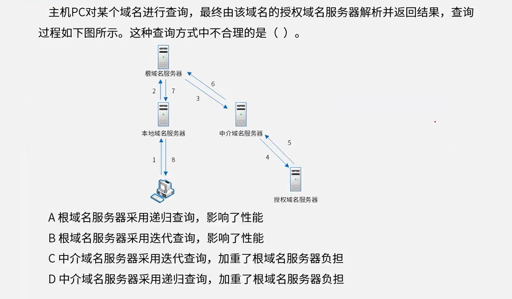
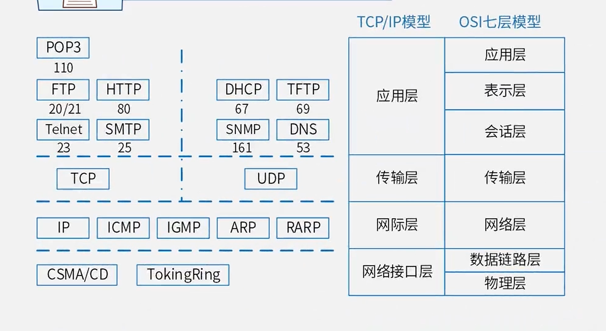
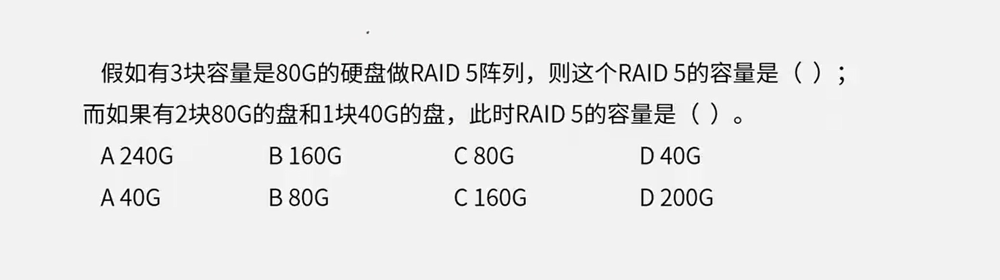
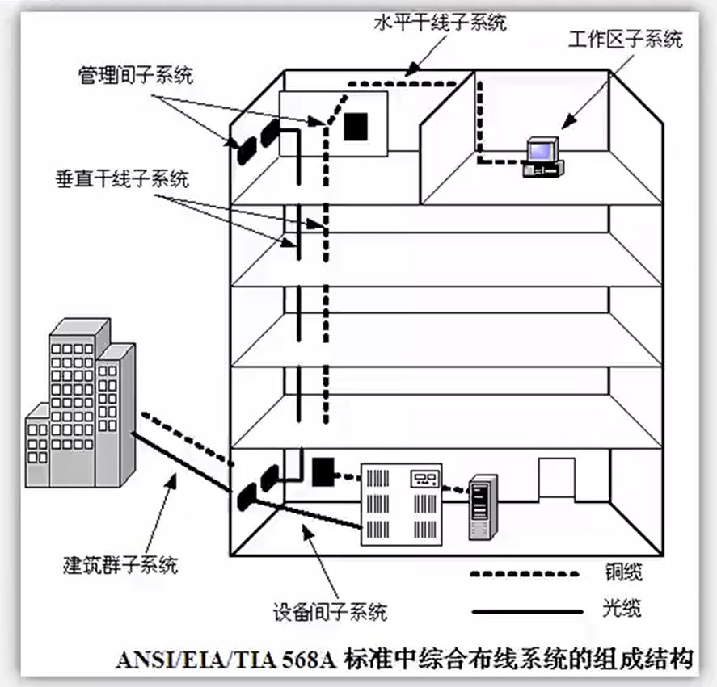

# 4.计算机网络（4分）

# 网络协议

- OSI网络体系结构：

  物理层、数据链路层、网络层、传输层、会话层、表示层、应用层
  
- TCP/IP网络协议模型:

  网络接口层、网际层、传输层、应用层 

## TCP、UDP

## DHCP、DNS（√）

DNS：域名系统

- 递归查询：服务器必需回答目标IP与域名的映射关系。

- 迭代查询：服务器收到一次迭代查询回复一次结果，这个结果不一定是目标IP与域名的映射关系，也可以是其它DNS服务器的地址

  **根域名服务器只能采用迭代查询**，立即返回信息
  
  

DHCP：动态主机配置协议

# 网络规划与设计

## 网络系统生命周期（√）

网络系统生命周期可以划分为5个阶段

1.  需求规范

2. 通信规范

   现有的网络体系分析，估计和测量通信量及设备利用率

3. **逻辑网络设计（√）**（考点）

   逻辑网络设计是体现网络设计核心思想的关键阶段，在这一阶段根据需求规范和通信规范，选择一种比较适宜的网络逻辑结构，并基于该逻辑结构实施后续的资源分配规划、安全规划等内容。**利用需求分析和现有网络体系分析的结果来设计逻辑网络结构**，最后得到一份逻辑网络设计文档

   - 网络结构的设计
   - 物理层技术的选择
   - 局域网技术的选择与应用
   - 路由选择协议
   - IP地址方案
   - 安全管理方案
   - **具体的软/硬件、广域网连接设备和基本的网络服务**
   - 逻辑网络设计文档

4. **物理网络设计（√）**（考点）

   物理网络设计是对逻辑网络设计的物理实现，**通过对设备的具体物理分布、运行环境等确定**，确保网络的物理连接符合逻辑连接的要求。在这一阶段，网络设计者需要确定**具体**的软/硬件、连接设备、布线和服务的部署方案

   - 网络物理结构图和布线方案
   - **设备和部件的详细列表清单**
   - 用户的培训计划

5. 实施阶段

## 网络规划与设计 - 分层设计

- 核心层：主要是**高速数据交换**，实现高速数据传输、出口路由，常用冗余机制。
- 汇聚层：**网络访问策略控制**、数据包处理和过滤、策略路由、广播域定义、寻址。
- 接入层：主要是针对用户端，**实现用户接入、计费管理**、MAC地址认证、MAC地址过滤、收集用户信息，可以使用集线器代替交换机。

## 网络冗余设计

在网络冗余设计中，对于通信线路常见的设计目标主要有两个

- 备用路径

  提高可用性，由路由器、交换机等设备之间的独立备用链路构成，一般情况下**备用路径仅仅在主路径失效时投入使用**

  - 备用路径的带宽
  - 切换时间

- 负载分担

  是对备用路径方式的扩充通过并行链路提供流量分担(余的形式)来提高性能，**主要的实现方法是利用两个或多个网络接口和路径来同时传递流量**
  
  - 网络中存在备用路径、备用链路时，可以考虑加入负载分担设计
  - 对于主路径、备用路径都相同的情况，可以实施负载分担的特例——负载均衡
  - 对于主路径、备用路径不相同的情况可以采用策略路由机制，让一部分应用的流量分摊到备用路径上

## 网络存储技术

- 直连式存储(DAS)

  通过SCSI连接到服务器，本身是硬件的堆叠不带有任何操作系统。存储器必须被直接连接到应用服务器上，**不能跨平台共享文件**，各系统平台下文件分别存储。

- 网络附加存储(NAS)

  通过网络接口与网络直接连接，由**用户通过网络访问(**支持多种TCP/IP协议)。NAS设备有自己的OS，类似于一个专用的文件服务器，一般存储信息采用RAID进行管理。即插即用。

- 存储区域网络(SAN)

  通过**专用高速网络将一个或多个网络存储设备和服务器连接起来的专用存储系统**，采用数据块的方式进行数据和信息的存储。目前主要使用以太网(IPSAN)和光纤通道(FCSAN)两类环境。

- Internet小型计算机系统接口(iSCSl)

  基于IP网络实现，设备成本低，配置技术简单，可共享和使用大突量的存储空间

**磁盘阵列**

- Raid0(条块化)：性能最高，并行处理，无几余，损坏无法恢复
- Raid1(镜像结构)：可用性，可修复性好，仅有50%利用率
- Raid0+1(Raid10):：Raid0与Raid1长处的结合，高效也可靠
- **Raid3**(奇偶校验并行传送)：N+1模式，有固定的校验盘，坏一个盘可恢复
- **Raid5(**分布式奇偶校验的独立磁盘)：N+1模式，无固定的校验盘，坏一个盘可恢复
- Raid6(两种存储的奇偶校验)：N+2模式，无固定的校验盘，坏两个盘可恢复

# IPv6

**IPv4是32位表示，IPv6是128位表示**

表示方法：

- IPv4：点分十进制
- IPv6：冒分十六进制，由8个16进制字段构成。（aaaa:0000:aaaa:0000:aaaa:0000:aaaa:0000）

**IPv6是设计用于替代现行版本IP协议 (IP4)的下一代IP协议**

1. **寻址能力方面的扩展**。IPv6地址长度为128位，地址空间增大了$2^{96}$倍;
2. **灵活的IP报文头部格式**。使用一系列固定格式的扩展头部取代了IPv4中可变2长度的选项字段。IPv6中选项部分的出现方式也有所变化，使路由器可以简单路过选项而不做任何处理，**加快了报文处理速度**;
3. **IPv6简化了报文头部格式**，字段只有8个，**加快报文转发，提高了吞吐量**;
4. 提高安全性。身份认证和隐私权是IPV6的关键特性;

- 单播地址(Unicast)：用于单个接口的标识符，传统的点对点通信。
- 组播地址(Multicast)：多播地址，一点对多点的通信，数据包交付到一组计算机中的每一个。IPv6没有广播的术语，而是将广播看做多播的一个特例。
- 任播地址(Anycast)：泛播地址，这是IPv6增加的一种类型。任播的目的站是一组计算机，但数据包在交付时只交付给其中一个，通常是距离最近的一个。

- IPv6规定每个网卡最少有3个IPv6地址，分别是**链路本地地址**、**全球单播地址**和**回送地址** (站点本地地址)

  IPv6把自动IP地址配置作为标维功能，只要计算机连接上网络便可自动f分配IP地址。

- **全状态自动配置**(Stateful Auto-Configuration)：IPv6**继承了IPv4**动态主机配置协议(DHCP)这种自动配置服务。

- **无状态自动配置**(Stateless Auto-Configuration)：主机通过两个阶段分别获得**链路本地地址**和**可聚合全球单播地址**。

1. 首先主机将其**网卡MAC地址**附加在链路本地地址前缀11111111010之后，产生一个**链路本地地址**，发出一个ICMPv6邻居发现请求，验证其地址唯一性。不唯一则使用随机接口ID组成一个新的链路本地地址。
2. 主机以**链路本地地址为源地址**，向本地链路中所有路由器的组播ICMPV6路由器请求报文并返回一个包含**可聚合全球单播地址前缀**的路由器公告报文响应。该地址前缀加上**自己的接口ID**，自动配置一个**全球单播地址**。使用无状态自动配置，无须用户手工干预就可以改变主机的IPv6地址

# 综合布线系统

- 工作区子系统
- 水平干线子系统
- 管理间子系统
- 设备间子系统
- 垂直干线子系统
- 建筑群子系统

# 物联网

​	物联网(ThelnternetofThings) 是实现物物相连的互联网络，其内涵包含两个方面:第一，物联网的核心和基础仍然是互联网，是在互联网基础上延伸和扩展的网络;第二，其用户端延伸和扩展到了任何**物体与物体之间**，使其进行信息交换和通信

# 云计算

​	云计算是一种基于互联网的计算方式，通过这种方式，**共享的软硬件资源和信息可以按需提供给计算机和其他设备**。云其实是网络、互联网的一种比喻说法。云计算的核心思想，是将大量用网络连接的**计算资源统一管理和调度**，构成一个计算资源池向用户按需服务。提供资源的网络被称为“云”。狭义云计算指IT基础设施的交付和使用模式，指通过网络以按需、易扩展的方式获得所需资源，广义云计算指服务的交付和使用模式，指通过网络以按需、易扩展的方式获得所需服务。这种服务可以是IT和软件、互联网相关，也可是其他服务

参考答案：

4-1：A

4-3：B、B（以最小盘为准）
