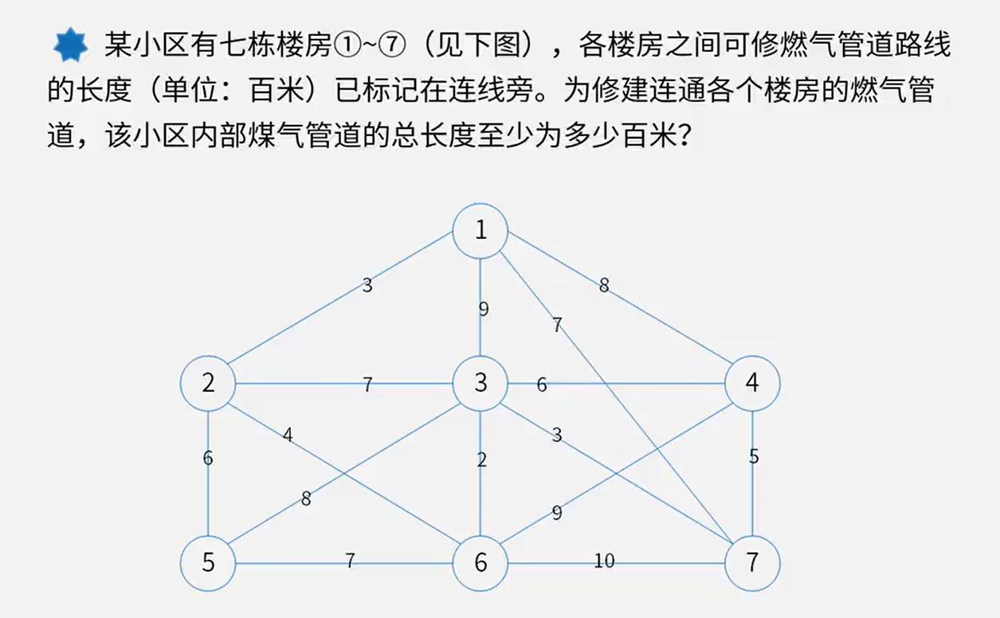
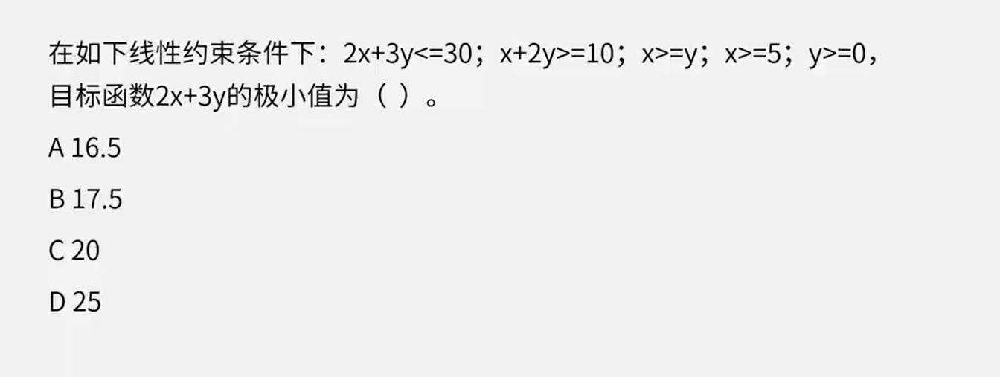

# 5.数学与经济管理

2分

# 图论应用

## 最小生成树

1. 最短边
2. 最近顶点

3+6+4+2+3+5=23

## 最短路径

21+20+20+8+12=81

## 网络与最大流量(√)

C

# 运筹方法

## 关键路径法(√)

## 线性规划

1. 画图法：根据函数画出图，根据交点求解
2. 解方程法

最快的做法：

求最小值，故而，x，y越小越好，由x>=5得，x=5

x+2y>=10   =>   5+2y>=10   =>   y>=2.5   =>    y=2.5

2×5+3×2.5=17.5 选B

## 动态规划(√)

$P=(\frac{A->A}{B->A}, \frac{A->B}{B->B})$

## 预测

## 决策

**不确定型决策**

1. 乐观主义准则

   大中取大

2. 悲观主义准则

   小中取大

3. 等可能准则

   各个的比例是一样的

**决策树：**

# 数学建模

数学建模是一种数学的思考方法，是运用数学的语言和方法，通过抽象和简化，建立能近似刻画并解决实际问题的模型的一种强有力的数学手段。

- 模型的合理性分析

  （最佳、适中、满意等)

- 模型的误差分析
  (模型误差、观测误差、截断误差、舍入误差、过失误差、绝对误差、相对误差等)

- 参数的灵敏性分析

  (变量数据是否敏感，在最优方案不变的条件下这些变量允许变化的范围）

参考答案：

5-4：B

5-5：D         x+y=1，当稳定的时候0.2x=0.4y   => $\frac{x}{y} = 2$

5-6：B
