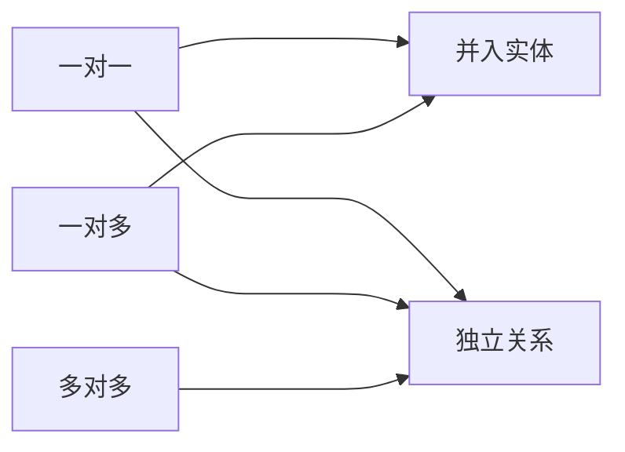

# 数据库模式

- 外模式
- 概念模式
- 内模式

关系表类型

- 基本关系
- 查询表
- 视图表

# 分布式数据库

全局：

- 全局外模式

  最终被用户看到的

- 全局概念模式

  数据的整体逻辑结构

- 分片模式

  数据如何切割

- 分布模式

  数据如何放置

局部：

- 局部概念模式

  局部数据库的库表

- 局部内模式

  存放在哪里

- 局部数据库

## 数据分片

- 分片透明性

- 复制透明性

  用户不用关心数据库在网络中各个节点的复制情况

- 位置透明性

- 局部映像模型透明性（逻辑透明）

  提供数据到局部数据库的映像

**2PC 事务提交的两个阶段**

**表决阶段**，目标是形成一个共同的决定

**执行阶段**，目标是实现这个协调者的决定

**两条全局提交规则**

只要有一个参与者撤销事务，协调者就必须做出全局撤销决定

只有所有参与者都同意提交事务，协调者才能做出全局提交决定

# 数据库设计过程

1. 需求分析

   数据流图、数据字典、需求说明书

2. 概念结构设计

   ER模型

3. 逻辑结构设计

   转换规则、规范化理论

4. 物理设计

   硬件、OS特性

## 数据模型

数据模型三要素

数据结构、数据操作、数据的约束条件

- 层次模型
- 网状模型
- 面向对象模型
- 关系模型

## 完整性约束

**实体完整性**：规定基本关系的主属性不能取空值**主键**

**参照完整性**：关系与关系间的引用，**外键**

**用户自定义完整性约束**：应用环境决定

## 逻辑结构设计

一个实体型必须转换为一个关系模式

- 一对一

  可以并入任意一端

- 一对多

  并入多端

- 多对多

  不能做归并

# 关系代数

并(∪)、交(∩)、差（-）、笛卡尔积（×)、投影(π)、选择(σ)、连接(⋈)

