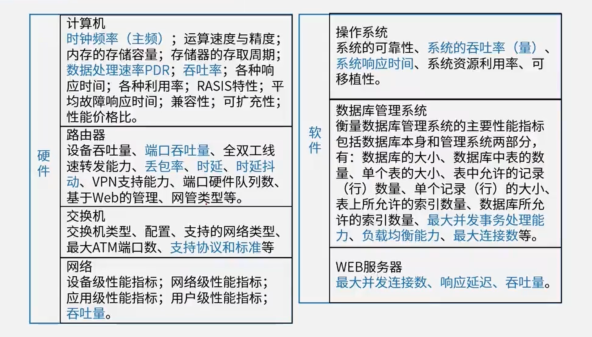

# 6.系统配置与性能评价

2分

# 性能指标

## 性能计算

- 字长和数据通路宽度            主频=外频*倍频
- 主存容量和存取速度            主频与CPU时钟周期
- 运算速度                               CPI与IPC
- 吞吐量与吞吐率                   MIPS与MFLOPS
- 响应时间(RT)与完成时间 (TAT)
- 兼容性

## 性能调整

**对于数据库系统**

性能调整主要包括**CPU/内存使用状况**、**优化数据库设计**、**优化数据库管理**以及**进程/线程状态**、**硬盘剩余空间**、**日志文件大小**等:

**对于应用系统**

性能调整主要包括应用系统的**可用性**、**响应时间**、**并发用户数**以及**特定应用的系统资源占用**等。

# 阿姆达尔解决方案

加速比计算公式
$$
R = \frac{T_p}{T_i} = \frac{1}{(1-F_e) + F_e/S_e}
$$
其中，$T_p$ 表示不使用改进组件时完成整个任务的时间，$T_i$ 表示使用改进组件时完成整个任务的时间

# 性能评价方法（√）

- 时钟频率法：以时钟频率高低衡量速度。

- 指令执行速度法：表示机器运算速度的单位是MIPS。

- 等效指令速度法 (Gibson mix，吉普森混合法)：通过各类指令在程序中所占的比例(W)进行计算得到的。特点：**考虑指令比例不同的问题**

- 数据处理速率法(PDR，Processing Data Rate)：DR值的方法来衡量机器性能，PDR值越大,机器性能越好。PDR=L/R 特点：**考虑CPU+存储**

- 综合理论性能法 (CTP，Composite TheoreticalPerformance)：CTP用MTOPS (MillionTheoreticalOperations Per Second，每秒百万次理论运算)表示。CTP的估算方法是，首先算出处理部件每个计算单元的有效计算率，再按不同字长加以调整，得出该计算单元的理论性能，所有组成该处理部件的计算单元的理论性能之和即为CTP。

- **基准程序法**：把应用程序中用得最多、最频繁的那部分核心程序作为评估计算机系统性能的标准程序，称为基准测试程序(benchmark)。基准程序法是目前一致承认的测试系统性能的较好方法

  **[测试精确度排名]真实的程序 > 核心程序 >小型基准程序 > 合成基准程序**
