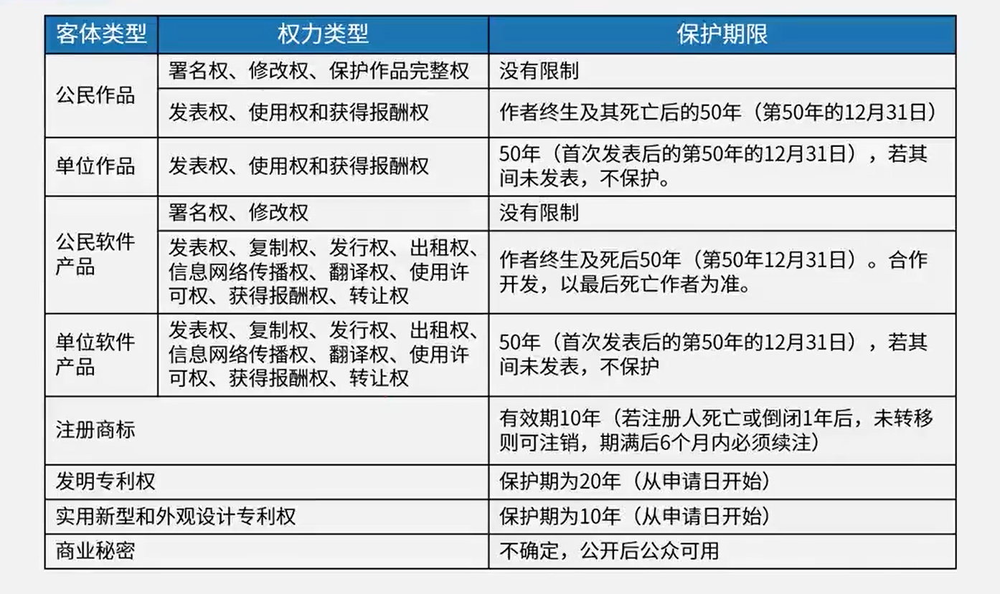
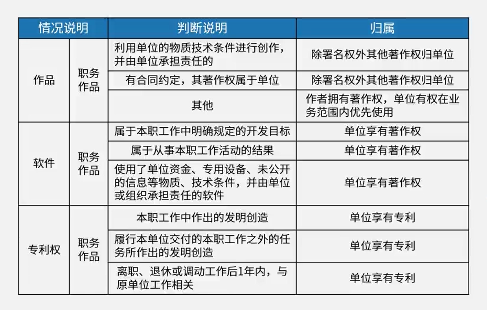
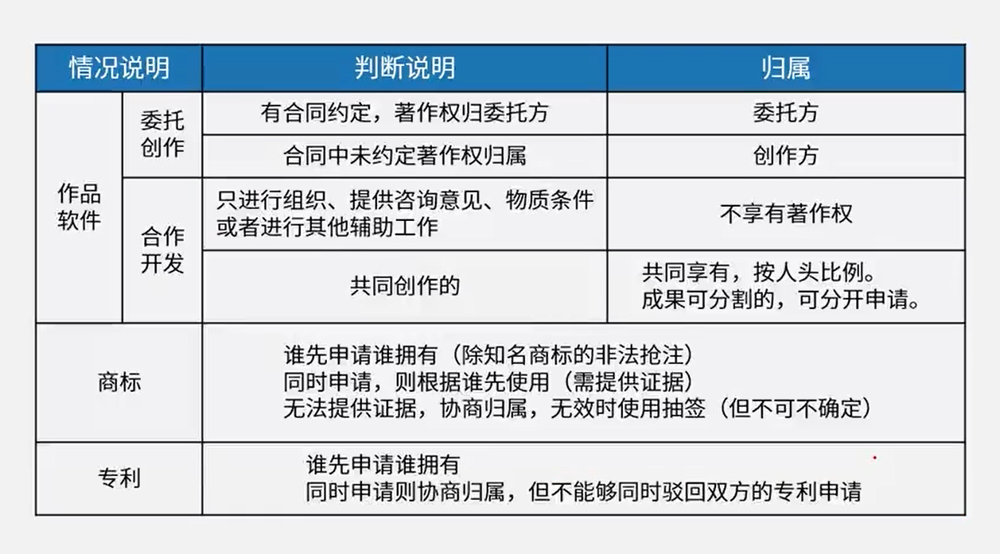

# 7.知识产权化yu

3分

# 保护范围与对象

| 法律法规名称                       | 保护对象及范围                   | 注意事项                                                     |
| :--------------------------------- | :------------------------------- | :----------------------------------------------------------- |
| 著作权法                           | 著作权 文学、绘画、摄影等作品 | 1、不需要申请，作品完成即开始保护 2、绘画或摄影作品原件出售(赠予)著作权还归原 作者，原件拥有者有：所有权、展览权。 |
| 软件著作权法 计算机软件保护条例 | 软件著作权 软件作品           | 1、不需要申请，作品完成即开始保护 2、登记制度便于举证    |
| 专利法                             | 专利权                           | 需要申请，专利权有效期是从申请日开始计算                     |
| 商标法                             | 商标权                           | 需要申请，核准之日起商标受保护                               |
| 反不正当竞争法                     | 商业秘密权                       | 1、商业秘密包括技术与经营两个方面 2、必须有保密措施才能认定商业秘密 |

# 保护期限

# 知识产权人确定

# 侵权判断(√)

- 中国公民、法人或者其他组织的作品，不论是否发表，都享有著作权
- 开发软件**所用的思想、处理过程、操作方法或者数学概念**不受保护
- 软件作品并不是指代码，而是指带有特定业务逻辑的程序以及软件文档

- 著作权法不适用于下列情形
  - 法律、法规，国家机关的决议、决定、命令和其他具有立法、行政、司法性质的文件，及其官方正式译文;
  - 时事新闻
  - 历法、通用数表、通用表格和公式

# 标准的分类

国际标准：ISO、IEC等国际标准化组织

国家标准：GB-中国、ANSI一美国、BS-英国、JIS一日本

区域标准：又称为地区标准，如PASC-太平洋地区标准会议、CEN-欧洲标准委员会、ASAC一亚洲标准咨询委员会、ARSO一非洲地区标准

化组织

行业标准：GJB一中国军用标准、MIT-S一美国军用标准、IEEE一美国电气电子工程师协会

地方标准：国家的地方一级行政机构制订的标准

企业标准

项目规范

# 标准代号的识别

- 国际、国外标准代号：标准代号+专业类号+顺序号+年代号
- 我国国家标准代号：强制性标准代号为GB、推荐性标准代号为GB/T指导性标准代号为GB/Z、实物标准代号GSB
- 行业标准代号：由汉语拼音大写字母组成(如电子行业为SJ)
- 地方标准代号：由DB加上省级行政区划代码的前两位
- 企业标准代号：由Q加上企业代号组成

