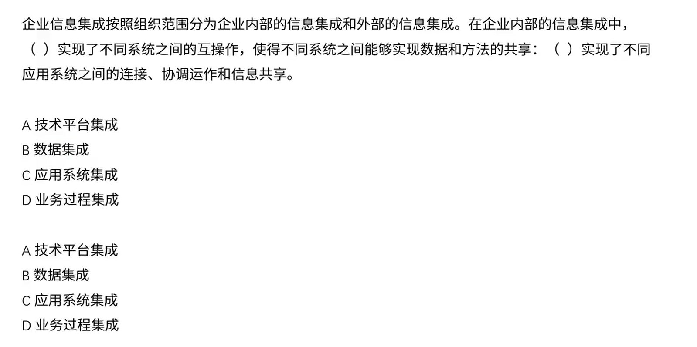

# 8.企业信息化战略与实施

# 信息与信息化的概念

**信息的定义**

- 香农：信息就是不确定性的减少。
- 维纳：信息就是信息，既不是物质，也不是能量维纳

**香浓公式**：
$$
C=B*log_2(1+\frac{S}{N})
$$

- C：信道容量，单位 b/s

- B：信道带宽，单位 Hz

- S：信号平均功率，单位 W

- N：噪声平均功率，单位是 W

- S/N：信噪比，单位是 dB(分贝)

**信息的特点**

- 客观性(真伪性)：也叫事实性，不符合事实的信息不仅没价值，还有副作用。
- 动态性：信息随着时间的变化而变化。
- 层次性：信息可分为战略级、管理级和操作级。
- 传递性：信息在**时间上的传递即是存储**，在**空间上的传递即是转移或扩散**

- 滞后性：信息是数据加工后的产物，所以相对数据有滞后性。

- 扩压性：信息和实物不同，它可以扩散也可以压缩。

- 分享性：信息可以分享，这和物质不同，并且信息分享具有非零和性

---

**信息化的概念**

- 信息化是从工业社会到信息社会的演进与变革。
- 信息化的主体是全体社会成员 (政府、企业、团体和个人)，时域是一个长期过程空域是经济和社会的一切领域，手段是先进社会生产工具。

**信息化对组织的意义**

- 组织的结构创新：如虚拟企业、虚拟社区。
- 组织的管理创新：实施电子政务、建立电子政府、建立电子社区以提升管理水平。
- 组织经营创新：利用信息化将经营和管理融为一体。
- 造就信息化的人才队伍：三类人才 (IT专业人才，业务人才，专家型人才)。

# 信息系统

信息系统：是一种以处理信息为目的的专门的系统。信息系统的组成部分包括：**硬件、软件、数据库、网络、存储设备、感知设备、外设、人员以及把数据处理成信息的规程**等。

## 信息系统生命周期

- 立项阶段：企业全局、形成概念、需求分析
- 开发阶段
  - 总体规划
  - 系统分析
  - 系统设计
  - 系统实施
  - 系统验收
- 运维阶段：通过验收、移交之后
- 消亡阶段：更新改造、功能扩展、报废重建

## 信息系统开发方法

- 结构化方法
- 原型化方法
- 面向对象方法
- 面向服务的方法

## 信息系统战略规划（√）

1. 第一阶段以**数据处理为核心**围绕职能部门需求
   - **企业系统规划法**：**自上而下**的规划和**自下而上**的实现相结合
   - **关键成功因素法**：根据**关键信息集合**确定开发优先次序
   - **战略集合转化法**：根据战略目标和信息集合转化成信息系统的**战略目标**
2. 第二阶段以**企业内部MIS为核心**围绕企业整体需求
   - **战略数据规划法**
   - 信息工程法
   - 战略栅格法
3. 第三阶段综合考虑企业内外环境**以集成为核心**，围绕企业战略需求
   - 价值链分析法
   - 战略一致性模型

# 信息化的典型应用

## 1. 政府信息化与电子政务

电子政务主要有3类角色：

- 政府 (Government)
- 企(事)业单位( Business) 
- 公民(Citizen)
- 如果有第4类就是公务员(Employee)。

## 2. 企业信息化与电子商务（√）

## 3. 企业资源计划（ERP）

打通了供应，链把财务、人力资源、销售管理等纳入

## 4. 客户关系管理（CRM）

客户服务与支持

## 5. 供应链管理（SCM）

**信息化的三流：**

- 信息流
  - **需求信息流 (需方到供方)**：如客户订单、生产计划、采购合同等
  - **供应信息流(供方到需方)**：如入库单、完工报告单、库存记录、可供销售量、提货发运单等
- 资金流
- 物流

## 5. 企业门户

- 企业**信息**门户：使员工/合作伙伴/客户/供应商都能够访问企业**内部网络和因特网存储**的各种自己所需的信息。
- 企业**知识**门户：企业网站的基础上增加**知识性内容**
- 企业**应用**门户：以商业流程和**企业应用为核心，把商业流程中功能不同**的应用模块通过门户技术集成在一起。
- **垂直**门户：为某一**特定的行业服务**的，传送的信息只属于人们感兴趣的领域。

## 商业智能

一般认为**数据仓库**、**联机分析处理**(OLAP)和**数据挖掘**是商业智能的三大组成部分

- 数据仓库(Data Warehouse)是一个面向主题的、集成的、相对稳定且随时间变化的数据集合，用于支持管理决策。数据仓库的关键特征是：面向主题、集成的、非易失的、时变的。
- OLTP与OLAP的比较：
  - OLTP 即**联机事务处理**，就是我们经常说的关系数据库的基础；
  - OLAP即**联机分析处理**，是数据仓库的核心部分。
- 数据挖掘
  - 关联分析：挖掘出隐藏在数据间的相互关系
  - 序列模式分析：侧重点是分析数据间的前后关系(因果关系)
  - 分类分析：为每一个记录赋予一个标记再按标记分类
  - 聚类分析：分类分析法的逆过程

数据挖掘与传统数据分析的区别：数据挖掘是在没有明确假设的前提下去挖掘信息、发现知识。数据挖掘所得到的信息应具有**先知**、**有效**和**可实用**三个特征。

**数据湖**是一个存储企业的各种各样原始数据的大型仓库，其中的数据可供存取、处理、分析及传输。

- 数据仓库仅支持分析处理
- 数据湖既支持分析处理，也支持事务处理

# 企业应用集成（√）

**企业应用集成通过采用多种集成模式构建统一标准的基础平台，将具有不同功能和目的且独立运行的企业信息系统联合起来**

## 企业应用集成

- 表示(界面)集成：统一入口，产生“整体”感觉
- 数据集成：不同来源的数据逻辑或物理上“集中“
- 控制集成：调用其他系统已有方法，达到集成效果
- 业务流程集成：跨企业，或优化流程而非直接调用
- 门户集成：将内部系统对接到互联网上

## 企业应用集成2(信息传递方向)

- 消息集成：**数据量小**，交互频繁，立即地，**异步**
- 共享数据库：交互频繁，立即地，**同步**
- 文件传输：**数据量大**，交互频度小，即时性要求低 (月末，年末)

## 企业信息集成(按照组织范围划分)

- **内部集成**
  - **业务过程的集成**：实现不同应用系统中的流程能够**无缝连接**
  - **应用系统的集成**：实现不同应用系统之间能够实现**数据和方法**的共享
  - **数据的集成**：实现不同系统的**数据**交流与共享
  - **技术平台的集成**：软件/硬件/网络层面的集成
- 外部集成
  - **通过门户网站和互联网实**现企业内外部信息资源的有效交流和集成
  - **通过与合作伙伴信息系统的对接**，建立动态的企业联盟

## 企业集成平台

1. 企业集成平台的概念

   企业集成平台（ EnterpriseIntegrationPlatform , EIP ）技术是近年来用于企业信息化系统集成的一种先进的软件技术。经过多年的发展，企业集成平台可以实现**企业资源共享和集成**

2. 企业集成平台的基本功能（3服务2工具）

   |                  |                             效果                             |
   | ---------------- | :----------------------------------------------------------: |
   | 平台运行管理工具 | 负责企业集成平台系统的配置、应用运行管理和维护、事件管理和出错管理 |
   | 二次开发工具     |                         简化开发工作                         |
   | 应用集成服务     |        通过高层应用编程接口来实现对相应应用程序的访问        |
   | 信息集成服务     | 它为应用提供透明的信息访问服务，通过实现异种数据库系统之间数据的交换、 互操作、分布数据管理和共享信息模型定义(或共享信息数据库的建立) |
   | 通信服务         |            分布环境下透明的同步/异步通信服务功能             |

3. **集成支持的方式**

   - 面向**信息**的集成：针对信息孤岛，解决企业内**数据共享问题**

   - 面向**过程**的集成：采用工作流管理方式可以对**业务过程逻辑和应用逻辑进行分离**，实现过程建模和数据、功能的分离。
   - 面向**服务**的集成：面向服务的集成可以较好地实现(企业间)具有松散耦合关系的**不同应用间的互操作**。

### 企业集成平台实现

1. 数据集成

   企业集成平台的**首要目的**是实现数据集成，数据集成主要有三种模式：**数据联邦**、**数据复制**和基于接口技术的**数据集成**

2. 应用集成

   应用集成模式有**四种集成模式**，分别是：**适配器集成模式**、**信使集成模式**、**面板集成模式**、**代理集成模式**

3. 企业集成

   从企业集成运行的**实现策略**来看， EAI 主要有三种模式：**前端集成模式**、**后端集成模式**和**混合集成模式**

## 电子商务

电子商务主要有2类角色：企业 (Business) 及个人 (Customer）

|                  类型                  |          应用          |
| :------------------------------------: | :--------------------: |
|                  B2B                   |          1688          |
|                  C2C                   |          闲鱼          |
|                  B2C                   |       京东，天猫       |
|                  C2B                   | 个人给企业提供咨询服务 |
| O2O(Online To offline) [线上对线下] |          团购          |

参考答案：

8-1：C、D
