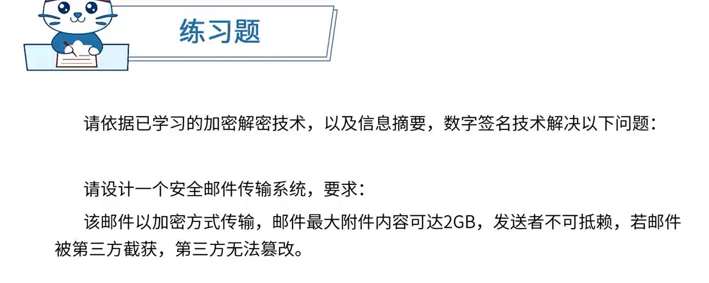

13-22分

# 软件开发方法

- **结构化法**

  自顶向下，逐步分解求精，严格分阶段，阶段产出标准化，应变能力差

- **面向对象方法**

  自底向上，阶段界限不明，更好应变、更好复用，符合人们的思维习惯

- 面向服务的方法

  粗粒度、松耦合标准化和构件化

  抽象级别：操作【低】->服务【中】 -> 业务流程【高】

- 形式化方法

  净室软件工程[受控污染级别的环境)

  数学模型化

  所有东西均可证明/验证，而不是测试

- 统一过程方法

- 敏捷方法

- 基于架构的开发方法【ABSD】

# 软件开发模型

- **瀑布模型**

  适用于**需求明确**的系统

- 迭代模型/迭代开发方法

- **螺旋模型**

  引入了**风险分析**

- **统一过程/统一开发方法**

  初始、细化、构建、交付

  细化设计及**确定系统架构**

- **原型模型**

- **敏捷开发方法**

  - 极限编程 (XP)：一些对**费用控制严格**的公司中的使用，非常有效。
  - 水晶方法：探索了**用最少纪律约束而仍能成功的方法**，从而在产出效率与易于运作上达到一种平衡。
  - 开放式源码：程序开发人员在**地域上分布很广**[其他方法强调集中办公]。
  - SCRUM：明确定义了的**可重复的方法过程**。
  - 功用驱动开发方法 (FDD)：编程开发人员分成两类：**首席程序员和“类”程序员。**
  - ASD方法：其核心是三个非线性的、重叠的开发阶段: **猜测、合作与学习**

- 演化模型

- 快速应用开发

- 增量模型

- 构件组装模型/基于构件的开发方法

  构建管理

- 喷泉模型

- 模型驱动的开发方法

- V模型

  **测试**贯穿始终

- **基于架构的开发方法**

# 逆向工程

实现级：包括程序的**抽象语法树、符号表、过程**的设计表示

结构级：包括反映**程序分量之间相互依赖关系的信息**，例如调用图、结构图、程序和数据结构

功能级：包括反映**程序段功能及程序段之间关系的信息**，例如数据和控制流模型

领域级：包括反映程序分量或程序诸实体与**应用领域概念之间对应关系**的信息，例如实体关系模型

# 需求工程（√）

**软件需求**是指用户对系统在功能、行为、性能、设计约束等方面的期望

- 需求开发：需求获取、需求分析、需求定义、需求验证
- 需求管理：变更控制、版本控制、需求跟踪、需求状态跟踪

## 需求开发

### 需求获取

- 收集资料
- 联合讨论会
- 用户访谈
- 书面调查

### 需求分析（√）

**结构化**需求分析

- 数据字典
- **功能模型**
  - **数据流图**（DFD）
- 数据模型
  - E-R图
- 行为模型
  - 状态转换图

**面向对象**概念

- 实体类

  映射需求中的每个实体，实体类保存需要存储在永久存储体中的信息，例如，在线教育平台系统可以提取出学员类和课程类，它们都属于实体类

- 控制类

  用于控制用例工作的类，一般是由动宾结构的短语(“动词+名词”或“名词+动词”)转化来的名词，例如用例“身份验证”可以对应于一个控制类“身份验证器”它提供了与身份验证相关的所有操作

- 边界类

  用于封装在用例内、外流动的信息或数据流。边界类位于系统与外界的交接处，包括所有窗体、报表、打印机和扫描仪等硬件的接口，以及与其他系统的接口

**UML（√）**

- 静态图(结构图)
  - 类图：一组类、接口、协作和它们之间的关系
  - 对象图：一组对象及它们之间的关系
  - 构件图：一个封装的类和它的接口
  - **部署图：软硬件之间映射**
  - 制品图：系统的物理结构
  - 包图：由模型本身分解而成的组织单元，以及它们之间的依赖关系
  - 组合结构图
- 动态图(行为图)
  - **用例图: 系统与外部参与者的交互**
  - **顺序图: 强调按时间顺序**
  - **通信图(协作图)**
  - **状态图：状态转换变迁**
  - **活动图：类似程序流程图，并行行为**
  - **定时图：强调实际时间**
  - **交互概览图**

**4+1 试图**

- 逻辑视图
  - 系统分析、设计人员
- 实现视图
  - 程序员
- 进程视图
  - 系统集成人员
- 部署视图
  - 系统和网络工程师

**面向对象分析建模**

- 用例模型
- 分析模型

### 需求定义

- 严格定义法
  - **所有需求都能够被预先定义**
  - 开发人员与用户之间能够准确而清晰地交流
  - 采用图形/文字可以充分体现最终系统
- 严格定义法
  - **并非所有的需求都能在开发前被准确的说明**

### 需求验证

用户签字确认

验收标准之一

## 需求管理

### 定义需求基线

### 需求跟踪

- 正向跟踪
- 反向跟踪

### 需求变更

1. 问题分析和变更描述

2. 变更分析和成本计算

3. 变更实现

# 软件系统建模

1. 结构化建模方法
   结构化建模方法是以过程为中心的技术，可用于分析一个现有的系统以及定义新系统的业务需求。结构化建模方法所绘制的模型称为数据流图(DFD)。对于流程较为稳定的系统可考虑结构化建模方法。

2. 信息工程建模方法 (或数据库建模方法)

   信息工程建模方法是一种以数据为中心，但过程敏感的技术，它强调在分析和研究过程需求之前，首先研究和分析数据需求。信息工程建模方法所创建的模型被称为实体联系图(ERD)。主要用于数据建模。

3. 面向对象建模方法
   面向对象建模方法将“数据”和“过程”集成到被称为“对象”的结构中，消除了数据和过程的人为分离现象。面向对象建模方法所创建的模型被称为对象模型。随着面向对象技术的不断发展和应用，形成了面向对象的建模标准，即UML(统一建模语言》。UML定义了几种不同类型的模型图，这些模型图以对象的形式共建一个信息系统或应用系统，是目前比较常用的建模方法。

# 系统设计

## 界面设计

- 置于用户控制之下

- 减少用户的记忆负担

- 保持界面的一致性

## 软件设计

软件设计包括体系结构设计、接口设计、数据设计和过程设计。

- **结构设计**：定义软件系统各主要部件之间的关系。
- **数据设计**：将模型转换成数据结构的定义。好的数据设计将**改善程序结构和模块划分**，降低过程复杂性。
- **接口设计** (人机界面设计)：软件内部，软件和操作系统间以及软件和人之间如何通信。
- **过程设计**：系统结构部件转换成软件的过程描述。

## 结构化设计

- 概要设计[外部设计]：功能需求分配给软件模块，确定每个模块的功能和**调用关系**，形成**模块结构图**
- 详细设计[内部设计]：为每个**具体任务**选择适当的技术手段和处理方法

结构化设计原则：

- 模块独立(**高内聚、低耦合**)
- 保持模块的大小适中
- 多扇入，少扇出
- 深度和宽度均不宜过高

## 面向对象设计（√）

# 测试与评审

# 系统运行与软件维护

