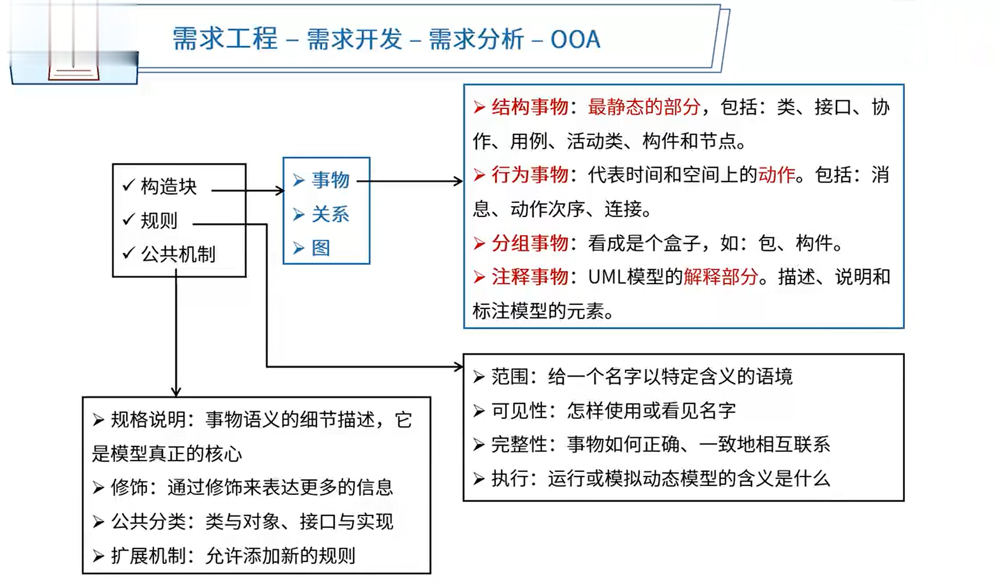
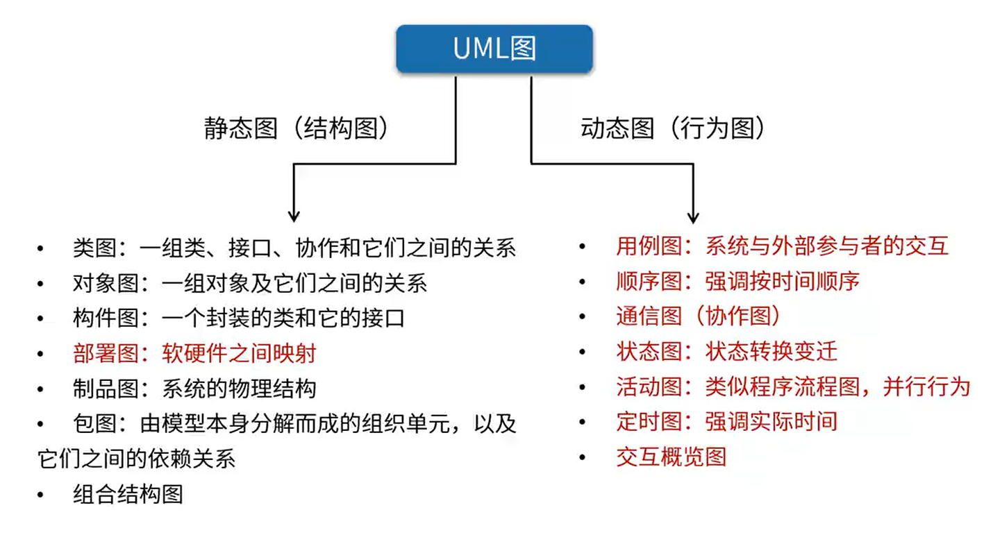

# 9.软件工程

13-22分

# 软件开发方法

- **结构化法**

  **自顶向下**，逐步分解求精，严格分阶段，阶段产出标准化，**应变能力差**

- **面向对象方法**

  **自底向上**，阶段界限不明，**更好应变**、更好复用，符合人们的思维习惯

- **面向服务的方法**

  **粗粒度、松耦合**、标准化和构件化

  抽象级别：操作【低】->服务【中】 -> 业务流程【高】

- 原型法

  需求阶段

  **针对需求不明确**

  按功能分：水平原型(界面)、垂直原型(复杂算法)

  按最终结果分：抛弃式原型、演化式原型

- 形式化方法

  净室软件工程[受控污染级别的环境)

  **数学模型化**

  所有东西均可证明/验证，而不是测试

- 统一过程方法

- 敏捷方法

- 基于架构的开发方法【ABSD】

# 软件开发模型

一个开发方法包含多个开发模型

- **原型模型**

- **瀑布模型**

  - 软件计划
  - 需求分析
  - 软件设计
  - 程序编码
  - 软件测试
  - 运行维护等步骤

  一气呵成

  适用于**需求明确**的系统，需求不明确后期需要修改的话，代价很大

- 增量模型

- 迭代模型/迭代开发方法

- **螺旋模型**

  以原型为基础+瀑布模型，并引入了**风险分析**

- **统一过程/统一开发方法**

  用例驱动、以架构为中心、迭代和增量

  分为 **初始、细化、构建、交付** 4部分

  - 初始
    1. 定义最终产品视图和业务模型
    2. 确定系统范围
  - 细化
    1. 设计及**确定系统架构**
    2. 制定工作计划及资源要求
  - 构建
    1. 构造产品并继续演进需求架构、计划直至产品提交
  - 交付
    1. 把产品提交给用户使用

- 演化模型

- **快速应用开发**

  瀑布模型 + 构件组装模型

- **构件组装模型**/基于构件的开发方法

  模块化的方式，制作一个构架库，进行构建管理

- 喷泉模型

- 模型驱动的开发方法

- V模型

  **测试**贯穿始终

- **基于架构的开发方法**

- **敏捷开发方法**

  敏捷方法、适应性的、以人为本、增量迭代，小步快跑、适合**小型项目**

  - 极限编程 (XP)：一些对**费用控制严格**的公司中的使用，非常有效。
  - 水晶方法：探索了**用最少纪律约束而仍能成功的方法**，从而在产出效率与易于运作上达到一种平衡。
  - 开放式源码：程序开发人员在**地域上分布很广**[其他方法强调集中办公]。
  - SCRUM：明确定义了的**可重复的方法过程**。
  - 功用驱动开发方法 (FDD)：编程开发人员分成两类：**首席程序员和“类”程序员。**
  - ASD方法：其核心是三个非线性的、重叠的开发阶段：**猜测、合作与学习**

# 逆向工程

实现级：包括程序的**抽象语法树、符号表、过程**的设计表示

结构级：包括反映**程序分量之间相互依赖关系的信息**，例如调用图、结构图、程序和数据结构

功能级：包括反映**程序段功能及程序段之间关系的信息**，例如数据和控制流模型

领域级：包括反映程序分量或程序诸实体与**应用领域概念之间对应关系**的信息，例如实体关系模型

# 需求工程（√）

**软件需求**是指**用户对系统**在功能、行为、性能、设计约束等方面的期望

- 需求开发：需求获取、需求分析、需求定义、需求验证
- 需求管理：变更控制、版本控制、需求跟踪、需求状态跟踪

## 需求开发（案例分析题）

### 需求获取

- 收集资料
- 联合讨论会
- 用户访谈
- 书面调查

### 需求分析（√）

#### 结构化需求分析

- 数据字典

  - 数据元素
  - 数据结构
  - 数据流
  - 数据存储
  - 加工逻辑
  - 外部实体

- **功能模型**
  
  - **数据流图**（DFD）
  
    - **数据流**
  
      由一组固定成分的数据组成，表示数据的流向。每个数据流通常有一个合适的名词，反映数据流的含义
  
    - **加工**
  
      加工描述了输入数据流到输出数据流之间的变换，也就是输入数据流做了什么处理后变成了输出数据流
  
    - **数据存储**
  
      用来表示暂时存储的数据，每个文件都有名字。流向文件的数据流表示写文件，流出的表示读文件
  
    - **外部实体**
  
      指存在于软件系统外的人员或组织
  
- 数据模型
  - E-R图
  
    实体
  
    联系
  
- 行为模型
  - 状态转换图
    - 状态 (初态、终态)
    - 事件

#### 面向对象设计

**面向对象概念**

- 实体类

  映射需求中的每个实体，实体类保存需要存储在永久存储体中的信息，例如，在线教育平台系统可以提取出学员类和课程类，它们都属于实体类

- 控制类

  用于控制用例工作的类，一般是由动宾结构的短语(“动词+名词”或“名词+动词”)转化来的名词，例如订单结算

- 边界类

  用于封装在用例内、外流动的信息或数据流。例如购物车

**面向对象分析建模**

- 用例模型
- 分析模型

**分析模型**

- 用例描述及用例图
- 领域概念模型

**设计模型**

- 体系结构图
- 用例实现图
- 类图
- 状态图
- 活动图等

#### UML（√）

**UML图**

##### 静态图(结构图)

- 类图：一组类、接口、协作和它们之间的关系

- 对象图：一组对象及它们之间的关系

  - 依赖关系
  - 泛化关系
  - 关联关系
  - 实现关系

  

- 构件图：一个封装的类和它的接口

- **部署图：软硬件之间映射**

- 制品图：系统的物理结构 

- 包图：由模型本身分解而成的组织单元，以及它们之间的依赖关系

- 组合结构图

##### 动态图(行为图)

- **用例图**：系统与外部参与者的交互

  关系包括：**包含关系、扩展关系、泛化关系**

  用例规约包含：用例名称、用例ID、角色、用例说明、前置条件、基本事件流、其他事件流、异常事件流、后置条件

  

  

- **顺序图**：顺序图是一种交互图(interactiondiagram)，它强调对象之间消息发送的顺序，同时显示对象之间的交互

- **通信图(协作图)**：通信图也是一种交互图，它强调对象之间存在消息收发关系，而不专门突出这些消息发送的时间顺序

- **状态图**：状态转换变迁

- **活动图**：类似程序流程图，并行行为

- **定时图**：强调实际时间

- **交互概览图**

活动图与流程图的主要区别：

1. 活动图描述的是对象活动的顺序关系所遵循的规则，它着重表现系统的行为，而非处理过程，而流程图着重描述处理过程。
2. 流程图一般都限于顺序进程，而活动图则可以支持并发进程。
3. 活动图是面向对象的，而流程图是面向过程的

#### 4+1 视图

- 逻辑视图
  - 系统分析、设计人员
- 实现视图
  - 程序员
- 进程视图
  - 系统集成人员
- 部署视图
  - 系统和网络工程师
- 用例视图
  - 最终用户

### 需求定义

- 严格定义法
  - **所有需求都能够被预先定义**
  - 开发人员与用户之间**能够准确而清晰地交流**
  - 采用图形/文字可以**充分体现最终系统**
- 原型法
  - **并非所有的需求都能在开发前被准确的说明**

### 需求验证

用户签字确认

验收标准之一

## 需求管理

### 定义需求基线

### 需求跟踪

- 正向跟踪
- 反向跟踪

### 需求变更

1. 问题分析和变更描述

2. 变更分析和成本计算

3. 变更实现

# 软件系统建模

1. 结构化建模方法

   结构化建模方法是以过程为中心的技术，可用于分析一个现有的系统以及定义新系统的业务需求。结构化建模方法所绘制的模型称为数据流图(DFD)。对于流程较为稳定的系统可考虑结构化建模方法。

2. 信息工程建模方法 (或数据库建模方法)

   信息工程建模方法是一种以数据为中心，但过程敏感的技术，它强调在分析和研究过程需求之前，首先研究和分析数据需求。信息工程建模方法所创建的模型被称为实体联系图(ERD)。主要用于数据建模。

3. 面向对象建模方法

   面向对象建模方法将“数据”和“过程”集成到被称为“对象”的结构中，消除了数据和过程的人为分离现象。面向对象建模方法所创建的模型被称为对象模型。随着面向对象技术的不断发展和应用，形成了面向对象的建模标准，即UML(统一建模语言》。UML定义了几种不同类型的模型图，这些模型图以对象的形式共建一个信息系统或应用系统，是目前比较常用的建模方法。

# 系统设计

## 界面设计

- 置于用户控制之下

- 减少用户的记忆负担

- 保持界面的一致性

## 软件设计

软件设计包括体系结构设计、接口设计、数据设计和过程设计。

- **结构设计**：定义软件系统各主要部件之间的关系。
- **数据设计**：将模型转换成数据结构的定义。好的数据设计将**改善程序结构和模块划分**，降低过程复杂性。
- **接口设计** (人机界面设计)：软件内部，软件和操作系统间以及软件和人之间如何通信。
- **过程设计**：系统结构部件转换成软件的过程描述。

## 结构化设计

- 概要设计[外部设计]：功能需求分配给软件模块，确定每个模块的功能和**调用关系**，形成**模块结构图**
- 详细设计[内部设计]：为每个**具体任务**选择适当的技术手段和处理方法

结构化设计原则：

- 模块独立(**高内聚、低耦合**)
- 保持模块的大小适中
- 多扇入，少扇出
- 深度和宽度均不宜过高

## 面向对象设计（√）

### 设计原则

- 单一职责原则：设计目的单一的类
- 开放-封闭原则：对扩展开放，对修改封闭
- 李氏(Liskov) 替换原则：子类可以替换父类
- 依赖倒置原则：要依赖于抽象，而不是具体实现，针对接口编程，不要针对实现编程
- 接口隔离原则：使用多个专门的接口比使用单一的总接口要好
- 组合重用原则：要尽量使用组合，而不是继承关系达到重用目的
- 迪米特 (Demeter) 原则 (最少知识原则)：一个对象应当对其他对象有尽可能少的了解

### 设计模式

- 架构模式：软件设计中的高层决策，例如C/S结构就属于架构模式，架构模式反映了开发软件系统过程中所作的基本设计决策

- 设计模式：主要关注软件系统的设计，与具体的实现语言无关

- 惯用法：是最低层的模式，关注软件系统的设计与实现，实现时通过某种特定的程序设计语言来描述构件与构件之间的关系。每种编程语言都有它自己特定的模式，即语言的惯用法。例如引用-计数就是C++语言中的一种惯用法

### 设计模式分类

**记住分类归属**

- **创建型模式**：创建对象
  
  - 工厂方法(FactoryMethod)模式
  
    定义了创建对象的接口，它允许子类决定实例化**哪个类**
  
  - 抽象工厂(Abstract Factory) 模式
  
    提供一个接口，可以创建**一系列**相关或相互依赖的对象，而无需指定它们具体的类
  
  - 原型(Prototype) 模式
  
    允许对象在不了解要创建对象的确切类以及如何创建等细节的情况下创建自定义对象。通过**拷贝**原型对象来创建新的对象
  
  - 单例(Singleton)模式
  
    确保一个类只有**一个实例**，并且提供了对该类的全局访问入口
  
  - 构建器(Builder)模式
  
    将一个**复杂类**的表示与其构造相分离，使得相同的构建过程能够得出不同的表示
  
- **结构型模式**：更大的结构
  
  - **适配器 (Adapter) 模式**
  
    将一个类的接口**转换**成用户希望得到的另一种接口。它使原本不相容的接口得以协同工作
  
  - **桥接 (Bridge) 模式**
  
    将一个复杂的组件**分成两个独立的但又相关的继承层次结构**，将类的抽象部分和它的实现部分分离开来，使它们可以独立地变化
  
  - **组合 (Composite) 模式**
  
    创建**树型层次结构**来改变复杂性，同时允许结构中的每一个元素操作同一个接口。用于表示“整体-部分”的层次结构
  
  - **装饰 (Decorator) 模式**
  
    在不修改对象外观和功能的情况下添加或者删除对象功能即**动态**地给一个对象**添加一些额外的职责**
  
  - 外观(Facade)模式
  
    子系统中的一组接口提供了**一个统一的接口**
  
  - 享元(Flyweight) 模式
  
    可以通过共享对象减少系统中低等级的、详细的对象数目提供支持大量细粒度对象**共享**的有效方法
  
  - 代理(Proxy)模式
  
    为控制对初始对象的访问提供了一个代理或者**占位符对象**
  
- **行为型模式**：交互及职责分配
  
  - **职责链 (Chain of Responsibility) 模式**
  
    可以在系统中建立**一个链**，这样消息可以在首先接收到它的级别处被处理，或者可以定位到可以处理它的对象
  
  - **命令 (Command) 模式**
  
    在对象中封装了请求，这样就**可以保存命令**，将该命令传递给方法以及像任何其他对象一样返回该命令
  
  - 解释器 (Interpreter)模式
  
    可以解释定义其语法表示的语言，还提供了用表示来解释语言中的语句的解释器
  
  - 迭代器 (lterator) 模式
  
    **为集合中的有序访问提供了一致的方法**，而该集合是独立于基础集合，并与之相分离的
  
  - **中介者 (Mediator) 模式**
  
    通过引入一个能够管理对象间消息分布的对象，简化了系统中对象间的通信
  
  - 备忘录(Memento)模式
  
    保持对象状态的“**快照**”(snapshot)，这样对象可以在不向外界公开其内容的情况下返回到它的最初状态
  
  - **观察者 (observer) 模式**
  
    为组件向相关接收方**广播消息**提供了灵活的方法，定义对象间的一种一对多的依赖关系
  
  - **状态 (state) 模式**
  
    允许一个对象在其内部状态改变时改变它的行为
  
  - **策略 (Strategy) 模式**
  
    定义一系列算法，把它们一个个封装起来，并且使它们之间可**互相替换**，从而让算法可以独立于使用它的用户而变化
  
  - 模板方法(Template Method) 模式
  
    提供了在不重写方法的前提下允许子类重载部分方法的方法
  
  - 访问者(Visitor)模式
  
    提供了一种方便的、可维护的方法来表示在对象结构元素上要进行的操作，数据与操作分离

# 软件测试

## 测试类型

- 动态测试[计算机运行]
  - 黑盒测试法（功能测试）
    - 等价类划分
    - 边界值分析
    - 错误推测
    - 因果图
  - 白盒测试法（代码测试）
    - 基本路径测试
    - 循环覆盖测试
    - 逻辑覆盖测试
  - 灰盒测试法
- 静态测试[纯人工]
  - 桌前检查
  - 代码审查
  - 代码走查

## 测试阶段

- 单元测试：**模块测试**，模块功能、性能、接口等
- 集成测试：**模块间的接口**
  - 一次性组装[风险高]
  - 增量式组装[测试全面]
    - 自顶向下【需要桩模块】
    - 自底向上【需要驱动模块】
    - 混合式【都需要】
- 系统测试：**真实环境下**，验证完整的软件配置项能否和系统正确连接
  - 功能测试
  - 性能测试
    - **负载测试**：**各种工作负载**下系统的性能
    - **压力测试**：系统的**瓶颈**或不能接受的性能点
    - **强度测试**：系统**资源特别低**的情况下运行
    - **容量测试**[并发测试]：**同时在线**的最大用户数
    - 可靠性测试：MTTF之类的参数
  - 健壮性测试
  - 用户界面测试
  - 安全性测试
  - 安装与反安装测试
- 确认测试：验证软件**与需求的一致性**。内部确认测试、Alpha测试、Beta测试、验收测试
- 回归测试：测试软件变更之后，**变更部分的正确性**对变更需求的符合性

## 软件调试

- 蛮力法
- 回溯法
- 原因排除法

# 系统转换计划

## 遗留系统演化策略

- 信息孤岛

  淘汰、继承、继承、改造

  

## 新旧系统转换策略

- 直接转换策略
- 并行转换策略
- 分段转换策略

## 数据转换与迁移

1. 抽取
2. 转换
3. 装载

# 系统运行与软件维护

- **正确性维护**：指**改正**在系统开发阶段已发生而系统测试阶段尚**未发现的错误**
- **适应性维护**：指使应用软件**适应环境变化**[外部环境、数据环境]而进行的修改。
- **完善性维护**：**扩充功能和改善性能**而进行的修改。
- **预防性维护**：为了**适应未来**的软硬件环境的变化，应主动增加预防性的新的功能，以使用系统适应各类变化而不被淘汰。如将专用报表功能改成通用报表生成功能，以适应将来报表格式的变化。

