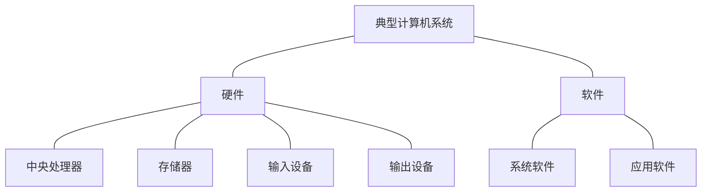

# 2. 计算机系统

- 硬件子系统
- 软件子系统

计算机网络：连接多个计算机，实现计算机间数据交换能力的网络设备，简称**网络**

# 2.2 计算机硬件

冯 · 诺依曼 计算机硬件

- **处理器**
  - CISC
  
    指令数量多，使用频率差别的，支持的寻址方式多种，研制周期长。
  
  - RISC
  
    指令的数量少，使用频率接近。支持的寻址方式少。增加了通用寄存器（单个指令速度快）。
  
    有新的功能会调用已有的指令组合起来形成子程序，再调用子程序
  
- **存储器**
  
  - 片上缓存（寄存器）
  - 片外缓存（Cache）
  - 主存（DRAM）
  - 外存（硬盘）
  
- **总线**
  
  - 内总线
  - 系统总线
  - 外部总线
  
  总线：
  
  - 数据总线
  - 地址总线
  - 控制总线
  
- **接口**

- **外部设备**

# 2.3 计算机软件

计算机软件是指计算机系统中的程序及其文档，是计算任务的处理对象和处理规则的描述。

- 计算机软件通常分为两大类

  1. **系统软件**

     系统软件是为整个计算机系统配置的不依赖特定应用领域的通用软件。

  2. **应用软件**

     应用软件是指为某类应用需要或解决某个特定问题而设计的软件。

     应用软件还可以细分为以下两类：

     - 专用的应用软件
     - 通用的应用软件

## 操作系统

操作系统是计算机系统的资源管理者，它包含对系统软、硬件资源实施管理的一组程序。

- 操作系统通常由**操作系统内核**(Kernel) 和其他许多**附加的配套软件**所**组成**

操作系统的**作用**：

1. 管理计算机中运行的程序和分配各种软硬件资源。
2. 为用户提供友善的人机界面。
3. 为应用程序的开发和运行提供一个高效率的平台。

操作系统的**特点**：

1. 并发性
2. 共享性
3. 虚拟性
4. 不确定性

操作系统**分类**：

1. 批处理操作系统
2. 分时操作系统
3. 实时操作系统
4. 网络操作系统
5. 分布式操作系统
6. 微型计算机操作系统
7. 嵌入式操作系统

## 数据库

数据库（DataBase）是指长期存储在计算机内、有组织的、统一管理的相关数据的**集合**。

数据库类型：

1. 关系型数据库
2. 键值数据库
3. 列存储数据库
4. 文档数据库
5. 搜索引擎数据库

---

- **关系型数据库系统**的设计

- **分布式数据库系统**

  分布式数据库系统是指地理上分散，而管理上又需要不同程度集中管理的需求而提出的一种数据管理信息系统。

  特性：

  - 集中控制性
  - 数据独立性
  - 数据冗余可控性
  - 场地自治性
  - 存取有效性

- 常用的数据库管理系统：

  - Oracle

  - MySql

## 文件系统

文件系统是操作系统中实现文件统一管理的一组软件和相关数据的集合，是专门负责管理和存取文件信息的软件机构。

**文件的结构：**

1. 从用户的角度看成为**文件的逻辑结构**：
   - 有结构的记录式文件
   - 无结构的流式文件
2. 从实现的角度看成为**文件的物理结构**：
   - 连续结构
   - 链接结构
   - 索引结构
   - 多个物理块的索引表

**文件的存取方法：**

- 顺序存取
- 随机存取

**文件存储空间的管理：**

- 空闲区表
- 位示图
- 空闲块链

## 网络协议

- 局域网协议（LAN）
- 广域网协议（WAN）
- 无线网协议
- 移动网协议

## 中间件

中间件：使应用软件的开发相对独立与计算机硬件和操作系统，并能在不同的系统上运行，实现相同的应用功能。

+++

中间件分类：

1. 通信处理（消息）中间件
2. 事务处理（交易）中间件
3. 数据库存取管理中间件
4. Web服务器中间件
5. 安全中间件
6. 跨平台和架构的中间件
7. 专用平台中间件
8. 网络中间件

## 软件构件

构件又称为组件，是一个自包容、可复用的程序集。

构建组装模型的开发过程

## 应用软件

- 通用的应用软件
- 专用的应用软件

# 2.4 嵌入式系统及软件

嵌入式系统是为了特定应用而专门构建且将信息处理过程和物理过程紧密结合为一体的专用计算机系统。

嵌入式系统是以应用为中心，以计算机技术为基础，并将可配置与可裁减的软、硬件集成与一体的专用计算机系统。

- 一般嵌入式系统由**嵌入式处理器**、**相关支撑硬件**、**嵌入式操作系统**、**支撑软件**以及**应用软件**组成

---

嵌入式操作系统的特点：

1.专用性强
2.技术融合
3.软硬一体软件为主
4.比通用计算机资源少
5.程序代码固化在非易失存储器中
6.需专门开发工具和环境
7.体积小、价格低、工艺先进、性能价格比高、系统配置要求低、实时性强
8.对安全性和可靠性的要求高

---

嵌入式系统分类：

1. 实时系统
2. 安全攸关系统

---

嵌入式系统组成：

1. 硬件层
2. 抽象层
3. 操作系统层
4. 中间件层
5. 应用层

---

应用层主要包括不用的应用软件：

应用软件的主要特点：

1. 可剪裁性
2. 可配置性
3. 强实时性
4. 安全性
5. 可靠性
6. 高确定性

## 安全攸关软件的安全性设计

DO-178B 的软件生命周期

- 软件计划过程
- 软件开发工程
  - 软件需求过程
  - 软件设计过程
  - 软件编码过程
  - 继承过程
- 软件综合过程
  - 软件验证过程
  - 软件配置管理过程
  - 软件质量保证过程
  - 审核联络过程

# 2.5 计算机网络

计算机网络是利用通信线路将地理上分散的、具有独立功能的计算机系统和通信设备按不同的形式连接起来，并依靠网络软件及通信协议实现资源共享和信息传递的系统。

计算机网络共经历了**诞生**、**形成**、**互联互通**、**高速发展**四个阶段

## 网络的基本概念

**计算机网络功能：**

1. 数据通信
2. 资源共享
3. 管理集中化
4. 实现分布式处理
5. 负荷均衡

---

**网络有关指标：**

- 性能指标：
  1. 速率
  2. 带宽
  3. 吞吐量
  4. 时延
  5. 往返时间
  6. 利用率
- 非性能指标
  1. 费用
  2. 质量
  3. 标准化
  4. 可靠性
  5. 可扩展性和可升级性
  6. 易管理性和维护性

## 通信技术

计算机网络是利用通信技术将数据从一个结点传到另一结点的过程。通信技术是计算机网络的基础。这里说的数据，指的是模拟信号和数字信号

1. 信道

   **香浓公式**：
   $$
   C=B*log_2(1+\frac{S}{N})
   $$

   - C：信道容量，单位 b/s

   - B：信道带宽，单位 Hz

   - S：信号平均功率，单位 W

   - N：噪声平均功率，单位是 W

   - S/N：信噪比，单位是 dB(分贝)

2. **信号交换**

   发信机进行信号处理包括**信源编码**、**信道编码**、**交织**、**脉冲成型**、**调制**

   收信机进行信号处理包括**解调**、**采样判决**、**去交织**、**信道译码**、**信源译码**

3. **复用技术和多址技术**

   复用技术：

   - 时分复用(TDM)
   - 频分复用(FDM)
   - 码分复用(CDM)

   多址技术：

   - 时分多址(TDMA)
   - 频分多址(FDMA)
   - 码分多址(CDMA)

4. 5G 通信网络

## 网络技术

- 局域网（LAN）
- 无线局域网（WLAN）
- 城域网（MAN）
- 广域网（WAN）
- 移动通信网

---

1. 局域网

   **网络拓朴结构：**

   - 星状结构
   - 树状结构
   - 总线结构
   - 环形结构

   **以太网技术：**

   - 以太网帧结构
   - 最小帧长（64字节）
   - 最大传输距离
   - 流量控制

2. 无线局域网

   **WLAN拓扑结构：**

   - 点对点型
   - HUB型
   - 全分布型

3. 广域网

   广域网由**通信子网**与**资源子网**组成。

   广域网分类为：

   - 公用传输网络
   - 专用传输网络
   - 无限传输网络

   广域网相关技术：

   - 同步光网络
   - 数组数据网
   - 帧中继
   - 异步传输技术

4. 城域网

5. 移动通信网 

   5G的主要特征：

   1. 服务化架构
   2. 网络切片

## 组网技术

**网络设备及其工作层级**

基本网络设备：集线器、中继器、网桥、交换机、路由器、防火墙等

**网络协议**

OSI网络体系结构：

物理层、数据链路层、网络层、传输层、会话层、表示层、应用层

TCP/IP网络协议模型:

网络接口层、网际层、传输层、应用层

**交换技术路由技术**

交换机是一种基于MAC地址识别，能完成封装转发数据包功能的网络设备

交换机的功能

- 转发路径学习
- 数据转发
- 数据泛洪
- 链路地址更新

## 网络工程

1. 网络规划
2. 网络设计
3. 网络设施

# 2.6 计算机语言

- 机器语言
- 汇编语言
- 高级语言（C语言等）

---

1. **机器语言**

   汇编指令包含：

   1. 操作码
   2. 操作数的地址
   3. 操作结果和存储地址
   4. 下条指令的地址

2. **汇编语言**

   汇编语言是机器语言的符号化描述，所以也是面向机器的程序设计语言。

   汇编语言的语句格式：

   1. 指令语句
      - 名字
      - 操作符
      - 操作数
      - 注释
   2. 伪指令语句
   3. 宏指令语句

3. **高级语言**

   高级语言与计算机的架构、指令集无关，因此它具有良好的可移植性。（C、C++、Java等）

4. 建模语言 （UML）

5. 形式化语言

# 2.7 多媒体

# 2.8 系统工程

