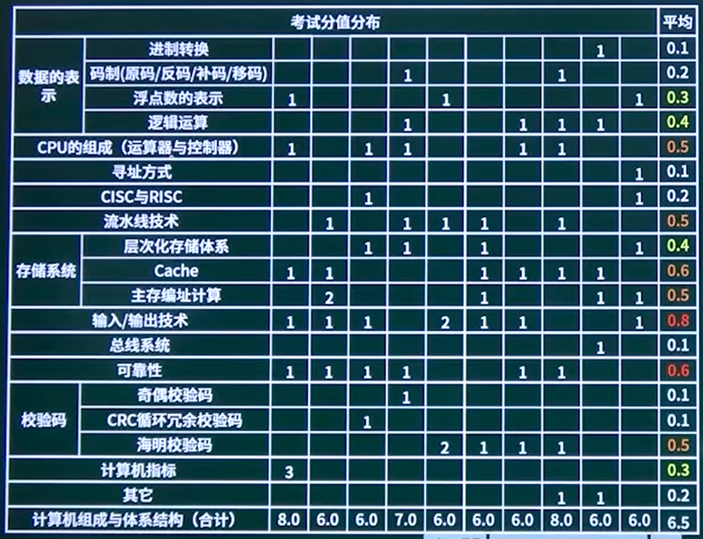
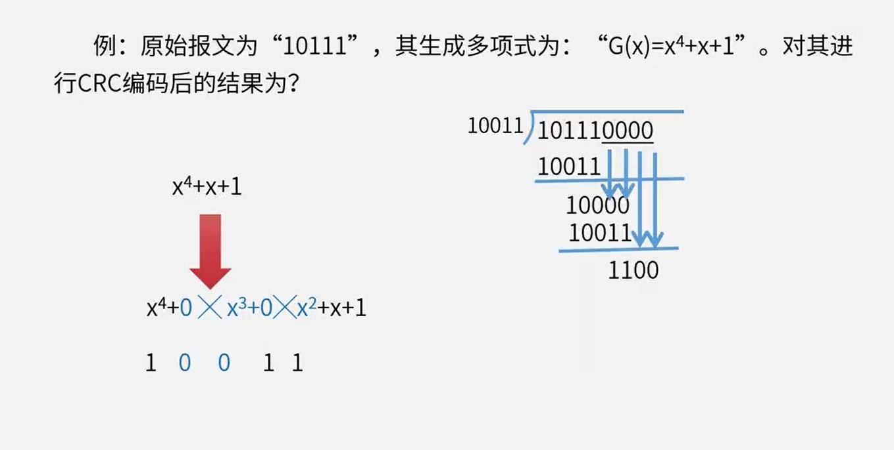

# 1. 进制转换

## 按权展开法

### n进制转10进制

10100.01B = $2^{4}$ + $2^{2}$ + 1 × $2^{-2}$ = 20.25D

整数部分，从右到左，指数从0开始。即$×2^{0}$，然而小数部分从$×2^{-1}$开始

## 短除法

### 10进制转n进制（除基取余法）

例如10进制转二进制，需除2，转16进制则需要除16

**整数部分：**

20 / 2 = 10 ······ 0

10 / 2 = 5 ······ 0

5 / 2 = 2 ······ 1

2 / 2 = 1 ······ 0

1 / 2 = 0 ······ 1      商为0停止

余数从下往上数 10100B

**小数部分**

对**小数部分**进行**乘2取整**的操作，**直到小数部分为0**，或者达到所需的精度为止。每次取整的结果构成二进制小数部分

0.25 × 2 = 0.5

0.5 × 2 = 1.0

取整数部分从上往下数，即 0.25D = 01B

0.7 × 2 = 1.4

0.4 × 2  = 0.8

0.8 × 2 = 1.6

0.6 × 2 = 1.2

0.2 × 2 = 0.4

0.4 × 2 = 0.8

则 0.7D = 0.101100110...0110的循环

## n进制转进制

二进制转8进制有3对1的关系    1001B 转 8 进制，得 1_001B = 11O`

二进制转16进制有4对1的关系

4进制转16进制有2对1的关系

## 二进制数运算

1. 加减法与10位数类似，具体参考《微型计算机原理》课本

2. 乘法

   把乘数拆开，取1的部分，然后移位相加即可（乘 8 则左移三位）

   1100B × 1001B = 1100 × (1000 + 0001) = 1100000 + 1100 = 1101100

3. 除法

   计算机在进行二进制除法时，底层的实现方式主要依赖于**减法**和**位移**

   1100B ÷ 11B 就是 1100 不断的减11，减去一个11，结果+1，减去4的，最后结果是 100B

   为了方便计算，如果被除数是$2^n$直接右移n位即可

# 2. 码制

## 原码

在原码表示法中。机器最高位是符号位，其余部分是数的绝对值。0表示正号，1表示负号。

所以，0的默认值是+0

取值范围：[$-2^{n-1}+1$, $2^{n-1}-1$]

如8位地址，即n = 8，取值范围为[$-2^7+1$, $2^7-1$] = [-127, 127]

## 反码

对于正数来讲，正数的反码与原码相同。对于负数来讲，其**符号位不变**，反码的数值部分为真值的各位按位取反

10000001 的反码为 11111110

## 补码

计算机底层计算一般用补码

正数的补码与原码、补码相同。负数的补码等于其**符号位不变**，数值部分的各位为**原码按位取反再加1**

10000001的补码为11111111

此时10000000按设置应该是-0，但是不能和+0冲突，所以00000000表示是0，而10000000会被定义为$-2^{n-1}$

故而补码表示的数值范围应该是[$-2^{n-1}$, $2^{n-1}-1$]

如8位地址，即n = 8，取值范围为[$-2^7$, $2^7-1$] = [-128, 127]

|      | 正数(1)  | 127      | 负数(-1) | -127     | -128     |
| ---- | -------- | -------- | -------- | -------- | -------- |
| 原码 | 00000001 | 01111111 | 10000001 | 11111111 |          |
| 反码 | 00000001 | 01111111 | 11111110 | 10000000 |          |
| 补码 | 00000001 | 01111111 | 11111111 | 10000001 | 10000000 |
| 移码 | 10000001 | 11111111 | 01111111 | 00000001 | 00000000 |

**移码**：补码的符号位取反，一般用于表示浮点数

# 3. 浮点数表示

**科学计数法**

**N =$尾数 * 基数^{指数}$**         1.25 × $2^{10}$

- 尾数一般是定点小数，如1.25
- 指数即阶码

---

运算过程：

对阶 > 尾数计算 > 结果格式化

---

存储方式：阶符 + 阶码 + 数符 + 尾数。基数一般为 `2`

<table>
    <tr style="text-align:center;">
        <td>阶符（1位）</td>
        <td colspan="6">阶码</td>
        <td>数符（1位）</td>
        <td colspan="8">尾数（小数部分）</td>
    </tr>
    <!-- tr内为每一行的内容 -->
    <tr style="text-align:center;">
        <td>0为正，1为负数</td>    
        <td></td> 
        <td></td>
        <td></td>    
        <td></td> 
        <td></td>
        <td></td>    
        <td>0为正，1为负数</td> 
        <td></td>
        <td></td>    
        <td></td> 
        <td></td>
        <td></td>    
        <td></td> 
        <td></td>
        <td></td>
    </tr>
</table>

1. 一般尾数用**补码**，阶码用移码

2. 基数不参与存储

3. **阶码的位数**决定数的**表示范围**，位数越多范围越大

   阶码是定点整数，如32，64，128，即指数部分$2^n$的 `n`

   `n` 取值范围是与补码形式一样

4. **尾数的位数**决定数的**有效精度**，位数越多精度越高

   **实际存储的尾数部分只有小数部分**，故而**存储的尾数部分一定会大于0小于1，[0, 1)**

   1. **非规格化浮点数**：尾数的整数部分为 `0`，加上符号位，非规格化的尾数取值范围是`(-1, 1)`。具体来说是(-1+$2^{-n}$, $1-2^{-n}$)

      当尾数用**补码或移码**表示时，尾数会受补码限制，取值范围会包含 `-1`，[-1, $1-2^{-n}$)

   2. **规格化浮点数**：尾数的整数部分 `1` 被默认认为是存在的，故而规格化的尾数取值范围是`1 + [0, 1)`，最终范围是 `(-2, -1]` && `[1, 2)`

      当尾数用**补码或移码**表示时，规格化浮点数不会受补码限制，取值范围依旧是`(-2, -1]` && `[1, 2)`

5. 对阶时，**小数向大数看齐**

6. 对阶是通过较小数的尾数右移实现的

例题：

设16位浮点数，其中阶符1位、阶码值`6`位、数符1位、尾数`8`位。若阶码用**移码**表示，尾数用**补码**表示，则该浮点数所能表示的数值范围是？

$2^6 = 64$

则取值范围是：[ $-2^{63}$ ,  $(1-2^{-8}) * 2^{63}$ ]

# 4. 逻辑运算

略

程序员不会这个可以不干了:dog2:

# 5. 奇偶检验

**可以检查`1`位错误，不可纠错**

奇偶校验码的编码方法是：由若干位有效信息(如一个字节)，再加上**一个**二进制位(**校验位**)组成校验码。

奇校验：整个校验码(有效信息位和校验位)中“1”的个数为奇数；如：111

偶校验：整个校验码(有效信息位和校验位)中“1”的个数为偶数；如：110

# 6. 循环冗余校验CRC

**可检错，不可纠错**

生成多项式：发送方和接收方事前就约定好的

**冗余位数**为生成多项式的最高次幂

校验码： 信息位与生成多项式**异或**后（模二除法）

编码后数据：信息位 + 校验码

如原始报文为 10111，生成多项式为 $x^4 + x + 1$（10011），生成的校验码为1100，则编码后数据为 101111100

# 7. 海明校验

**可检错，可纠错**

海明校验码的原理：在有效信息位中加入几个校验位形成海明码使**码距比较均匀地拉大**，并把海明码的每个二进制位**分配到几个奇偶校验组**中。当某一位出错后，就会引起有关的几个校验位的值发生变化这不但可以发现错误，还能指出错误的位置，为自动纠错提供了依据

校验码位数求取： $2^r >= m+r+1$，此公式必须掌握

- m：信息位个数
- r：校验码个数

当 m = 16 时，r >= 5，则校验位为 $2^0$、$2^1$、$2^2$、$2^3$、$2^4$，其他位数为信息位。

### 检查错误码

在一个码组内，要检测e个误码，要求的最小码距应该满足：d = e **+ 1**

### 纠错错误码

在一个码组内，要纠正t个误码，要求的最小码距应该满足：d = 2t **+ 1**

同时纠错检错：**d = e + t + 1**

参考答案：

1-2：101111100
