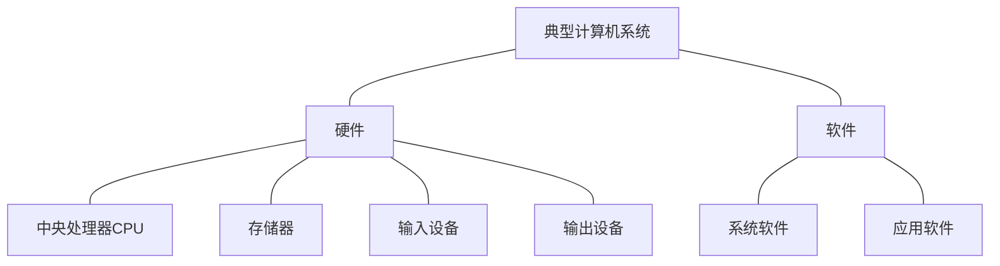
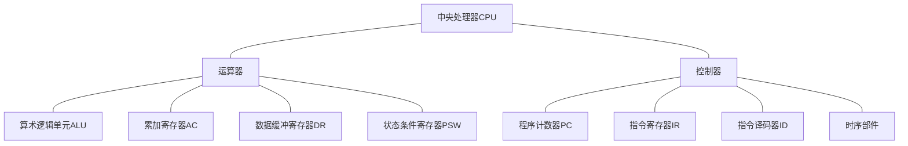

# 计算机结构

- 中央处理器CPU
- 主存储器（内存）、辅助存储器（外存）
- 输入设备
- 输出设备

- 总线

  - 数据总线

    数据通信；在CPU与RAM之间来回传送需要处理或是需要储存的数据

  - 控制总线

    与CPU的**控制器**通信；将微处理器控制单元(ControlUnit)的信号，传送到周边设备

  - 地址总线

    CPU的**控制器与**主存的通信；用来指定在RAM(RandomAccessMemory)之中储存的数据的地址

## CPU组成

**运算器**

1. **算术逻辑单元ALU**：数据的算术运算和逻辑运算
2. **累加寄存器AC**：**通用寄存器**，为ALU提供一个工作区，用在**暂存数据数据**
3. **数据缓冲寄存器DR**：写内存时，暂存指令或数据
4. **状态条件寄存器PSW**：存状态标志与控制标志

**控制器**

1. **程序计数器PC**：存储下一条要执行**指令的地址**
2. **指令寄存器IR**：存储即将执行的指令
3. **指令译码器ID**：对指令中的操作码字段进行分析解释
4. **时序部件**：供时序控制信号

## 存储系统（重要）

> 去看高级的:dog: -> [存储系统](../系统架构设计师/1.计算机组成(中级).md#存储系统 "系统架构设计师")

# 指令系统

## 寻址方式

1. 立即寻址方式

   ==**操作数**==直接在指令中，速度快，灵活性差

2. 直接寻址方式

   指令中存放的是**操作数的地址**

3. 间接寻址方式

   指令中存放了一个地址，这个**地址**对应的内容是**操作数的地址**

4. 寄存器寻址方式

   寄存器存放操作数

5. 寄存器间接寻址方式

   寄存器内存放的是操作数的地址

## CISC、RISC

CISC：复杂指令集

RISC：精简指令集

| 指令系统类型 | 指令                                                         | 寻址方式   | 实现方式                                          | 其他                       |
| ------------ | ------------------------------------------------------------ | ---------- | ------------------------------------------------- | -------------------------- |
| CISC（复杂） | 数量多，使用频率差别大;可变长格式                            | 支持多种   | 微程序控制技术(微码)                              | 研制周期长                 |
| RISC（精简） | 数量少，使用频率接近，定长格式，大部分为单周期指令， 操作寄存器，只有Load/Store操作内存 | 支持方式少 | 增加了通用寄存器;硬布线逻辑控制为主适合采用流水线 | 优化编译，有效支持高级语言 |

## 流水线技术

> 去看高级的:dog: -> [指令执行流水线](../系统架构设计师/1.计算机组成(中级).md#指令执行流水线 "系统架构设计师")

# 可靠性

> 去看高级的:dog: -> [系统可靠性分析](../系统架构设计师/12.系统可靠性分析与设计.md#系统可靠性分析 "系统架构设计师")

# 性能指标

> 去看高级的:dog: -> [性能计算](../系统架构设计师/6.系统配置与性能评价.md#性能计算 "系统架构设计师")

