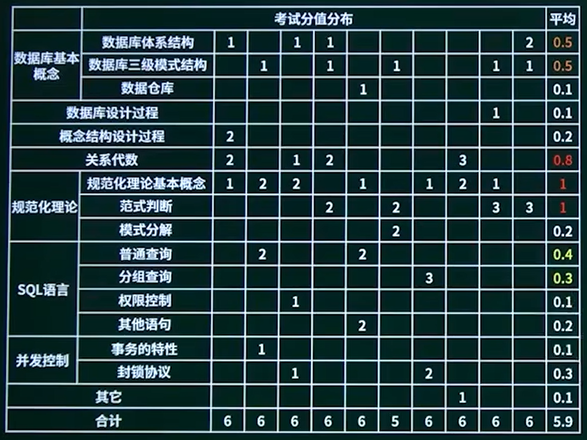
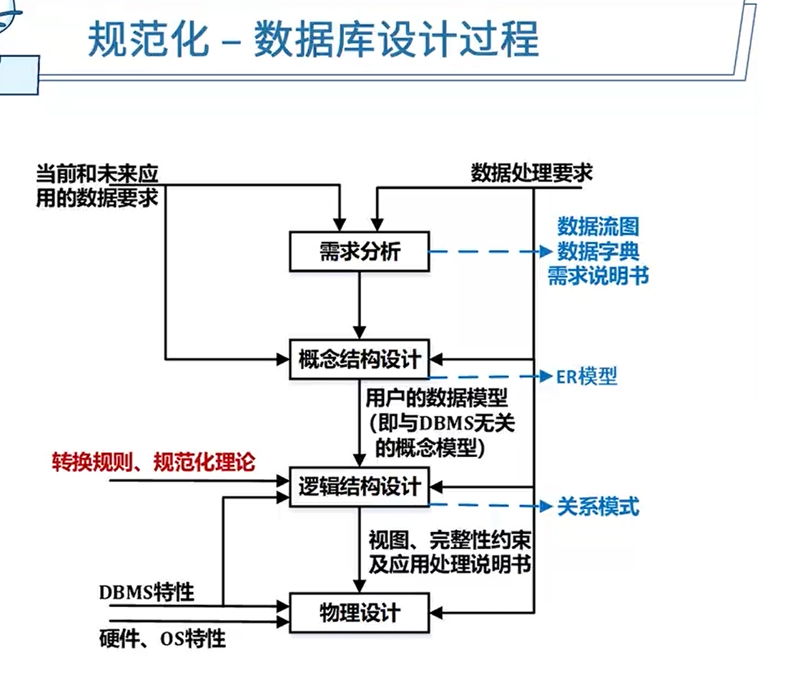
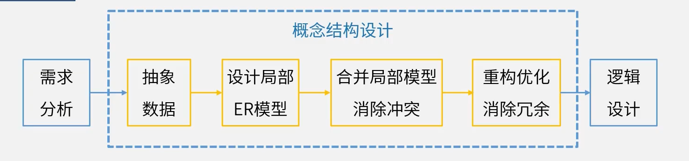
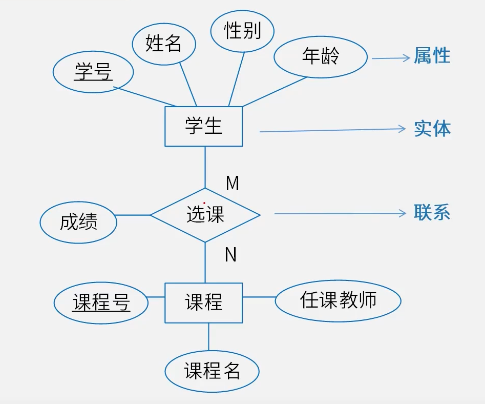
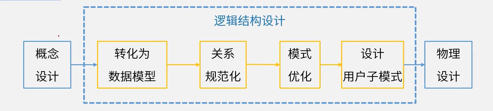
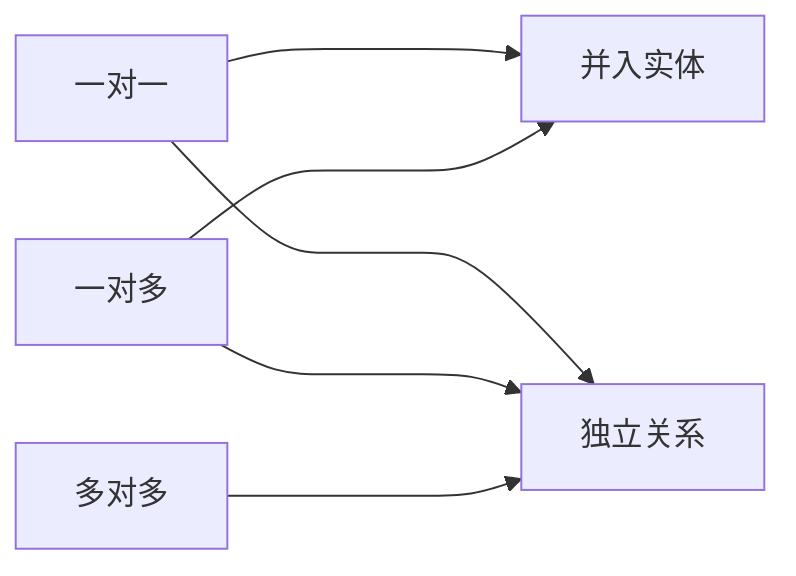
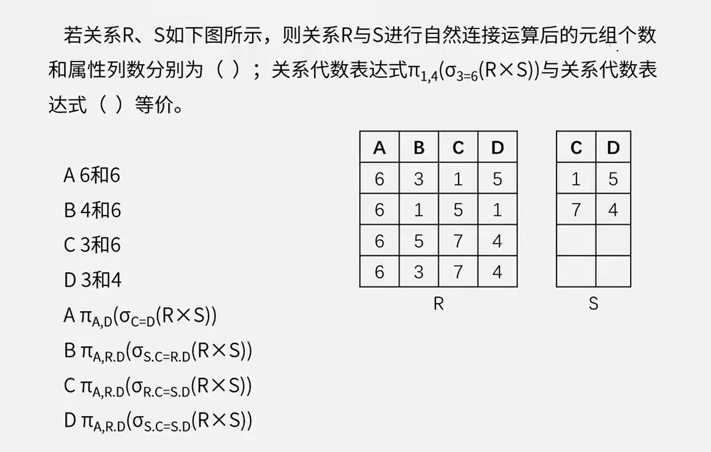
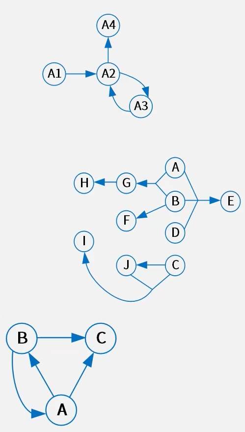

# 数据库

去看高级的:dog: -> [数据库](../系统架构设计师/3.数据库设计基础知识.md "系统架构设计师")


## 数据库体系结构

1. 集中式数据库系统
2. C/S、B/S结构
3. 分布式数据库
4. 并行数据库


### 分布式数据库

数据的集中控制性、数据独立性、数据冗余可控性、场地自治性、存取有效性

- 数据独立性：

- 数据的集中控制性：局部独立地管理局部数据库

- 数据冗余可控性：在不同场地存储同一数据副本

  可以提高系统的**可靠性和可用性**

- 全局有效性


### 分布式数据库透明性

- **分片透明性**

  用户不必关心数据是如何分片的，他们对**数据的操作**在全局关系上进行

  - 水平分片：按**记录**分
  - 垂直分片：按**字段**分
  - 混合分片

- **复制透明性**

  用户不用关心数据库在网络中各个节点的复制情况，被复制的数据和更新都由系统自动完成

- **位置透明性**

  数据放在哪里，用户不用管，即数据分配到哪个站点存储对用户是透明的

- **局部映像模型透明性（逻辑透明）**

  提供数据到局部数据库的映像，用户不必关心局部DBMS支持哪种**数据模型**，使用哪种**数据操纵语言**，数据模型和操纵语言由系统自动完成


# 三级模式结构

> 去看高级的:dog: -> [数据库三级模式结构](../系统架构设计师/3.数据库设计基础知识.md#数据库三级模式结构 "系统架构设计师")


# 数据仓库

数据仓库的特点：

- **面向主题**： 数据按主题组织
- **集成的**：消除了源数据中的不一致性，提供整个企业的一致性全局信息
- **相对稳定的(非易失的)**：主要进行查询操作，只有少量的修改和删除操作(或是不删除)
- **反映历史变化(随着时间变化)**：记录了企业从过去某一时刻到当前各个阶段的信息，可对发展历程和未来趋势做定量分析和预测

企业信息化和商业智能：

1. 数据预处理

2. 数据仓库存储

3. 数据分析

   OLTP与OLAP：

   - OLTP 即**联机事务处理**，就是我们经常说的关系数据库的基础
   - OLAP即**联机分析处理**，是数据仓库的核心部分

4. 数据展示

   数据挖掘与传统数据分析的区别：数据挖掘是在没有明确假设的前提下去挖掘信息、发现知识。数据挖掘所得到的信息应具有**先知**、**有效**和**可实用**三个特征


# 数据库设计过程

1. 需求分析

   **数据流图、数据字典、需求说明书**

2. 概念结构设计

   **ER模型**

3. 逻辑结构设计

   **转换规则、规范化理论**

4. 物理设计

   **硬件、OS特性、聚簇索引**



## 1.需求分析阶段

## 2.概念设计阶段

### 概念设计过程



1. 抽象数据

2. 设计局部ER模型

3. 合并局部模型消除冲突

   集成方法：

   - 多个局部E-R图一次集成
   - 逐步集成，用累加的方式一次集成两个局部E-R

   集成产生的冲突及解决办法:(针对同一对象)

   - 属性冲突：包括属性域冲突和属性取值冲突
   - 命名冲突：包括同名异义和异名同义
   - 结构冲突：包括同一对象在不同应用中具有不同的抽象，以及同一实体在不同局部E-R图中所包含的属性个数和属性排列次序不完全相同

4. 重构优化消除冗余

### E-R图（实体联系图）

E：实体

R：联系



#### 联系类型判断

两个不同实体集之间联系

- 一对一

- 一对多

- 多对多


## 3.逻辑结构设计



### 关系模式相关概念

#### 数据模型

数据模型三要素：数据结构、数据操作、数据的约束条件

- 层次模型
- 网状模型
- 面向对象模型
- **关系模型**

##### 关系模型

- 目或度：关系模式中**属性的个数**
- 候选码（[候选键](#候选键)）：唯一标识元组，且无冗余
- 主码（主键）：候选键的其中一个
- [主属性与非主属性](#主属性与非主属性)：组成候选码的属性就是主属性，其它的就是非主属性
- 外码（外键）
- 全码（ALL-Key）：关系模式的所有**属性组**是这个关系的候选码

##### 完整性约束

**实体完整性**：规定基本关系的主属性不能取空值**主键**

**参照完整性**：关系与关系间的引用，**外键**

**用户自定义完整性约束**：应用环境决定


### E-R图转关系模式

一个**实体**型必须转换为一个**关系模式**
联系转关系模式

- 一对一：

  **独立的关系模式**：并入两端主键及联系自身属性。（主键：任一端主键）

  **归并(任意一端)**：并入另一端主键及联系自身属性。（主键：保持不变）

- 一对多：

  **独立的关系模式**：并入两端主键及联系自身属性。（主键：多端主键）

  **归并(多端)**：并入另一端主键及联系自身属性。(主键：保持不变）

- 多对多：

  **独立的关系模式**：并入两端主键及联系自身属性。（主键:两端主键的组合键）

  不能做归并




### 关系代数

并(∪)、交(∩)、差(-)、笛卡尔积(×)、投影(π)、选择(σ)、连接(⋈)

- 笛卡尔积(×)

  - 列：二者之和
  - 行：二者乘积

- 投影(π)

  无条件选择

  ```sql
  select * from table where 1=1
  ```

- 选择(σ)

  有条件选择

  ```sql
  select * from table where columnName > 1
  ```

- 连接(⋈)

  条件相等的两个表

  ```sql
  select * from table1, table2
  where table1.a = table2.b
  ```

  - 列：二者之和 减 重复列数
  - 行：条件相等的行数




### 规范化理论

**Armstrong公理**

- 自反律(Reflexivity) : 若Y∈X∈U，则X->Y成立。
- 增广律(Augmentation):若Z∈U且X->Y，则XZ->YZ成立
- 传递律(Transitivity):若X->Y且Y->Z，则X->Z成立。

根据A1，A2，A3这三条推理规则可以得到下面三条推理规则：

- 合并规则:由X->Y，X->Z，有X->YZ。 (A2，A3)
- 伪传递规则:由X->Y，WY->Z，有XW->Z。 (A2，A3)
- 分解规则:由X->Y及Z∈Y，有X->Z。 (A1，A3)


冗余依赖：A->B、B->C、A->C，则A->C是冗余的。即传递函数依赖


#### 候选键

将关系模式的函数依赖关系用“有向图”的方式表示

- 找**入度为0**的属性，并以该属性集合为起点，尝试遍历有向图，若能正常遍历图中所有结点，则该属性集即为关系模式的候选键
- 若入度为0的属性集不能遍历图中所有结点，则需要尝试性的将一些**中间结点**(既有入度，也有出度的结点)并入入度为0的属性集中，直至该集合能遍历所有结点，集合为候选键



图1：此处A1的入度位0（0个箭头流向它），并且能推出所有节点，所以A1为候选键

图2：候选键为ABCD

图3：A能推出所有节点，B也能推出所有节点，所以A、B为均是候选键


#### 主属性与非主属性

组成候选码的属性就是主属性，其他的就是非主属性

图1的主属性为A1，图2的主属性为A、B、C、D


#### 范式

**部分依赖**：A->C，AB->D，候选键是AB，A->C属于部份依赖。

- 第一范式 (1NF)

  在关系模式R中，当且仅当所有域只包含原子值，即每个属性都是**不可再分的数据项**，则称关系模式R是第一范式。

  如，课程老师可以分为语文老师、数学老师，则属于可再分

- 第二范式 (2NF)

  当且仅当实体E是第一范式 (1NF) ，且每一个**非主属性==完全==依赖主键**，而不能只依赖于主键的一部分，则称实体E是第二范式。

  如候选键为AB，不能存在一个属性仅仅依赖于B，只能依赖于AB。所以只有一个主键的表一定会满足2NF

- 第三范式 (3NF)

  当且仅当实体E是第二范式 (2NF) ，且**非主属性**不能依赖于其他非主属性，**必须直接依赖于主键**（**消除传递依赖**），则称实体E是第三范式。

  当B->C，AC->B，故而候选键是AB和AC，当没有非主属性的时候至少满足3NF

- BC范式 (BCNF)

  设R是一个关系模式，F是它的依赖集，R属于BCNF当且仅当其F中每个依赖的决定因素**必定包含R的某个候选键**（即必须是某个主键）。

  当B->C，AC->B，故而候选键是AB和AC，满足3NF，但是B不等于AB，也不等于AC（即B不是主键），故而，不满足BCNF


#### 模式分解

- **保持函数依赖分解**

  设数据库模式ρ={R1，R2，··，Rk}是关系模式R的一个分解，F是R上的函数依赖集，ρ中每个模式Ri上的FD集是Fi。如果{F1, F2, ···, FK}与F是等价的 (即相互逻辑蕴涵)，那么称分解ρ保持FD。

  

  例：有关系模式R(A，B，C)，F= {A->B，B->C，A->C}，将其拆分为:R1 (A，B)，R2 (B，C) ，则保持函数依赖。

  

- **无损联接分解**：指将一个关系模式分解成若干个关系模式后，通过**自然联接和投影**等运算仍能还原到原来的关系模式

  1. 保持了函数依赖
  2. 通过自然连接可以还原

  

  **表格法**：出现同名属性列的才可以当主键，如R(A，B，C)，F= {A->B，A->C}，将其拆分为:R1 (A，B)，R2 (B，C) ，同名属性列是B，故而只能推导出B->A，B->C，此间关系不在{A->B，A->C}中，所以这样分解是有损联接分解。

  ---

  例：设R=ABC，F={A->B}，则分解 ρ1={ R1(AB)，R2(AC) } 与分解 ρ2{ R1(AB)，R3(BC) } 是否都为无损分解?

  - R1(AB)满足 A->B 保持了函数依赖，ρ1同名列为A，**A是决定因素**，将C提上AB行得出ABC，ρ1是无损联接分解；故而ρ1是保持了函数依赖，并且是无损联接分解

  - R1(AB)满足 A->B 保持了函数依赖，ρ2同名列为B，**B不是决定因素**，无法满足一行同时拥有ABC，ρ2是保持了函数依赖，可有损联接分解

  ---


### 反规范化

优点：

​	连接操作少、检索快、**统计快**，需要查的表较少，检索容易

缺点：

- 数据冗余，**需要更大存储空间**
- 插入、更新、删除操作开销更大、**数据不一致**
- 可能产生添加、修改、删除**异常**、更新和插入代码更难写


### 事务的特性

- 原子性：事务是原子的，**要么做，要么都不做**。
- 一致性：事务执行的结果必须**保证数据库从一个一致性状态变到另一个一致性状态**。
- 隔离性：**事务相互隔离**。当多个事务并发执行时，任一事务的更新操作直到其成功提交的整个过程，对其他事物都是不可见的。
- 持续性：一旦**事务成功提交**，即使数据库崩溃，其对数据库的更新操作也永久有效。


**事务并发**的问题：

1. 丢失更新

   多个事务同时的修改

2. 不可重复读

   验算数据之前，数据被其他事务修改

3. 读“脏”数据

   读取到**回滚**前的脏数据


**并发控制**：

对事务并发产生的问题解决方案：

使用封锁协议

1. S锁（共享锁、读锁）

   若事务T对数据对象A加上S锁，其他事务只能对A**再加S锁**，不能再对A添加X锁。

2. X锁（排他锁、独占锁、写锁）

   若事务T对数据对象A加上X锁，其他事务**不能**再对A添加任意锁


## 4.物理设计


参考答案：

5-7：D、C
