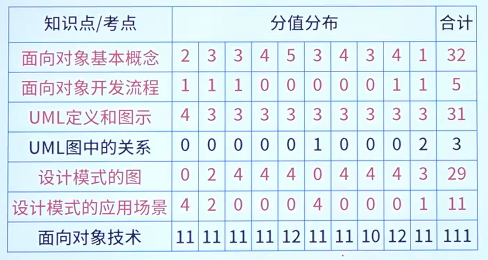
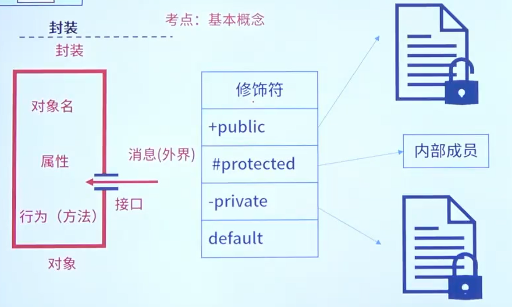

> 参考使用:dog: -> [软件工程](../系统架构设计师/9.软件工程（√）.md "系统架构设计师")

# 面向对象基础

## 封装

### 对象

在面向对象方法中，将逻辑上相关的**数据以及行为绑定**在一起使**信息对使用者隐蔽**称为封装

- 对象名
- 属性
- 行为（方法）

### 类

类名、数据成员、成员函数

| 类的分类                        |                                                              |
| ------------------------------- | ------------------------------------------------------------ |
| 实体类(数据类)                  | 现实世界**真实存在的实体**有大量属性                         |
| 接口类(功能类、边界类interface) | 为用户提供系统合作**交互的方式**，有大量方法                 |
| 控制类                          | 描述业务逻辑，用来**控制活动流**充当实体类和接口类之间的协调者 |

## 继承

继承：子类是父类的特殊化

泛化：父类是子类的泛化

**重写（覆盖）**：在子类中重新定义父类中已经定义的方法

**重载**：一个类可以有多个同名而参数类型不同的方法

多重继承的问题：Java不支持，C++支持

## 多态

**重写（覆盖）和重载是多态具体的表现形式**。不同继承类的同名方法的不同表现形式

动态绑定和多态

1. 要有继承关系
2. 要发生了重写
3. 要有[父类引用]指向[子类对象]

动态绑定：运行时

静态绑定：编译时

---

- 参数多态：应用广泛、最纯的多态
- 包含多态：同样的操作可用于一个类型及其子类型。包含多态一般需要进行运行时的类型检查
- 强制多态：编译程序通过语义操作，把操作对象的类型强行加以变换，以符合函数或操作符的要求
- 过载多态：同一个名(操作符、函数名)在不同的上下文中所代表的含义不同

# 面向对象开发流程

| 面向对象开发流程   | --                                                           |
| ------------------ | ------------------------------------------------------------ |
| 1.面向对象分析     | 认定**对象**(名词) 组织**对象**(抽象成类) **对象**间的相互作用 基于**对象**的操作 |
| 2.面向对象设计     | **识别**类及对象 **定义**属性 **定义**服务 **识别**关系 **识别**包 |
| 3.面向对象程序设计 | 程序设计范型 选择一种面向对象**语言**                   |
| 4.面向对象测试     | 算法层 类层 模板层 系统层                     |

## 设计原则

- 单一职责原则：设计目的单一的类
- 开放-封闭原则：对扩展开放，对修改封闭
- 李氏(Liskov) 替换原则：**子类**可以**替换父类**
- 依赖倒置原则：要依赖于抽象，而不是具体实现，**针对接口编程**，不要针对实现编程
- 接口隔离原则：使用**多个专门的接口**比使用单一的总接口要好
- 组合重用原则：要尽量**使用组合**，而不是继承关系达到重用目的
- 迪米特 (Demeter) 原则 (最少知识原则)：一个对象应当对其他对象有尽可能**少的了解**

其他原则

-  重用发布等价原则：重用的粒度就是发布的粒度
- **共同封闭原则**：包中的所有类对于同一性质的变化应该是共同封闭的。一个变化若对一个包产生影响，则将对该包里的所有类产生影响，而**对于其他的包不造成任何影响**
- **共同重用原则**：一个包里的所有类应该是共同重用的。如果重用了包里的一个类，那么就要重用包中的所有类
- **无环依赖原则**：在包的依赖关系图中不允许存在环，即包之间的结构必须是一个直接的无环图形
- 稳定抽象原则：包的抽象程度应该和其稳定程度一致
- 稳定依赖原则：朝着稳定的方向进行依赖

