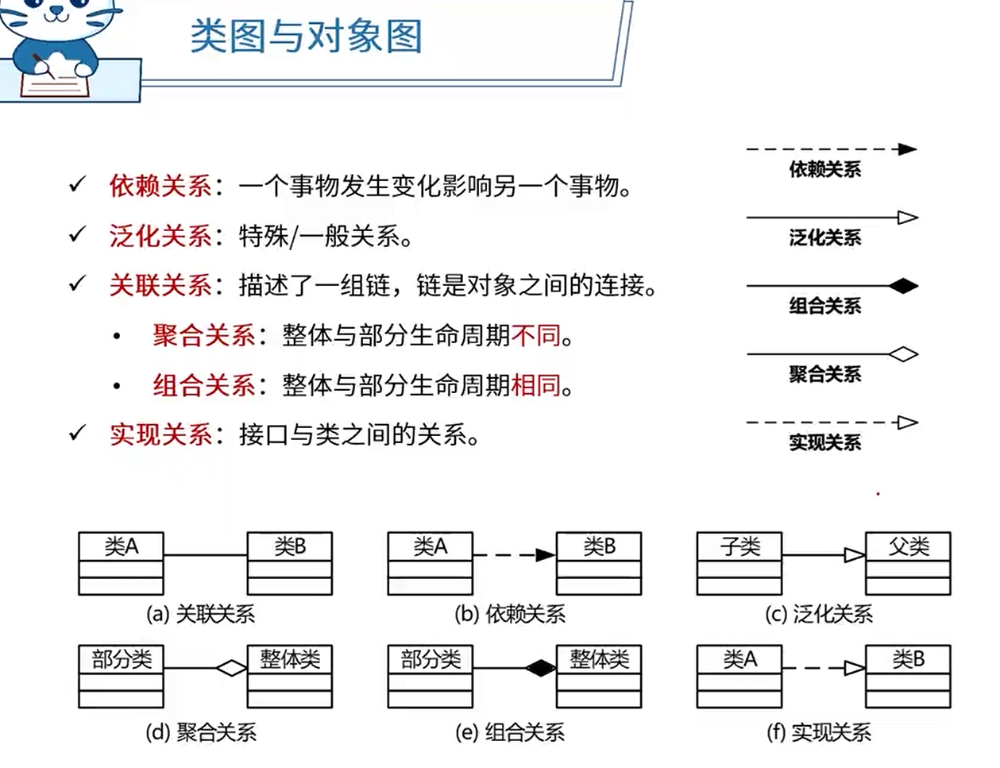
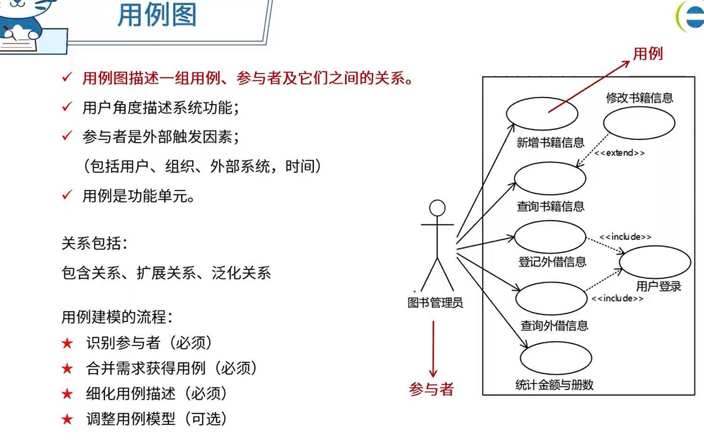
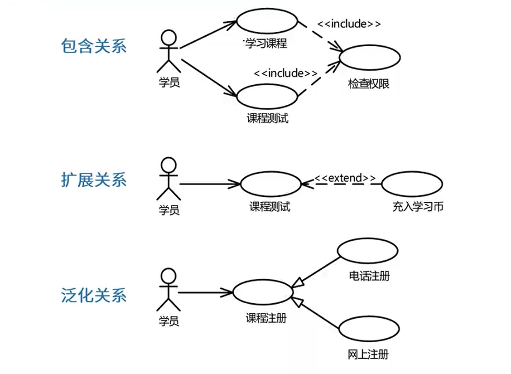
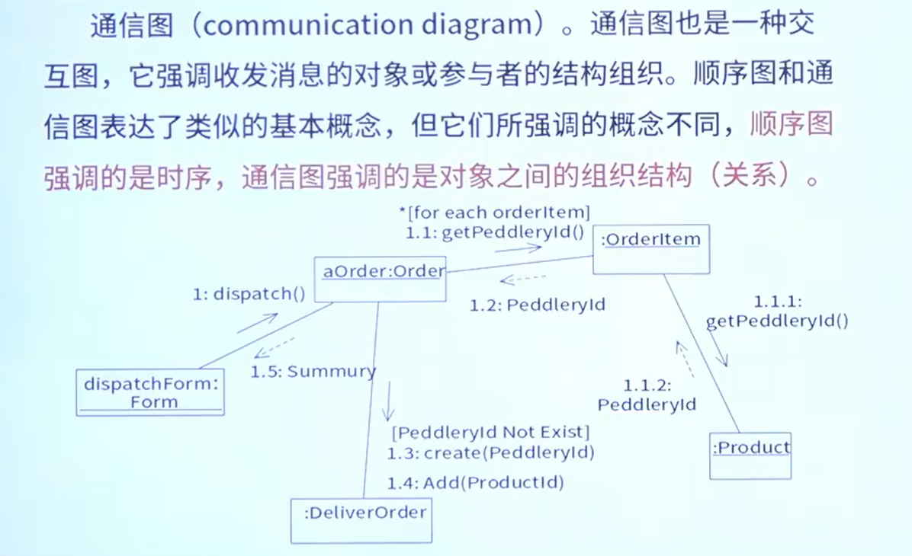

# 统一建模语言 UML

参考使用:dog: -> [UML](../系统架构设计师/9.软件工程（√）.md#UML "系统架构设计师")

==**Unified Modeling Language 统一建模语言，又称标准建模语言**==

- **类图**：一组类、接口、协作和它们之间的关系

  通常对**系统词汇**、**简单协作**、**逻辑数据库模式**建模

- **对象图**：一组对象以及它们之间的关系

  **对象**快照

- 通信图：强调**收发消息**的对象之间的组织结构。（对象之间收发消息）

- 序列图（顺序图）：场景的图像化表示，以**时间顺序**组织的对象间的交互活动。（按时间顺序的交互）

- 状态图：展现了一个状态机，由**状态**、转换、事件和活动组成。（物体状态）

- 活动图：专注于系统的动态视图，一个**活动到另一个活动的流程**。（业务层）

## 静态图(结构图)

### 类图

**类图**：一组类、接口、协作和它们之间的关系

#### 类图中的关系

1. 依赖关系
2. 泛化关系
3. 关联关系
4. 实现关系

### 构件图(组件图)

构件图描述一个封装的类和它的接口、端口，以及由内嵌的构件和**连接件构成**的内部结构。构件图用于表示系统的**静态设计实现视图**。对于由小的部件构建大的系统来说，构件图是很重要的。构件图是类图的变体。

即模块之间的关系

- 半圆是需要接口
- 整圆是供接口

### 部署图

## 动态图(行为图)

### 用例图

**用例图**：系统与外部参与者的交互

用例图中的关系：

- **包含关系**

  当可以从**两个或两个以上的用例**中提取**公共行为**时应该使用包含关系来表示它们，其中这个提取出来的公共用例称为抽象用例，而把原始用例称为基本用例或基础用例

- **扩展关系**

  如果**一个用例**明显地**混合**了两种或两种以上的**不同场景**，即根据情况可能发生多种分支，则可以将这个用例分为一个基本用例和一个或多个扩展用例，这样使描述可能更加清晰

- **泛化关系**

  当**多个用例**共同**拥有一种类似的结构和行为**的时候可以将它们的共性抽象成为**父用例**，其他的用例作为泛化关系中的子用例。在用例的泛化关系中，子用例是父用例的一种特殊形式，子用例继承了父用例所有的结构、行为和关系

  本质上都是一个功能，只是实现方式不同，如课程注册、电话注册、网上注册。都是注册:dog:

用例建模的流程：

1. 识别参与者
2. 合并需求获得用例
3. 细化用例描述
4. 调整用例模型

### 顺序图

顺序图(sequence diagram，序列图)。顺序图是种交互图(interaction diagram)，交互图展现了一种交互，它由一组对象或参与者以及它们之间可能**发送的消息**构成。交互图专注于系统的动态视图。顺序图是强调**消息的时间次序**的交互图

实线箭头：调用消息

虚线箭头：返回消息

备注：**以()为标准**，有()（如`readCard()`）为调用，没有则为返回对象

### 通信图

通信图也是一种交互图，它强调收发消息的对象或参与者的结构组织。顺序图和通信图表达了类似的基本概念，但它们所强调的概念不同，**顺序图强调的是时序**，通信图强调的是**对象之间的组织结构**(关系)

### 活动图

活动图(activitydiagram)。活动图将进程或其他计算结构展示为计算内部一步步的控制流和数据流。

活动图专注于**系统的动态视图**。它对系统的功能建模和业务流程建模特别重要，并强调对象间的控制流程。

活动图更多的是强调**业务层**面的东西

关键词汇：

- 流
- 并发分叉、并发汇合
- **监护表达式**

### 状态图

状态图(state diagram)。状态图描述一个状态机，它由状态.转移、事件和活动组成。状态图给出了对象的动态视图。它对于接口、类或协作的行为建模尤为重要，而且它强调事件导致的对象行为，这非常有助于对**反应式系统**建模。

状态图由以下五部分进行构成：**一般状态**(起始状态，终止状态)、**事件**、**监护条件**、**动作**，**转移**(又叫转换)

- 状态：一个状态图只能有**一个初态**，但**终态可以**有一个或**多个**，也可以没有终态

  状态名 -> 进入/退出动作 -> 内部转移 -> 子状态 -> 延迟事件

  组合状态

  - 顺序子状态：多个子状态之间是互斥的，不能同时存在。
  - 并发子状态：某个时刻可以同时达到多个子状态，并且状态内部可以并发进行。

- 事件：

  - 信号事件
  - 调用事件
  - 变换事件
  - 时间事件

- 转移：转移是两个**状态间的一种关系**，表示对象将在当前状态中执行动作，并在某个特定事件发生或某个特定的条件满足时进入后继状态。

  格式：事件（参数）[条件]/动作

  如turnOn为事件、有水为条件、烧水为动作

- 当对系统、类或用例的动态方面建模时，通常是对反应型对象建模
