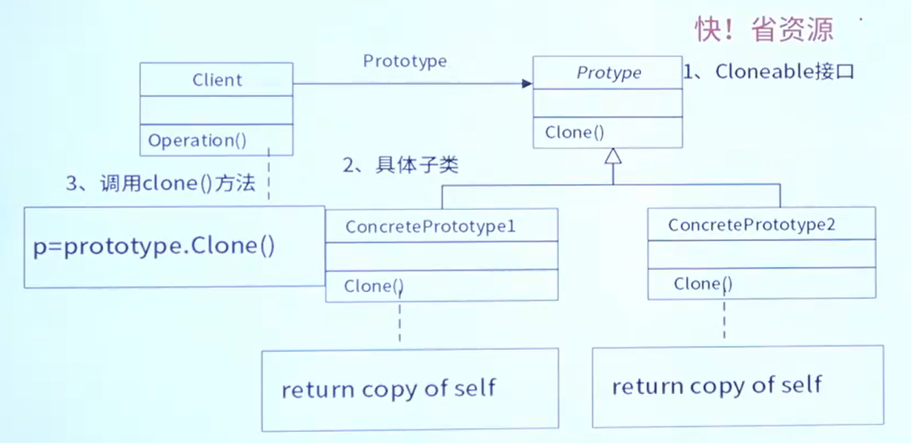

# 设计模式

备考要求：

1. 需要辨识中英文名称
2. 需要背一下设计模式的UML图
3. 了解设计模式的意图使用场景及类图结构

|      | 创建型5                                                      | 结构型7                                                      | 行为型11                                                     |                    |
| ---- | ------------------------------------------------------------ | ------------------------------------------------------------ | ------------------------------------------------------------ | ------------------ |
| 类   | 工厂方法(FactoryMethod)模式                                  | **适配器 (Adapter) 模式**                                    | 模板方法(Template Method) 模式 解释器 (Interpreter)模式 | 4 工适有个模特小解 |
| 对象 | **抽象工厂(Abstract Factory) 模式** **原型(Prototype) 模式** 单例(Singleton)模式 **构建器(Builder)模式** | **桥接 (Bridge) 模式** **组合 (Composite) 模式** **装饰 (Decorator) 模式** 外观(Facade)模式 享元(Flyweight) 模式 代理(Proxy)模式 | 职责链 (Chain of Responsibility) 模式 **命令 (Command) 模式** 迭代器 (lterator) 模式 **中介者 (Mediator) 模式** 备忘录(Memento)模式 **观察者 (observer) 模式** **状态 (state) 模式** **策略 (Strategy) 模式** 访问者(Visitor)模式 |                    |
|      |                                                              | 四桥组装外箱带                                               |                                                              |                    |

## 创建型

主要用于创建对象，为设计类实例化提供指南

| 设计模式名称                 | 简要说明                                                     | 速记关键字         |
| ---------------------------- | ------------------------------------------------------------ | ------------------ |
| AbstractFactory 抽象工厂模式 | 提供一个接口，可以创建**一系列**相关或相互依赖的**对象**，而无需指定它们具体的类 | 生产成**系列**对象 |
| Builder 构建器模式           | 将一个**复杂类**的**表示**与其**构造**相**分离**，使得相同的构建过程能够得出不同的表示 | **复杂对象**构造   |
| Factory Method 工厂方法模式  | 定义一个创建对象的接口，但由其子类决定需要实例化**哪一个**类。工厂方法使得子类实例化的过程推迟 | 动态生产一个对象   |
| Prototype 原型模式           | 用原型实例指定创建对象的类型，并且通过**拷贝**这个原型来创建**新的对象** | **克隆对象**       |
| Singleton 单例模式           | 保证一个类**只有一个实例**，并提供一个访问它的**全局访问点** | **单**实例         |

### 抽象工厂模式

提供一个接口，可以创建**一系列**相关或相互依赖的**对象**，而无需指定它们具体的类

### 工厂模式

定义一个创建对象的接口，但由其子类决定需要实例化**哪一个**类。工厂方法使得子类实例化的过程推迟  

### 原型模式

用原型实例指定创建对象的类型，并且通过**拷贝**这个原型来创建**新的对象**

### 单例模式

保证一个类**只有一个实例**，并提供一个访问它的**全局访问点**

### 构建器模式

将一个**复杂类**的**表示**与其**构造**相**分离**，使得相同的构建过程能够得出不同的表示

## 结构型

主要用于处理类或对象的**集合**，对类如何设计以形成更大的结构提供指南

| 设计模式名称           | 简要说明                                                     | 速记关键字       |
| ---------------------- | ------------------------------------------------------------ | ---------------- |
| **Adapter 适配器模式** | 将一个类的**接口**转换成用户**希望**得到的**另一种接口**。它使原本不相容的接口得以相容后协同工作 | 转换接口         |
| Bridge 桥接模式        | 将类的**抽象部分**和它的**实现部分**分离开来，使它们可以独立地变化。抽象部分通过实现部分的接口与实现部分联系起来。 此时的接口就像一座**桥梁**一样。 | 继承树拆分       |
| Composite 组合模式     | 将具有**层级关系**的多个对象组合成**树型结构**以表示“整体-部分”的层次结构，使得用户对单个对象和组合对象的使用具有一致性 | 树型目录结构     |
| Decorator 装饰模式     | 动态地给一个对象**添加**一些额外的**职责、功能**。就像是添加了一些**装饰**。它提供了用子类扩展功能的一个灵活的替代，比派生一个子类更加灵活 | 附加职责         |
| Facade 外观模式        | 为子系统中的**一组接口**提供一个**接口**，从而简化了该子系统的使用。在外界看来，系统只有1个样子(**外观**) | 对外统一接口     |
| Flyweight 享元模式     | 支持大量细粒度对象**共享元对象**的有效方法                   | 文章共享文字对象 |
| Proxy 代理模式         | 为其他对象提供一个代理用以控制这个对象的访问                 | 快捷方式         |

### 适配器模式

将一个类的**接口**转换成用户**希望**得到的**另一种接口**。它使原本不相容的接口得以相容后协同工作

### 桥接模式

将类的**抽象部分**和它的**实现部分**分离开来，使它们可以独立地变化。抽象部分通过实现部分的接口与实现部分联系起来

此时的接口就像一座**桥梁**一样

### 组合模式

将具有**层级关系**的多个对象组合成**树型结构**以表示“整体-部分”的层次结构，使得用户对单个对象和组合对象的使用具有一致性

### 装饰模式

**动态**地给一个对象**添加**一些额外的**职责、功能**。就像是添加了一些**装饰**。它提供了用子类扩展功能的一个灵活的替代，比派生一个子类更加灵活

### 外观模式

为子系统中的**一组接口**提供一个**接口**，从而简化了该子系统的使用。在外界看来，系统只有1个样子(**外观**)

### 享元模式

支持大量细粒度对象**共享元对象**的有效方法

### 代理模式

为其他对象提供一个**代理**用以控制这个对象的访问

## 行为型

主要用于描述类或对象的**交互**及**职责的分配**，对类之间的交互以及分配职责的方式提供指南

| 设计模式名称                       | 简要说明                                                     | 速记关键字       |
| ---------------------------------- | ------------------------------------------------------------ | ---------------- |
| Chain of Responsibility 职责链模式 | 通过给多个对象处理请求的机会减少请求的发送者与接收者之间的耦合。将**接收对象**链接起来，在链中传递请求，直到有一个对象处理这个请求 | 传递职责         |
| Command 命令模式                   | 将**一个请求(方法调用)**封装为一个**对象**，从而可用不同的请求对客户进行参数化，将请求排队或**记录请求日志**，**支持可撤销**的操作 | 日志记录，可撤销 |
| Interpreter 解释器模式             | 给定一种**语言**，定义它的**文法**表示，并定义一个**解释器**，该解释器用来根据文法表示来解释语言中的句子 | 虚拟机的机制     |
| lterator 迭代器模式                | 提供**一种统一的方法**顺序访问一个聚合对象中各个元素，而又不需暴露该对象的内部表示 | 数据库数据集     |
| Mediator 中介者模式                | 用**一个中介对象**来封装**一系列的对象交互**。它使各对象不需要显式地相互调用，从而达到低耦合，还可以独立地改变对象间的交互 | 直接引用         |
| Memento 备忘录模式                 | 在不破坏封装性的前提下，捕获一个对象的内部状态，并在该对象之外保存这个状态，从而可以在以后将该**对象恢复到原先保存的状态** |                  |
| Observer 观察者模式                | 定义对象间的一种一对多的依赖关系，当**一个对象的状态发生改变时**，所有依赖于它的对象都**得到通知并被自动更新** |                  |
| State 状态模式                     | 允许一个对象在其内部**状态改变**时**改变行为**               | 状态变成类       |
| Strategy 策略模式                  | 定义**一系列算法**，把它们一个个封装起来，并且使它们之间可互相替换，从而让算法可以**独立**于使用它的用户而变化 | 多方案切换       |
| Template Method 模板方法模式       | 定义一个操作中的**算法骨架**，而将一些步骤延迟到子类中，使得子类可以不改变一个算法的结构即可重新定义算法的某些特定步骤 | 文档模板填空     |
| Visitor 访问者模式                 | 表示**一个**作用于某对象结构中的各元素的**操作**，使得在不改变各元素的类的前提下定义作用于这些元素的**新操作** | 数据与操作分离   |

### 观察者模式

定义对象间的一种一对多的依赖关系，当**一个对象的状态发生改变时**，所有依赖于它的对象都**得到通知并被自动更新**

### 访问者模式

表示**一个**作用于某对象结构中的各元素的**操作**，使得在不改变各元素的类的前提下定义作用于这些元素的**新操作**

定义`Accept`操作

### 状态模式

允许一个对象在其内部**状态改变**时**改变行为**

### 职责链模式

通过给多个对象处理请求的机会减少请求的发送者与接收者之间的耦合。将**接收对象**链接起来，在链中**传递请求**，直到有一个对象处理这个请求

### 命令模式

将**一个请求(方法调用)**封装为一个**对象**，从而可用不同的请求对客户进行**参数化**，将**请求排队**或**记录请求日志**，**支持可撤销**的操作

### *解释器模式*

给定一种**语言**，定义它的**文法**表示，并定义一个**解释器**，该解释器用来根据文法表示来解释语言中的句子

### 迭代器模式

提供**一种统一的方法**顺序访问一个聚合对象中各个元素，而又不需暴露该对象的内部表示

`Iterator` 迭代器中有很多封装好的迭代方法

比如List继承了 `Iterator` ，因此拥有了迭代器的方法

### 中介者模式

用**一个中介对象**来封装**一系列的对象交互**。它使各对象不需要显式地相互调用，从而达到**低耦合**，还可以独立地改变对象间的交互

降低对象间的联系，达到低耦合的效果

### 备忘录模式

在不破坏封装性的前提下，捕获一个对象的内部状态，并在该对象之外保存这个状态，从而可以在以后将该**对象恢复到原先保存的状态**

### 策略模式

定义**一系列算法**，把它们一个个封装起来，并且使它们之间可互相替换，从而让算法可以独立于使用它的用户而变化

### 模板方法模式

定义一个操作中的**算法骨架**，而将一些步骤延迟到子类中，使得子类可以不改变一个算法的结构即可重新定义算法的某些特定步骤

