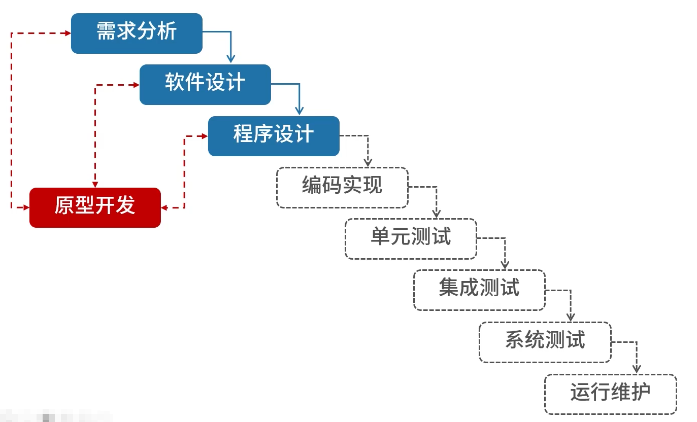
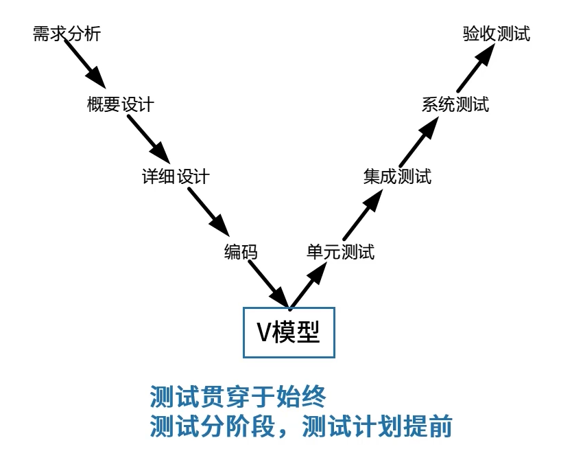
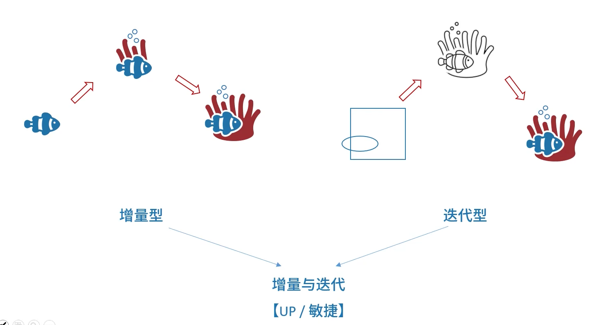
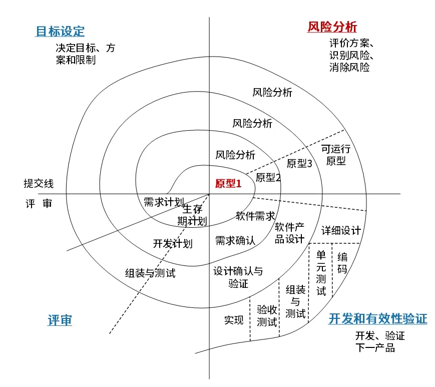
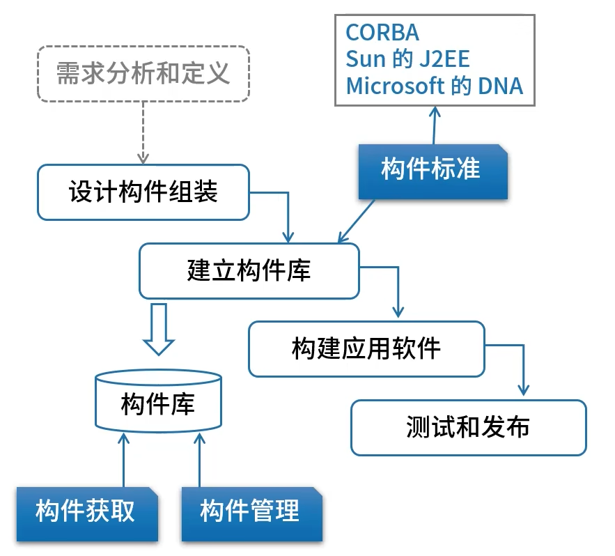
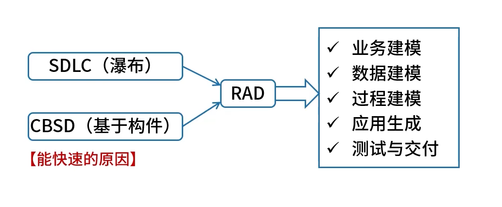
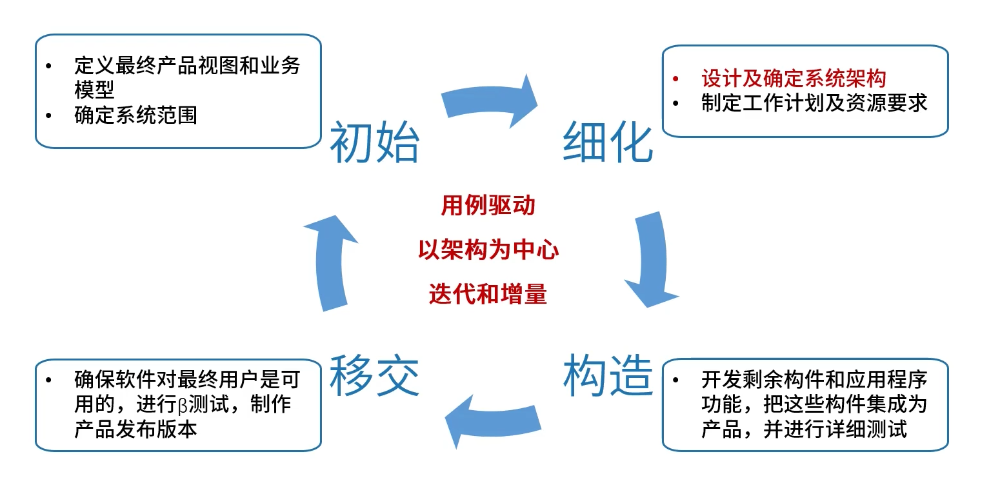
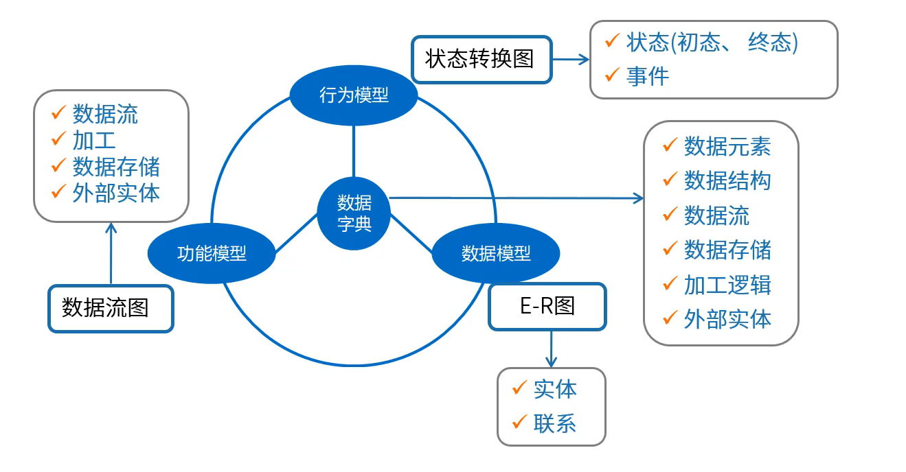
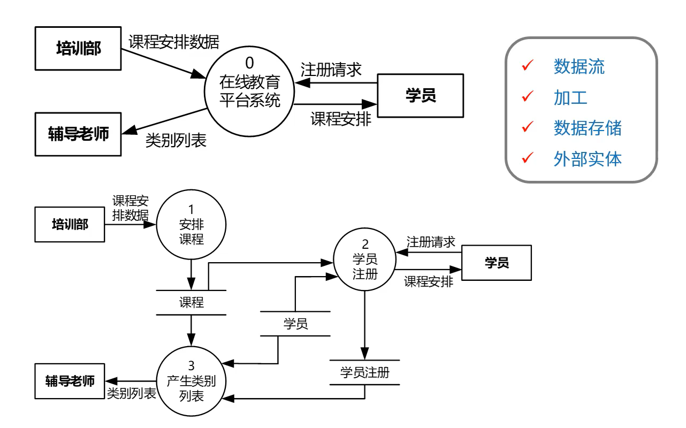
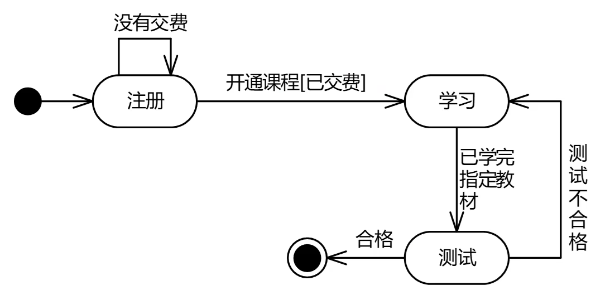

# 软件过程模型

## ==瀑布模型==

特点：

- 严格区分阶段，**每个阶段因果关系紧密相连**
- 只适用于**需求明确**的系统，需求不明确后期需要修改的话，代价很大

开发过程：

1. 需求分析
2. 软件设计
3. 程序设计
4. 编码实现
5. 单元测试
6. 集成测试
7. 系统测试
8. 运行维护

缺点：

1. 软件需求完整性、正确性难确定
2. 严格串行化，**很长时间才能看到结果**
3. 瀑布模型**要求每个阶段一次性完全解决该阶段工作**，这不现实

## ==原型模型==

适合**需求不明确**的项目，弥补了瀑布模型的不足

原型模型两个阶段：

1. 原型开发阶段
2. 目标软件开发阶段

原型分类：

1. 抛弃型原型
2. 演化型原型

> 原型模型会是很多模型的基础

## V模型【瀑布变种】

测试始终贯穿

## 迭代与增量

## 螺旋模型【原型+瀑布】

以**快速原型为基础** + 瀑布模型

考虑了**风险分析**

## 构件组装模型

【优点】易扩展、易**重用**、降低成本、安排任务更灵活

【缺点】构件设计要求经验丰富的架构师、设计不好的构件难重用、强调重用可能牺牲其它指标(如性能)、第三方构件质量难控制

初期构造**构件**比较困难，这个开发方法的优势在于在有构件的基础上，复用构件开发速度较快。如果没有构件基础，此方法的构建构件库的成本会比较大

## 基于构件的软件工程(CBSE)

在构件组装模型的基础上，以构件为基础完成软件工程全流程，强调购买组件而不是开发组件

CBSE的构件应该具备的特征：

1. 可组装性：所有**外部交互**必须通过**公开定义的接口**进行
2. 可部署性：构件总是二进制形式的，能作为一个**独立实体在平台上运行**
3. 文档化：用户根据文档来判断构件是否满足需求
4. 独立性：可以在无其他特殊构件的情况下进行组装和部署
5. 标准化：**符合某种标准化的构件模型**

构件的组装：

1. 顺序组装：按顺序调用己经存在的构件，可以用两个已经存在的构件来创造一个新的构件
2. 层次组装：被调用构件的“提供”接口必须和调用构件的“请求”**接口兼容**
3. 叠加组装：**多个构件合并形成新构件**，新构件整合原构件的功能，**对外提供新的接口**

## 快速应用开发RAD【瀑布+构件组装】

以瀑布模型为基础，通过引入大量构件给整个过程提速。

## 统一过程/统一开发方法(UP/RUP)

用例驱动、以架构为中心、迭代和增量

分为 **初始、细化、构造、移交** 4部分

1. 业务建模
2. 需求
3. 分析与设计
4. 实现
5. 测试
6. 部署
7. 配置与变更管理
8. 项目管理
9. 环境

## 敏捷开发方法

敏捷方法诞生比较晚

以原型开发思想为基础，采用迭代式增量开发

传统软件开发方法：

1. 预设性的
2. 以开发过程为本
3. 整体分阶段

敏捷方法：

1. 适应性的
2. **以人为本**
3. 增量迭代，小步快跑
4. 适合**小型项目**

**敏捷方法-XP**

4大价值观

1. 沟通（加强面对面沟通）
2. 简单（不过度设计）
3. 反馈（即使反馈）
4. 勇气（接受变更的勇气）

其他的方法

- **极限编程(XP)**：价值观【交流、朴素、反馈、勇气】、近螺旋式的开发方法。

- **水晶方法**：提倡“机动性”的方法，拥有对不同类型项目非常有效的敏捷过程。

- **SCRUM**：侧重于项目管理。

- **特征驱动开发方法(FDD)**：认为有效的软件开发需要3要素【人、过程、技术】

  定义了6种关键的项目角色：项目经理、首席架构设计师、开发经理、主程序员、程序员和领域专家。

- 开放式源码：程序开发人员在地域上分布很广【其他方法强调集中办公】

- ASD方法：其核心是三个非线性的、重叠的开发阶段:猜测、合作与学习。

- 动态系统开发方法(DSDM)：倡导以业务为核心

# 逆向工程

要抄一个东西（引入再提升），首先要有别人的成品（现有系统），然后拆解（逆向工程），然后结合自己的新需求，开发出新的东西

即：

1. 现有系统
2. 再工程
   1. 逆向工程
   2. 考虑新需求
   3. 正向工程
3. 新系统

---

其中逆向工程包括：

实现级：包括程序的**抽象语法树、符号表、过程**的设计表示

结构级：包括反映**程序分量之间相互依赖关系的信息**，例如调用图、结构图、程序和数据结构

功能级：包括反映**程序段功能及程序段之间关系的信息**，例如数据和控制流模型

领域级：包括反映程序分量或程序诸实体与**应用领域概念之间对应关系**的信息，例如实体关系模型

---

与逆向工程相关的概念有**重构**、**设计恢复**、**再工程**和**正向工程**。

1. 重构/重组(Restructuring)。重构是指在【**同一抽象级别**】上【转换系统描述形式】
2. 设计恢复(Design recovery)。设计恢复是指借助工具从**已有程序中抽象出有关数据设计**、总体结构设计和过程设计等方面的信息
3. 逆向工程(Reverse engineering)：逆向工程是分析程序，力图在比源代码更高抽象层次上建立程序的表示过程，**逆向工程是设计的恢复过程**
4. 正向工程(Forward engineering)。正向工程是指不仅从现有系统中恢复设计信息，**而且使用该信息去改变或重构现有系统，以改善其整体质量**
5. 再工程/重构工程(Re-engineering)。再工程是对现有系统的重新开发过程，**包括逆向工程**、**新需求的考虑过程**和**正向工程**三个步骤

# 净室工程

- 净室即无尘室、洁净室。也就是一个**受控污染级别的环境**
- 使用盒结构规约(或形式化方法)进行分析和设计建模，并且**强调将正确性验证，而不是测试**，作为发现和消除错误的主要机制
- 使用**统计的测试**来获取认证被交付的软件的可靠性所必需的出错率信息

技术手段：

1. **统计过程控制下的增量式开发**：控制迭代

2. **基于函数的规范和设计**：盒子结构

   定义3种抽象层次：行为视图(**黑盒**) -> 有限状态机视图(**状态盒**) -> 过程视图(**明盒**)

3. **正确性验证：净室工程的核心**

4. **统计测试和软件认证**：使用**统计学**原理，总体太大时必须采用**抽样方法**

缺点：

1. 太理论化，正确性验证的步骤比较困难且耗时
2. 开发小组不进行传统的模块测试，这是不现实的
3. 脱胎于传统软件工程，不可避免带有传统软件工程的一些弊端

# 需求工程

软件需求是指**用户对系统**在功能、行为、性能、设计约束等方面的**期望**

需求工程的主要活动阶段划分：

1. 需求获取

2. 需求分析

3. 形成需求规格

4. 需求确认与验证

5. 需求管理

   需求管理是对**需求基线**进行管理

   - 变更控制
   - 版本控制
   - 需求跟踪
   - 需求状态跟踪

## 1.需求获取

软件需求的获取方式：

| 方法           | 特点                                                         |
| :------------- | ------------------------------------------------------------ |
| 用户访谈       | 有代表性的用户，了解主观想法，交互好。**成本高，要有领域知识支撑** |
| 需求专题讨论会 | 高度组织的**群体会议**，各方参与，了解想法，消除分歧，交互好，成本高 |
| 问卷调查       | **用户多**，无法一一访谈，**成本低**                         |
| 现场观察       | 针对较为**复杂的流程**和操作                                 |
| 原型化方法     | 通过简易系统方式解决早期**需求不确定**问题                   |
| 头脑风暴法     | 一群人围绕新业务，**发散思维**，不产生新的观点               |

需求的**分层**：

- 业务需求（整体全局）
- 用户需求（用户视角）
- 系统需求（计算机化）
  - 功能需求
  - 性能需求
  - 设计约束

从**项目管理维度**来说：

- 基本需求（明确的）
- 期望需求（隐含）
- 兴奋需求（多余的）

## 2.需求分析

功能模型的数据流图(**DFD**)：

行为模型的状态转换图(**STD**)：

E-R(实体联系)图：参考[数据库的E-R图](./5.数据库基础.md#E-R图（实体联系图）)

## 3.需求定义

- 严格定义法
  - **所有需求都能够被预先定义**
  - 开发人员与用户之间**能够准确而清晰地交流**
  - 采用图形/文字可以**充分体现最终系统**
- 原型法
  - **并非所有的需求都能在开发前被准确的说明**

## 4.需求确认与验证

当完成需求规格说明书(SRS)，应该完成需求验证的工作

1. 需求评审

   正式评审

   非正式评审

2. 需求测试

最终**确认验收标准**，以及**用户签字确认**验收标准

## 5.需求管理

1. 变更控制
2. 版本控制
3. 需求跟踪
4. 需求状态跟踪

### 需求跟踪

- 正向跟踪

  用户原始需求 -> 软件需求 -> 下游工作产品

- 反向跟踪

  下游工作产品 -> 软件需求 -> 用户原始需求

### 需求变更管理过程

识别出问题 ->

1. 问题分析和变更描述

2. 变更分析和成本计算

   由变更控制委员会(CCB)决定是否变更

3. 变更实现

-> 最后生成修改后的需求

# 软件系统建模

1. **结构化建模方法**

   结构化建模方法是以过程为中心的技术，可用于分析一个现有的系统以及定义新系统的业务需求。结构化建模方法所绘制的模型称为数据流图(DFD)。对于流程较为稳定的系统可考虑结构化建模方法。

2. **信息工程建模方法 (或数据库建模方法)**

   信息工程建模方法是一种以数据为中心，但过程敏感的技术，它强调在分析和研究过程需求之前，首先研究和分析数据需求。信息工程建模方法所创建的模型被称为实体联系图(ERD)。主要用于数据建模。

3. **面向对象建模方法**

   面向对象建模方法将“数据”和“过程”集成到被称为“对象”的结构中，消除了数据和过程的人为分离现象。面向对象建模方法所创建的模型被称为对象模型。随着面向对象技术的不断发展和应用，形成了面向对象的建模标准，即UML(统一建模语言》。UML定义了几种不同类型的模型图，这些模型图以对象的形式共建一个信息系统或应用系统，是目前比较常用的建模方法。

# 人机界面设计（黄金三法则）

- 置于用户控制之下

- 减少用户的记忆负担

- 保持界面的一致性

# 结构化设计

- 概要设计[外部设计]：功能需求分配给软件模块，确定每个模块的功能和**调用关系**，形成**模块结构图**
- 详细设计[内部设计]：为每个**具体任务**选择适当的技术手段和**处理方法**

结构化设计原则：

- 模块独立性原则(**高内聚、低耦合**)
- 保持模块的大小适中
- 多扇入，少扇出
- 深度和宽度均不宜过高

## 内聚

需要记住顺序

| 内聚类型                             | 描述                                             |
| ------------------------------------ | ------------------------------------------------ |
| 功能内聚（最高内聚）                 | 完成一个**单一功能**，各个部分协同工作，缺一不可 |
| 顺序内聚                             | 处理元素相关，而且**必须顺序执行**               |
| 通信内聚                             | 所有处理元素集中在一个数据结构的区域上           |
| 过程内聚                             | 处理元素相关，而且必须按特定的次序执行           |
| 时间内聚 (瞬时内聚)             | 所包含的任务必须在**同一时间间隔**内执行         |
| 逻辑内聚                             | 完成逻辑上相关的一组任务                         |
| 偶然内聚（最低内聚） (巧合内聚) | 完成一组没有关系或松散关系的任务                 |

## 耦合

需要记住顺序

| 耦合类型                   | 描述                                                         |
| -------------------------- | ------------------------------------------------------------ |
| **非直接耦合**（最低耦合） | 两个模块之间没有直接关系，它们之间的联系完全是通过主模块的控制和调用来实现的 |
| 数据耦合                   | 一组模块借助参数表传递**简单数据**                           |
| 标记耦合                   | 一组模块通过参数表传递记录信息(**数据结构**)                 |
| 控制耦合                   | 模块之间传递的信息中包含用于控制模块内部逻辑的信息           |
| 外部耦合                   | 一组模块都访问同一**全局简单变量**，而且不是通过参数表传递该全局变量的信息 |
| 公共耦合                   | 多个模块都访问同一个公共数据环境                             |
| **内容耦合**（最高耦合）   | 一个模块直接访问另一个模块的内部数据； 一个模块不通过正常入口转到另一个模块的内部； 两个模块有一部分程序代码重叠； 一个模块有多个入口； |

## 模块

模块的四个要素

1. **输入和输出**：模块的输入来源和输出去向都是同一个调用者，即一个模块从调用者那儿取得输入，进行加工后再把输出返回调用者
2. **处理功能**：指模块把输入转换成输出所做的工作
3. **内部数据**：指仅供该模块本身引用的数据
4. **程序代码**：指用来实现模块功能的程序

