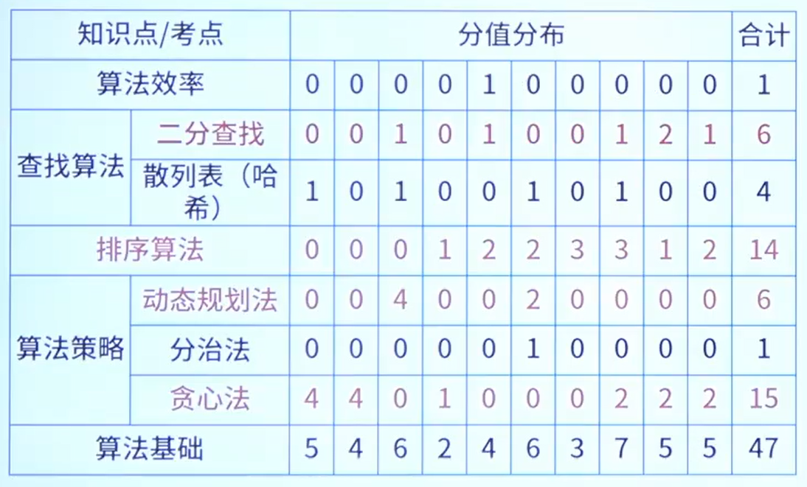

# 数据结构与算法

>去看C语言的:dog: -> [查找算法](../C生万物/查找算法.md "数据结构")
>
>去看C语言的:dog: -> [排序算法](../C生万物/排序算法.md "数据结构")

## 算法策略

### 分治法

### 贪心法

### 动态规划法

### 回溯法

| 算法名称   | 关键点                                         | 特征                                                         | 典型问题                               |
| ---------- | ---------------------------------------------- | ------------------------------------------------------------ | -------------------------------------- |
| 分治法     | 递归技术                                       | 把一个问题拆分成多个小规模的相同子问题，一般可用**递归解决**。 | 归并排序、快速排序、二分搜索           |
| 贪心法     | 一般用于求满意解，特殊情况可求最优解(部分背包) | **局部最优**，但整体不见得最优。每步有明确的、既定的策略。   | 背包问题(如装箱)、多机调度找零钱问题   |
| 动态规划法 | 最优子结构和递归式                             | 划分子问题(**最优子结构**)，使用数组存储子问题结果，利用查询子问题结果构造最终问题结果。 | 矩阵乘法、背包问题、 LCS最长公共子序列 |
| 回溯法     | 探索和回退                                     | 系统地搜索一个问题的所有解或任一解。有试探和回退的过程。     | N皇后问题、迷宫、背包问题              |

